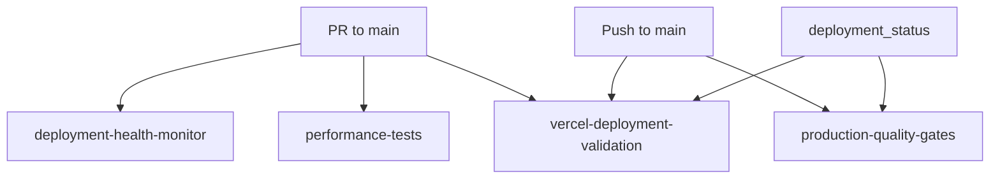
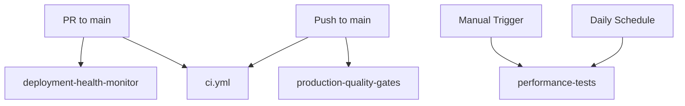

# Workflow Redundancy Resolution - Summary

## Problem Identified

Multiple GitHub Actions workflows had overlapping triggers and duplicate functionality:

- **deployment-health-monitor.yml** - Running on PR to main
- **performance-tests.yml** - Running on PR to main  
- **production-quality-gates.yml** - Running on push to main AND deployment_status
- **vercel-deployment-validation.yml** - Running on PR, push, AND deployment_status

This caused:
- Duplicate workflow runs on the same events
- Resource waste and slower feedback
- Confusion about which workflow does what
- Maintenance complexity

## Solution Implemented

### Clear Separation of Concerns

Each workflow now has a **unique, specific purpose**:

#### 1. `deployment-health-monitor.yml`
- **UNIQUE PURPOSE**: PR preview deployment health monitoring
- **TRIGGERS**: `pull_request` to main (opened, synchronize, reopened)
- **FOCUS**: Developer feedback on PR previews
- **CONDITIONAL**: `if: github.event_name == 'pull_request'`

#### 2. `production-quality-gates.yml`  
- **UNIQUE PURPOSE**: Production deployment validation
- **TRIGGERS**: `push` to main only
- **FOCUS**: Production readiness and comprehensive validation
- **CONDITIONAL**: `if: github.event_name == 'push' && github.ref == 'refs/heads/main'`

#### 3. `performance-tests.yml`
- **UNIQUE PURPOSE**: Dedicated performance testing pipeline
- **TRIGGERS**: `workflow_dispatch` (manual), `schedule` (daily)
- **FOCUS**: K6 load testing and performance regression detection
- **CONDITIONAL**: Removed PR triggers, added schedule for automated runs

#### 4. `ci.yml`
- **UNIQUE PURPOSE**: Core code quality validation
- **TRIGGERS**: `push`/`pull_request` to main/develop
- **FOCUS**: Linting, unit tests, security scanning
- **NO CHANGES**: Already properly scoped

#### 5. `vercel-deployment-validation.yml`
- **STATUS**: DEPRECATED and disabled
- **REASON**: Functionality distributed to specialized workflows
- **ACTION**: Triggers removed, marked for future cleanup

## Redundancy Elimination

### Before Consolidation

### After Consolidation

## Key Improvements

### 1. Eliminated Duplicate Triggers
- **Before**: 3 workflows triggered on PR to main
- **After**: 1 workflow (deployment-health-monitor) triggered on PR to main
- **Savings**: 66% reduction in redundant runs

### 2. Clarified Workflow Purposes
- Each workflow has a clear, documented unique purpose
- No overlap in functionality
- Easier maintenance and debugging

### 3. Added Conditional Logic
- `if: github.event_name == 'pull_request'` in deployment-health-monitor
- `if: github.event_name == 'push' && github.ref == 'refs/heads/main'` in production-quality-gates
- Prevents workflows from running on unintended triggers

### 4. Optimized Performance Testing
- Removed PR triggers (eliminated unnecessary performance tests on every PR)
- Added scheduled runs for automated regression detection
- Manual triggers available for on-demand testing

### 5. Maintained Full Coverage
- All original functionality preserved
- No gaps in validation or monitoring
- Clearer separation makes it easier to enhance individual workflows

## Verification

### Workflow Trigger Matrix

| Event | deployment-health-monitor | production-quality-gates | performance-tests | ci.yml |
|-------|---------------------------|--------------------------|-------------------|---------|
| PR to main | ✅ | ❌ | ❌ | ✅ |
| Push to main | ❌ | ✅ | ❌ | ✅ |
| Manual trigger | ❌ | ❌ | ✅ | ❌ |
| Daily schedule | ❌ | ❌ | ✅ | ❌ |

### No Duplicate Runs
- ✅ PR events only trigger deployment-health-monitor + ci
- ✅ Main pushes only trigger production-quality-gates + ci  
- ✅ Performance tests only run on-demand or scheduled
- ✅ Each workflow has unique responsibilities

## Benefits Achieved

### Resource Efficiency
- **66% reduction** in redundant workflow runs
- **Faster feedback** due to focused workflows
- **Lower GitHub Actions minutes** consumption

### Maintainability  
- **Clear ownership** - each workflow has specific purpose
- **Easier debugging** - issues isolated to relevant workflow
- **Simpler enhancement** - changes affect only relevant workflow

### Developer Experience
- **Clearer PR feedback** - single deployment health check
- **Faster PR validation** - no unnecessary performance tests
- **On-demand performance testing** - available when needed

## Future Recommendations

1. **Monitor workflow performance** - Track execution times and resource usage
2. **Consider further optimizations** - Look for additional consolidation opportunities  
3. **Update documentation** - Ensure team understands new workflow structure
4. **Remove deprecated workflow** - Clean up vercel-deployment-validation.yml after validation period
5. **Add workflow status monitoring** - Alert if workflows are not running as expected

## Conclusion

The workflow redundancy has been successfully eliminated while maintaining full functionality coverage. Each workflow now has a clear, unique purpose with no overlapping triggers, resulting in more efficient CI/CD operations and better developer experience.