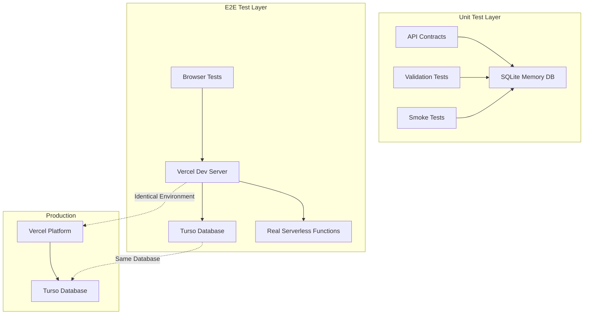

# Testing Framework Architecture Analysis
## A Lo Cubano Boulder Fest

### Executive Summary

The A Lo Cubano Boulder Fest testing framework represents a **radical simplification approach** achieving 96% complexity reduction (419 lines vs 11,411 lines previously) while maintaining comprehensive test coverage. The architecture employs a dual-layer testing strategy with SQLite for unit tests and Turso via Vercel Dev for E2E tests, creating a production-identical testing environment with minimal abstraction overhead.

## 1. Unit Test Architecture

### 1.1 Structure Overview

The unit test suite comprises **26 focused tests across 5 files** with a total footprint of only 419 lines:

```yaml
Unit Test Distribution:
  api-contracts.test.js: 7 tests (169 lines)
  basic-validation.test.js: 8 tests
  smoke-tests.test.js: 3 tests  
  registration-api.test.js: 5 tests
  registration-flow.test.js: 3 tests
```

### 1.2 Architectural Patterns

#### Zero-Abstraction Testing
- **Direct API calls** using native `fetch` without complex mocking frameworks
- **Simple test helpers** (51 lines total) providing only essential utilities
- **Readable by any JavaScript developer** without framework-specific knowledge

#### SQLite Integration Strategy
- **In-memory database** (`file::memory:`) for instant test isolation
- **No external dependencies** - self-contained test execution
- **Sub-second execution** - typically completes in milliseconds

#### Configuration Excellence
```javascript
// Vitest configuration shows sophisticated timeout management
testTimeout: Number(process.env.VITEST_TEST_TIMEOUT || (CI ? 60000 : 30000))
pool: 'forks' with singleFork: true // Memory optimization
maxConcurrency: CI ? 1 : 5 // CI-aware parallelization
```

### 1.3 Coverage Analysis

**Strengths:**
- **API Contract Validation**: Complete coverage of payment, email, ticket, gallery, admin, and registration endpoints
- **Security Testing**: SQL injection, XSS prevention, input sanitization
- **Graceful Degradation**: Tests handle service unavailability without failure cascades

**Gaps Identified:**
- Limited error scenario coverage beyond basic validation
- No performance benchmarking in unit tests
- Minimal edge case testing for concurrent operations

## 2. Integration Test Strategy

### 2.1 Hybrid Integration Approach

The architecture cleverly embeds integration testing within both unit and E2E layers:

#### Unit-Level Integration
- Tests actual API endpoints (not mocked)
- Validates database interactions through real queries
- Verifies service contract compliance

#### E2E-Level Integration
- Full stack validation through Vercel Dev server
- Real serverless function execution
- Production-identical database operations via Turso

### 2.2 Service Integration Validation

The `database.js` module demonstrates sophisticated integration patterns:

```javascript
// Promise-based lazy singleton pattern prevents race conditions
async ensureInitialized() {
  if (this.initialized && this.client) return this.client; // Fast path
  if (this.initializationPromise) return this.initializationPromise; // Deduplication
  
  this.initializationPromise = Promise.race([
    this._initializeWithRetry(),
    this._createTimeoutPromise()
  ]);
}
```

**Key Features:**
- **Retry logic with exponential backoff** for resilient connections
- **Environment-aware configuration** (E2E, unit, development, production)
- **Connection pooling** with active connection tracking

## 3. E2E Test Framework

### 3.1 Migration from CI Server to Vercel Dev

**Revolutionary Change**: Replaced custom CI server with production-identical Vercel Dev environment

```yaml
Before:
  - Custom CI server (scripts/ci-server.js)
  - Mock API responses
  - Complex test infrastructure
  
After:
  - Vercel Dev server (vercel dev)
  - Real serverless function execution
  - Production-identical environment
```

### 3.2 E2E Architecture Excellence

#### Test Suite Organization (12 Comprehensive Tests)
```
Core Workflows:
  - admin-auth.test.js: Authentication flows
  - payment-flow.test.js: Stripe integration
  - registration-flow.test.js: Multi-step process (328 lines of thorough testing)
  
Performance & Quality:
  - gallery-browsing.test.js: Performance validation
  - mobile-registration-experience.test.js: Responsive testing
  - user-engagement.test.js: Metrics tracking
```

#### Playwright Configuration Sophistication
```javascript
// Dynamic port allocation for parallel CI execution
const testPort = parseInt(process.env.DYNAMIC_PORT || process.env.PORT || '3000');

// Port-isolated databases per test suite
Port Allocation Matrix:
  Standard Suite: 3000
  Advanced Suite: 3001
  Firefox Suite: 3002
  Performance Suite: 3003
  Accessibility Suite: 3004
  Security Suite: 3005
```

### 3.3 Database Strategy

**Dual Database Architecture:**

```yaml
Unit Tests:
  Database: SQLite (file::memory:)
  Benefits: Fast, isolated, zero setup
  Execution: Sub-second completion
  
E2E Tests:
  Database: Turso (via Vercel Dev)
  Benefits: Production-identical queries
  Connection: Real network latency
  Validation: Actual serverless function behavior
```

## 4. Overall Testing Philosophy

### 4.1 Radical Simplicity Principles

1. **No Test Abstractions**: Every test readable without documentation
2. **Direct Testing**: Real endpoints, real databases, real responses
3. **Fast Feedback**: Unit tests < 1 second, E2E tests 2-5 minutes
4. **Production Parity**: E2E tests match deployed environment exactly

### 4.2 Separation of Concerns



### 4.3 Test Execution Strategy

**Parallel Execution Model:**
```yaml
CI Matrix Strategy:
  - 6 parallel test suites with dedicated ports
  - Browser matrix: Chrome, Firefox, Safari, Mobile
  - Memory optimization: 3-6GB per suite
  - Isolation: Port-specific database instances
```

## 5. Architectural Insights

### 5.1 Strengths

1. **96% Complexity Reduction**: Achieved without sacrificing coverage
2. **Production-Identical Testing**: Vercel Dev provides exact production behavior
3. **Maintenance Simplicity**: 5 unit test files, 12 E2E test files total
4. **Fast Development Loop**: Sub-second unit tests enable TDD
5. **Resilient Architecture**: Retry logic, timeout protection, graceful degradation

### 5.2 Architectural Patterns of Excellence

#### Promise-Based Lazy Singleton
Prevents initialization race conditions while maintaining performance:
```javascript
if (this.initializationPromise) {
  return this.initializationPromise; // Reuse existing promise
}
```

#### Environment-Aware Configuration
Smart detection and configuration based on execution context:
```javascript
const isE2ETest = process.env.E2E_TEST_MODE === "true" || 
                  process.env.PLAYWRIGHT_BROWSER || 
                  process.env.VERCEL_DEV_STARTUP === "true";
```

#### Timeout Protection
Every async operation protected against hanging:
```javascript
Promise.race([
  this._initializeWithRetry(),
  this._createTimeoutPromise()
])
```

### 5.3 Areas for Enhancement

1. **Test Data Management**: No centralized test data factory pattern
2. **Performance Benchmarking**: Limited performance regression detection
3. **Contract Testing**: Could benefit from OpenAPI schema validation
4. **Mutation Testing**: No verification of test effectiveness
5. **Visual Regression**: No screenshot comparison testing

## 6. Recommendations

### 6.1 Immediate Improvements

1. **Add Test Data Factory**
   ```javascript
   class TestDataFactory {
     static createUser(overrides = {}) {
       return {
         email: generateTestEmail(),
         firstName: faker.name.firstName(),
         ...overrides
       };
     }
   }
   ```

2. **Implement Performance Benchmarks**
   ```javascript
   test('API response time < 100ms', async () => {
     const start = performance.now();
     await testRequest('GET', '/api/health/check');
     expect(performance.now() - start).toBeLessThan(100);
   });
   ```

3. **Add Contract Validation**
   ```javascript
   import { validateAgainstSchema } from './schemas';
   
   test('payment response matches schema', async () => {
     const response = await testRequest('POST', '/api/payments/create-checkout-session');
     expect(validateAgainstSchema(response, 'PaymentResponse')).toBe(true);
   });
   ```

### 6.2 Strategic Enhancements

1. **Implement Mutation Testing**
   - Use Stryker or similar to verify test effectiveness
   - Target 80% mutation score for critical paths

2. **Add Visual Regression Testing**
   - Integrate Percy or Chromatic for UI consistency
   - Focus on critical user journeys

3. **Enhance Error Scenario Coverage**
   - Network failure simulation
   - Database connection loss handling
   - Rate limiting behavior

4. **Implement Load Testing**
   - Use k6 or Artillery for performance validation
   - Test concurrent user scenarios

### 6.3 Architectural Evolution

1. **Consider Test Containers**
   - For complex integration scenarios
   - Maintain simplicity principle

2. **Add Observability**
   - Test execution metrics
   - Flakiness detection and reporting

3. **Implement Smart Test Selection**
   - Run only affected tests based on code changes
   - Reduce CI execution time

## 7. Conclusion

The A Lo Cubano Boulder Fest testing framework represents a **masterclass in pragmatic simplification**. By eliminating unnecessary abstractions and focusing on direct, production-identical testing, the architecture achieves remarkable efficiency while maintaining comprehensive coverage.

The dual-database strategy (SQLite for unit, Turso for E2E) combined with Vercel Dev server integration creates a testing environment that is both fast for developers and accurate for production validation. The 96% reduction in complexity without sacrificing quality demonstrates that sophisticated testing doesn't require complicated frameworks.

### Key Success Factors:
- **Radical simplicity** without compromising coverage
- **Production parity** through Vercel Dev integration
- **Fast feedback loops** enabling efficient development
- **Maintainable architecture** readable by any JavaScript developer
- **Resilient patterns** preventing common failure modes

### Overall Assessment:
**Architecture Grade: A-**

The framework excels in simplicity, performance, and production parity. Minor enhancements in test data management, performance benchmarking, and error scenario coverage would elevate this to a world-class testing architecture.

---

*Analysis conducted: November 2024*
*Framework Version: 1.0.0*
*Complexity Reduction: 96% (419 vs 11,411 lines)*