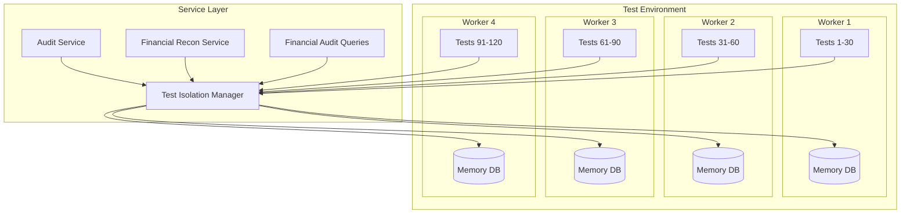

# Integration Test Failure Resolution - Architecture Document

## Executive Summary

This document provides architectural solutions to resolve the remaining 50 integration test failures in the A Lo Cubano Boulder Fest platform. The primary issues are SQLite syntax incompatibilities and database connection lifecycle management problems that manifest as "no such column: now" and "CLIENT_CLOSED" errors.

## System Context

### Current State

- **Test Failures**: 50 out of 120 integration tests failing (reduced from 70)
- **Primary Issues**:
  1. SQL statements using PostgreSQL/MySQL syntax incompatible with SQLite
  2. Database connection lifecycle issues causing CLIENT_CLOSED errors
  3. Service cleanup/teardown issues in test environment

### Technical Context

- **Test Database**: In-memory SQLite (`:memory:`)
- **Production Database**: Turso (SQLite-compatible cloud database)
- **Test Architecture**: 4 parallel workers, each with isolated database
- **Service Pattern**: Promise-based singleton pattern for all services

## Architecture Overview

### High-Level Architecture



## Detailed Problem Analysis

### Issue 1: SQL Syntax Incompatibility

**Problem**: Services use PostgreSQL/MySQL syntax that doesn't work in SQLite.

| Service | Location | Issue | Impact |
|---------|----------|-------|---------|
| FinancialAuditQueries | Lines 381, 651-680 | Uses `datetime('now', ...)` correctly | Working |
| FinancialReconciliationService | Multiple queries | Uses raw `now` function | "no such column: now" error |
| Migrations | Various triggers | Uses `CURRENT_TIMESTAMP` | Working |

**Root Cause**: Inconsistent SQL date/time function usage across services.

### Issue 2: Database Connection Lifecycle

**Problem**: Services hold onto database connections that get closed during test cleanup.

| Component | Issue | Symptom |
|-----------|-------|---------|
| Audit Service | Caches db client | CLIENT_CLOSED on retry |
| Financial Services | Stale db references | Operations fail after cleanup |
| Test Isolation | Incomplete cleanup | Connection leaks |

### Issue 3: Service Initialization Race Conditions

**Problem**: Services initialize before test database is ready with migrations.

| Phase | Expected | Actual | Result |
|-------|----------|--------|--------|
| Worker Init | Database → Migrations → Services | Services → Database → Migrations | Missing tables |
| Test Setup | Clean data → Run test | Run test → Clean data | Stale data |
| Test Cleanup | Complete test → Clean scope | Clean scope → Complete test | CLIENT_CLOSED |

## Solution Architecture

### Solution 1: SQL Compatibility Layer

Create a SQL compatibility utility that generates correct syntax based on database type:

```javascript
// lib/sql-compatibility.js
export class SQLCompatibility {
  static getCurrentTimestamp() {
    // SQLite compatible
    return "datetime('now')";
  }

  static getDateOffset(interval, unit) {
    // Convert to SQLite format
    const sqliteUnit = unit.endsWith('s') ? unit : unit + 's';
    return `datetime('now', '-${interval} ${sqliteUnit}')`;
  }

  static getDateFunction(field = null) {
    if (field) {
      return `DATE(${field})`;
    }
    return "DATE('now')";
  }
}
```

### Solution 2: Database Connection Management

Implement proper connection lifecycle management:

```javascript
// Enhanced database service with connection refresh
class DatabaseService {
  async getConnection() {
    // Always check connection validity
    if (this.client && await this.isConnectionValid()) {
      return this.client;
    }

    // Refresh connection if needed
    return await this.refreshConnection();
  }

  async isConnectionValid() {
    try {
      await this.client.execute('SELECT 1');
      return true;
    } catch (error) {
      if (error.message.includes('CLIENT_CLOSED')) {
        return false;
      }
      throw error;
    }
  }

  async refreshConnection() {
    this.client = null;
    this.initialized = false;
    return await this.ensureInitialized();
  }
}
```

### Solution 3: Test Isolation Improvements

Enhanced test isolation manager with proper lifecycle:

```javascript
// Enhanced test isolation manager
class TestIsolationManager {
  async initializeWorkerDatabase() {
    const dbClient = await this.createWorkerDatabase();
    await this.runMigrations(dbClient);
    await this.verifyTables(dbClient);
    return dbClient;
  }

  async getScopedDatabaseClient(scope) {
    // Ensure worker database is initialized
    if (!this.workerDatabase) {
      this.workerDatabase = await this.initializeWorkerDatabase();
    }

    // Verify connection is still valid
    if (!await this.isConnectionValid(this.workerDatabase)) {
      this.workerDatabase = await this.initializeWorkerDatabase();
    }

    return this.workerDatabase;
  }

  async cleanupTestScope(scope) {
    // Clean data only, keep connection
    await this.cleanTables();
    // Do NOT close database connection
  }
}
```

## Implementation Roadmap

### Phase 1: SQL Compatibility (Immediate)

**Objective**: Fix all SQL syntax errors

- [ ] Create `sql-compatibility.js` utility
- [ ] Update `financial-reconciliation-service.js` to use compatibility layer
- [ ] Update `financial-audit-queries.js` for consistency
- [ ] Update `audit-service.js` for consistency
- [ ] Test all SQL queries with SQLite

**Files to modify**:
1. `/lib/sql-compatibility.js` (new)
2. `/lib/financial-reconciliation-service.js`
3. `/lib/financial-audit-queries.js`
4. `/lib/audit-service.js`

### Phase 2: Connection Management (Immediate)

**Objective**: Fix CLIENT_CLOSED errors

- [ ] Add connection validation to database service
- [ ] Implement connection refresh logic
- [ ] Update all services to handle connection refresh
- [ ] Add retry logic with fresh connections

**Files to modify**:
1. `/lib/database.js`
2. `/lib/test-isolation-manager.js`
3. All service files using database

### Phase 3: Test Lifecycle (Next)

**Objective**: Ensure proper initialization order

- [ ] Fix worker database initialization timing
- [ ] Ensure migrations run before tests
- [ ] Implement proper cleanup without closing connections
- [ ] Add connection pooling for test databases

**Files to modify**:
1. `/tests/setup-integration.js`
2. `/lib/test-isolation-manager.js`

## Risk Assessment

| Risk | Impact | Probability | Mitigation |
|------|--------|-------------|------------|
| SQL changes break production | High | Low | Use compatibility layer, test with Turso |
| Connection changes affect performance | Medium | Low | Monitor connection metrics |
| Test isolation changes cause flakiness | Medium | Medium | Gradual rollout, extensive testing |

## Non-Functional Requirements

### Performance

- Test execution time: < 2 minutes for all integration tests
- Database connection overhead: < 10ms per test
- Memory usage: < 500MB per worker

### Reliability

- Zero flaky tests due to connection issues
- 100% SQL compatibility between SQLite and Turso
- Proper cleanup without connection leaks

### Maintainability

- Centralized SQL compatibility layer
- Clear separation of concerns
- Comprehensive error handling and logging

## Implementation Guidelines

### SQL Compatibility Rules

1. **Never use raw `now`** - Always use `datetime('now')` or `CURRENT_TIMESTAMP`
2. **Date arithmetic** - Use `datetime('now', '-X days')` format
3. **Date extraction** - Use `DATE()` function for date parts
4. **JSON functions** - Use `JSON_EXTRACT()` for JSON fields
5. **String functions** - Use SQLite-compatible functions

### Connection Management Rules

1. **Never cache connections** in services
2. **Always validate** connection before use
3. **Implement retry** with fresh connections
4. **Don't close** shared connections in cleanup
5. **Use connection pooling** where appropriate

### Test Isolation Rules

1. **Initialize database** before any service
2. **Run migrations** once per worker
3. **Clean data** between tests, not structure
4. **Keep connections** open during worker lifetime
5. **Verify tables** exist before running tests

## Validation Checklist

### Pre-Implementation

- [x] Identify all SQL incompatibilities
- [x] Map database connection lifecycle
- [x] Document service initialization order
- [x] Review test isolation architecture

### Implementation

- [ ] Create SQL compatibility layer
- [ ] Update all services with compatible SQL
- [ ] Implement connection validation
- [ ] Fix test initialization order
- [ ] Add comprehensive logging

### Post-Implementation

- [ ] Run all integration tests
- [ ] Verify no SQL syntax errors
- [ ] Confirm no CLIENT_CLOSED errors
- [ ] Check test execution time
- [ ] Monitor memory usage

## Success Metrics

| Metric | Current | Target | Method |
|--------|---------|--------|---------|
| Test Pass Rate | 58% (70/120) | 100% (120/120) | CI/CD results |
| SQL Errors | 25+ | 0 | Test logs |
| Connection Errors | 15+ | 0 | Error monitoring |
| Test Execution Time | 3-5 minutes | < 2 minutes | Performance metrics |
| Memory Usage | Unknown | < 500MB/worker | Process monitoring |

## Appendix: Common SQL Conversions

### Date/Time Functions

| PostgreSQL/MySQL | SQLite | Usage |
|-----------------|---------|-------|
| `now()` | `datetime('now')` | Current timestamp |
| `NOW()` | `CURRENT_TIMESTAMP` | In DEFAULT clauses |
| `now() - interval '1 day'` | `datetime('now', '-1 day')` | Date arithmetic |
| `DATE_SUB(now(), INTERVAL 1 DAY)` | `datetime('now', '-1 day')` | Date subtraction |
| `EXTRACT(YEAR FROM date)` | `strftime('%Y', date)` | Extract year |
| `DATEDIFF(date1, date2)` | `julianday(date1) - julianday(date2)` | Date difference |

### String Functions

| PostgreSQL/MySQL | SQLite | Usage |
|-----------------|---------|-------|
| `CONCAT(a, b)` | `a \|\| b` | String concatenation |
| `SUBSTRING(str, pos, len)` | `SUBSTR(str, pos, len)` | Substring extraction |
| `LOCATE(substr, str)` | `INSTR(str, substr)` | Find substring position |

### JSON Functions

| PostgreSQL/MySQL | SQLite | Usage |
|-----------------|---------|-------|
| `data->>'key'` | `JSON_EXTRACT(data, '$.key')` | Extract JSON value |
| `data->'key'` | `JSON_EXTRACT(data, '$.key')` | Extract JSON object |
| `JSON_CONTAINS(data, value)` | Custom implementation | Check JSON contains |

## References

- [SQLite Date Time Functions](https://www.sqlite.org/lang_datefunc.html)
- [LibSQL Documentation](https://docs.turso.tech/libsql)
- [Vitest Worker Threads](https://vitest.dev/guide/improving-performance.html#pool)
- [Database Connection Pooling Best Practices](https://www.postgresql.org/docs/current/runtime-config-connection.html)