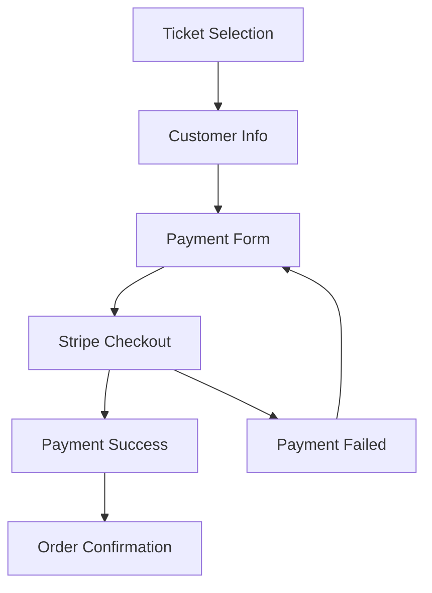

# A Lo Cubano Boulder Fest - Frontend Payment Integration

## Overview

This is a comprehensive frontend payment integration for A Lo Cubano Boulder Fest, featuring Stripe payment processing with a typography-forward design that maintains the festival's distinctive aesthetic.

## Key Features

### 🎨 Design & UX
- **Typography-forward design** that treats text as art
- **Mobile-first responsive design** with touch-friendly interfaces
- **Accessibility compliant** (WCAG 2.1 AA) with screen reader support
- **Real-time validation** with user-friendly error messages
- **Multi-step checkout flow** with clear progress indicators
- **Cuban festival theme** integration with brand colors and fonts

### 💳 Payment Processing
- **Stripe Elements integration** with custom styling
- **Secure checkout sessions** with server-side validation
- **Real-time inventory checking** with availability updates
- **Cart management** with session persistence and expiration
- **Payment method selection** supporting cards, Apple Pay, Google Pay
- **Order confirmation** with detailed receipts

### 📊 Analytics & Tracking
- **Conversion funnel tracking** with Google Analytics 4
- **Payment event analytics** for optimization insights
- **A/B testing support** for checkout optimization
- **Performance monitoring** with Core Web Vitals tracking
- **Error tracking** with detailed context

### 🛡️ Security & Validation
- **Client-side validation** with real-time feedback
- **XSS and injection protection** in form inputs
- **Rate limiting** and abuse prevention
- **Inventory reservation** to prevent overselling
- **Session management** with secure timeouts

## File Structure

```
js/
├── payment-integration.js          # Main payment integration class
├── lib/
│   ├── analytics-tracker.js        # Analytics and conversion tracking
│   ├── cart-manager.js             # Cart state and persistence
│   ├── payment-form-validator.js   # Client-side validation
│   ├── inventory-checker.js        # Real-time inventory checking
│   └── loading-state-manager.js    # Loading states and UI feedback
├── ticket-selection.js             # Enhanced ticket selection (existing)

css/
├── payment-integration.css         # Payment-specific styles

pages/
├── tickets.html                    # Updated with payment integration
├── payment-success.html            # Success page with order details
```

## Architecture

### Payment Flow



### Component Architecture

```
PaymentIntegration (Main Controller)
├── AnalyticsTracker (Conversion tracking)
├── CartManager (State management)
├── PaymentFormValidator (Input validation)
├── InventoryChecker (Availability monitoring)
└── LoadingStateManager (UI feedback)
```

## Setup Instructions

### 1. Environment Configuration

Add your Stripe keys to the environment:

```javascript
// In pages/tickets.html
window.STRIPE_PUBLISHABLE_KEY = 'pk_live_your_stripe_publishable_key';
```

### 2. Backend API Endpoints

Ensure these API endpoints are available:

- `POST /api/payment/create-checkout-session` - Create Stripe checkout session
- `POST /api/inventory/check-availability` - Check ticket availability
- `POST /api/payment/calculate-total` - Server-side price calculation
- `GET /api/payment/order-details` - Retrieve order information

### 3. Analytics Setup

Configure Google Analytics 4:

```html
<!-- Google Analytics -->
<script async src="https://www.googletagmanager.com/gtag/js?id=GA_MEASUREMENT_ID"></script>
<script>
  window.dataLayer = window.dataLayer || [];
  function gtag(){dataLayer.push(arguments);}
  gtag('js', new Date());
  gtag('config', 'GA_MEASUREMENT_ID');
</script>
```

### 4. SSL Certificate

Ensure HTTPS is enabled for production - required for Stripe integration.

## Usage

### Basic Integration

The payment integration initializes automatically when the tickets page loads:

```javascript
// Automatic initialization
document.addEventListener('DOMContentLoaded', () => {
  if (document.querySelector('.ticket-selection')) {
    window.paymentIntegration = new PaymentIntegration();
  }
});
```

### Manual Control

```javascript
// Access the payment integration instance
const payment = window.paymentIntegration;

// Get current state
const state = payment.getState();

// Reset payment flow
payment.resetPayment();

// Destroy instance
payment.destroy();
```

### Event Handling

```javascript
// Listen for cart updates
payment.cartManager.on('cart-updated', (event) => {
  console.log('Cart updated:', event.detail);
});

// Listen for inventory changes
payment.inventory.on('availability-changed', (event) => {
  console.log('Inventory changed:', event.detail);
});
```

## Customization

### Styling

The payment integration uses CSS custom properties for easy theming:

```css
:root {
  --color-primary: #CC2936;    /* Festival red */
  --color-secondary: #5B6BB5;  /* Festival blue */
  --font-display: 'Bebas Neue';
  --font-accent: 'Playfair Display';
}
```

### Stripe Appearance

Customize the Stripe Elements appearance:

```javascript
const appearance = {
  theme: 'flat',
  variables: {
    colorPrimary: '#CC2936',
    colorBackground: '#FFFFFF',
    fontFamily: 'system-ui, sans-serif',
  }
};
```

### Validation Rules

Add custom validation rules:

```javascript
payment.validator.addCustomValidator('email', (value) => {
  // Custom email validation logic
  return {
    valid: isValidEmail(value),
    message: 'Please enter a valid email address'
  };
});
```

## Analytics Events

The integration tracks these key events:

### Conversion Funnel
- `payment_integration_initialized`
- `checkout_button_clicked`
- `customer_info_submitted`
- `payment_form_shown`
- `payment_submit_attempted`
- `payment_completed`

### Error Tracking
- `payment_error`
- `inventory_unavailable`
- `validation_failed`

### Performance
- `payment_form_load_time`
- `checkout_session_creation_time`
- `payment_processing_time`

## Testing

### Test Cards

Use Stripe test cards for development:

```
Successful payment: 4242 4242 4242 4242
Declined card: 4000 0000 0000 0002
Insufficient funds: 4000 0000 0000 9995
```

### Test Scenarios

1. **Happy Path**: Select tickets → Enter info → Complete payment
2. **Validation Errors**: Test form validation with invalid inputs
3. **Inventory Issues**: Test with limited inventory scenarios
4. **Payment Failures**: Test with declined cards
5. **Session Expiry**: Test cart expiration handling

## Performance Optimization

### Core Web Vitals Targets
- **LCP** (Largest Contentful Paint): < 2.5s
- **FID** (First Input Delay): < 100ms
- **CLS** (Cumulative Layout Shift): < 0.1

### Optimization Techniques
- Lazy loading of Stripe Elements
- Efficient DOM manipulation
- Debounced validation
- Optimized analytics batching
- Minimal external dependencies

## Security Considerations

### Client-Side Security
- Input sanitization and validation
- XSS protection in form fields
- CSRF token validation
- Secure session management

### PCI Compliance
- No sensitive card data stored client-side
- Stripe Elements handle card data securely
- TLS 1.2+ required for all communications

## Accessibility Features

### WCAG 2.1 AA Compliance
- Semantic HTML structure
- ARIA labels and live regions
- Keyboard navigation support
- Screen reader announcements
- High contrast mode support
- Focus management
- Error message association

### Testing Tools
- axe-core for automated testing
- Screen reader testing (NVDA, JAWS, VoiceOver)
- Keyboard-only navigation testing

## Browser Support

### Supported Browsers
- Chrome 90+
- Firefox 88+
- Safari 14+
- Edge 90+

### Mobile Support
- iOS Safari 14+
- Chrome Mobile 90+
- Samsung Internet 14+

## Troubleshooting

### Common Issues

**Payment integration not loading**
- Check Stripe publishable key configuration
- Verify HTTPS is enabled
- Check browser console for errors

**Form validation not working**
- Ensure validation library is loaded
- Check for JavaScript errors
- Verify HTML5 form attributes

**Analytics not tracking**
- Verify Google Analytics configuration
- Check for ad blockers
- Confirm tracking events in GA4

**Mobile display issues**
- Test viewport meta tag
- Check CSS media queries
- Verify touch event handling

### Debug Mode

Enable debug logging:

```javascript
localStorage.setItem('payment-debug', 'true');
```

This will log detailed information about:
- Payment flow state changes
- API requests and responses
- Validation results
- Analytics events

## Deployment Checklist

### Pre-deployment
- [ ] Replace test Stripe keys with live keys
- [ ] Configure production analytics
- [ ] Test all payment flows
- [ ] Verify SSL certificate
- [ ] Test mobile experience
- [ ] Run accessibility audit
- [ ] Performance testing
- [ ] Security review

### Post-deployment
- [ ] Monitor error rates
- [ ] Track conversion metrics
- [ ] Test payment processing
- [ ] Verify email confirmations
- [ ] Monitor performance metrics

## Support

For technical support or questions:

- **Email**: dev@alocubanoboulderfest.com
- **Documentation**: See `/docs/` directory
- **API Reference**: See backend API documentation

## License

This payment integration is part of the A Lo Cubano Boulder Fest website and is proprietary software. All rights reserved.

---

**Last Updated**: January 2025
**Version**: 1.0.0
**Tested With**: Stripe API 2023-10-16