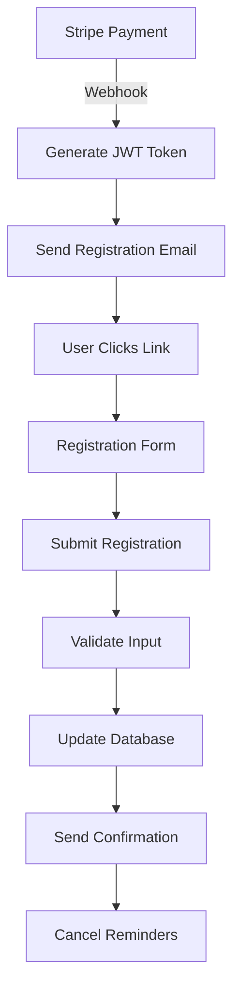

# Registration API Documentation

## Overview

The A Lo Cubano Boulder Fest registration system enables ticket purchasers to register attendee information for each ticket within a 72-hour window after purchase. The system includes JWT-based authentication, rate limiting, and comprehensive validation.

## Authentication

Tokens are generated during Stripe webhook processing after successful payment.

- GET `/api/registration/[token]`: token is supplied in the path segment (`[token]`).
- POST `/api/tickets/register` and `/api/registration/batch`: ticket ID and registration data in request body.
- GET `/api/registration/health`: does not require authentication.

### Token Structure
```json
{
  "transactionId": "pi_xxx",
  "purchaserEmail": "purchaser@example.com",
  "ticketIds": ["T001", "T002"],
  "exp": 1234567890
}
```

## Endpoints

### 1. Get Registration Status

**Endpoint:** `GET /api/registration/[token]`

Fetches the registration status for all tickets in a transaction.

**Parameters:**
- `token` (string, required): JWT token from registration email

**Response (200 OK):**
```json
{
  "transactionId": "pi_xxx",
  "purchaserEmail": "purchaser@example.com",
  "deadline": "2024-01-15T10:00:00Z",
  "tickets": [
    {
      "ticketId": "T001",
      "ticketType": "weekend",
      "status": "pending",
      "registeredAt": null,
      "hoursRemaining": 48,
      "attendee": null
    },
    {
      "ticketId": "T002",
      "ticketType": "weekend",
      "status": "completed",
      "registeredAt": "2024-01-13T15:30:00Z",
      "hoursRemaining": 48,
      "attendee": {
        "firstName": "John",
        "lastName": "Doe",
        "email": "john@example.com"
      }
    }
  ]
}
```

**Error Responses:**
- `400 Bad Request`: Token is missing or invalid format
- `401 Unauthorized`: Token is expired or invalid signature
- `404 Not Found`: No tickets found for transaction
- `500 Internal Server Error`: Server error

### 2. Register Single Ticket

**Endpoint:** `POST /api/tickets/register`

Registers attendee information for a single ticket.

**Rate Limiting:** 3 requests per 15 minutes per IP

**Request Body:**
```json
{
  "ticketId": "T001",
  "firstName": "John",
  "lastName": "Doe",
  "email": "john@example.com"
}
```

**Validation Rules:**
- `firstName`: 2-50 characters, letters/spaces/hyphens/apostrophes only
- `lastName`: 2-50 characters, letters/spaces/hyphens/apostrophes only
- `email`: Valid basic email format (local@domain.tld)
- All inputs are sanitized (HTML-escaped) to prevent XSS

**Response (200 OK):**
```json
{
  "success": true,
  "message": "Ticket registered successfully",
  "ticketId": "T001",
  "attendee": {
    "firstName": "John",
    "lastName": "Doe",
    "email": "john@example.com"
  },
  "allTicketsRegistered": false
}
```

**Error Responses:**
- `400 Bad Request`: Validation error or ticket already registered
- `404 Not Found`: Ticket not found
- `429 Too Many Requests`: Rate limit exceeded
- `500 Internal Server Error`: Server error

### 3. Batch Registration

**Endpoint:** `POST /api/registration/batch`

Registers multiple tickets in a single atomic transaction.

**Rate Limiting:** 3 requests per 15 minutes per IP

**Request Body:**
```json
{
  "registrations": [
    {
      "ticketId": "T001",
      "firstName": "John",
      "lastName": "Doe",
      "email": "john@example.com"
    },
    {
      "ticketId": "T002",
      "firstName": "Jane",
      "lastName": "Smith",
      "email": "jane@example.com"
    }
  ]
}
```

**Constraints:**
- Maximum 10 tickets per batch
- All validations must pass before any registration is processed
- Atomic transaction - all succeed or all fail

**Response (200 OK):**
```json
{
  "success": true,
  "message": "Successfully registered 2 tickets",
  "registrations": [
    {
      "ticketId": "T001",
      "status": "registered",
      "attendee": {
        "firstName": "John",
        "lastName": "Doe",
        "email": "john@example.com"
      }
    },
    {
      "ticketId": "T002",
      "status": "registered",
      "attendee": {
        "firstName": "Jane",
        "lastName": "Smith",
        "email": "jane@example.com"
      }
    }
  ],
  "emailStatus": [
    { "ticketId": "T001", "emailSent": true },
    { "ticketId": "T002", "emailSent": true }
  ]
}
```

**Error Responses:**
- `400 Bad Request`: Validation error or batch size exceeded
- `404 Not Found`: One or more tickets not found
- `429 Too Many Requests`: Rate limit exceeded
- `500 Internal Server Error`: Server error

### 4. Health Check

**Endpoint:** `GET /api/registration/health`

Checks the health of the registration system components.

**Response (200 OK - Healthy):**
```json
{
  "service": "registration-api",
  "version": "1.0.0",
  "status": "healthy",
  "timestamp": "2024-01-13T10:00:00Z",
  "responseTime": 45,
  "checks": {
    "database": {
      "status": "healthy",
      "responseTime": 12
    },
    "email": {
      "status": "healthy",
      "responseTime": 23
    }
  },
  "environment": "production"
}
```

**Response (503 Service Unavailable - Unhealthy):**
```json
{
  "service": "registration-api",
  "version": "1.0.0",
  "status": "unhealthy",
  "timestamp": "2024-01-13T10:00:00Z",
  "responseTime": 145,
  "checks": {
    "database": {
      "status": "unhealthy",
      "responseTime": null,
      "error": "Connection timeout"
    },
    "email": {
      "status": "healthy",
      "responseTime": 23
    }
  },
  "environment": "production"
}
```

## Security Features

### JWT Token Security
- Secret with at least 32 bytes of entropy (256-bit key)
- Token expiry enforcement (default 72 hours via `REGISTRATION_TOKEN_EXPIRY`)
- Algorithm restricted to HS256 for security
- Secure token transmission via HTTPS only

### Input Validation
- Name validation: 2-50 characters, letters/spaces/hyphens only
- Email validation: RFC 5322 compliant
- XSS prevention through HTML entity encoding
- SQL injection prevention via parameterized queries

### Rate Limiting
- 3 registration attempts per 15 minutes per IP
- Progressive backoff for failed attempts
- Bypass for authenticated admin users

## Email Notifications

### Confirmation Emails
When a ticket is registered, the system sends confirmation emails:

1. **Purchaser Confirmation** (if attendee is the purchaser)
   - Template ID: `BREVO_PURCHASER_CONFIRMATION_TEMPLATE_ID`
   - Contains ticket details and wallet pass links

2. **Attendee Confirmation** (if attendee is different from purchaser)
   - Template ID: `BREVO_ATTENDEE_CONFIRMATION_TEMPLATE_ID`
   - Contains ticket details and wallet pass links

### Email Template Variables
```json
{
  "firstName": "John",
  "lastName": "Doe",
  "ticketId": "T001",
  "ticketType": "weekend",
  "walletPassUrl": "https://domain.com/api/tickets/apple-wallet/T001"
}
```

## Performance Targets

- Token validation: <100ms
- Registration submission: <500ms
- Batch registration: <1000ms
- Health check: <100ms
- Database queries: <50ms

## Error Handling

### Error Response Format
```json
{
  "error": "Error message",
  "details": ["Specific error detail 1", "Specific error detail 2"],
  "code": "ERROR_CODE"
}
```

### Common Error Codes
- `INVALID_TOKEN`: JWT token is invalid or malformed
- `TOKEN_EXPIRED`: JWT token has expired
- `TICKET_NOT_FOUND`: Ticket ID does not exist
- `ALREADY_REGISTERED`: Ticket is already registered
- `REGISTRATION_EXPIRED`: Registration deadline has passed
- `VALIDATION_ERROR`: Input validation failed
- `RATE_LIMIT_EXCEEDED`: Too many requests
- `DATABASE_ERROR`: Database operation failed
- `EMAIL_SERVICE_ERROR`: Email sending failed

## Database Schema

### Tickets Table (Updated Fields)
```sql
attendee_first_name TEXT,
attendee_last_name TEXT,
attendee_email TEXT,
registration_status TEXT DEFAULT 'pending',
registered_at DATETIME,
registration_deadline DATETIME
```

### Registration Reminders Table
```sql
CREATE TABLE registration_reminders (
  id INTEGER PRIMARY KEY,
  ticket_id TEXT NOT NULL,
  reminder_type TEXT NOT NULL,
  scheduled_at DATETIME NOT NULL,
  sent_at DATETIME,
  status TEXT DEFAULT 'scheduled'
)
```

### Registration Emails Table
```sql
CREATE TABLE registration_emails (
  id INTEGER PRIMARY KEY,
  ticket_id TEXT NOT NULL,
  email_type TEXT NOT NULL,
  recipient_email TEXT NOT NULL,
  sent_at DATETIME,
  brevo_message_id TEXT
)
```

## Integration Flow



## Testing

### Test Coverage Requirements
- JWT token generation and validation
- Input validation for all fields
- XSS and SQL injection prevention
- Rate limiting enforcement
- Email template rendering
- Database transaction atomicity
- Error handling for all scenarios

### Example Test Cases
```javascript
// Token validation
expect(jwt.verify(token, secret)).toBeTruthy();

// Name validation
expect(NAME_REGEX.test("John")).toBe(true);
expect(NAME_REGEX.test("John123")).toBe(false);

// Email validation
expect(EMAIL_REGEX.test("user@example.com")).toBe(true);
expect(EMAIL_REGEX.test("invalid-email")).toBe(false);

// XSS prevention
expect(sanitize("<script>alert('xss')</script>"))
  .toBe("&lt;script&gt;alert('xss')&lt;/script&gt;");
```

## Monitoring

### Key Metrics to Track
- Registration completion rate
- Average time to register
- Token validation failures
- Rate limit violations
- Email delivery success rate
- Database query performance

### Recommended Alerts
- Registration rate < 50% after 48 hours
- Token validation errors > 5% of requests
- Database response time > 100ms
- Email service failures
- Rate limit violations > 10 per hour

## Support

For issues or questions about the registration API:
- Email: alocubanoboulderfest@gmail.com
- Documentation: https://github.com/damilola-elegbede/alocubano.boulderfest/docs