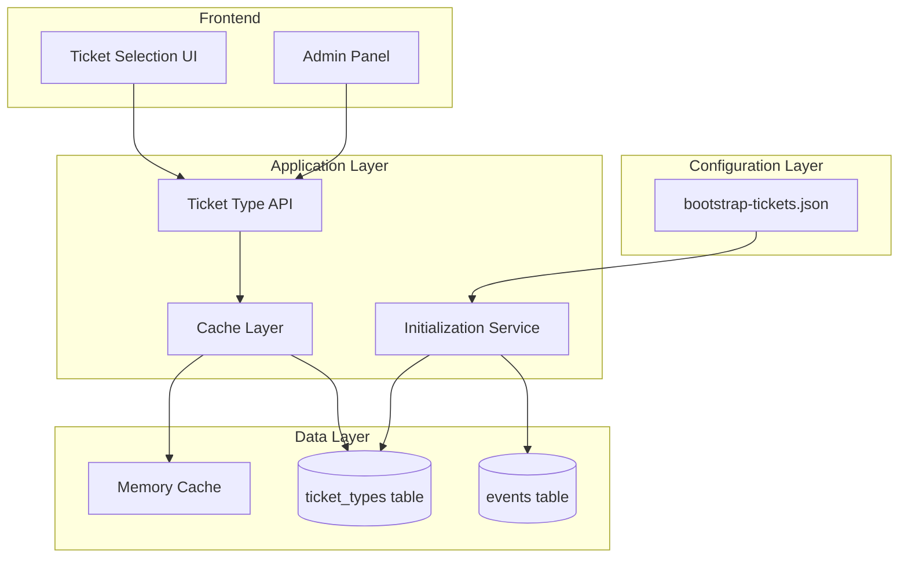

# Bootstrap-Driven Ticket Management Architecture

## Executive Summary

A centralized configuration system using a single `bootstrap-tickets.json` file that serves as the source of truth for all event and ticket definitions across all environments. This architecture ensures consistency, simplifies deployment, and provides excellent performance through strategic caching.

## System Context

### Business Context

- **Business Drivers**: Need for flexible ticket configuration without code changes
- **Key Stakeholders**: Event organizers, developers, operations team
- **Success Metrics**: Zero configuration drift, sub-100ms API response times

### Technical Context

- **Current State**: Ticket metadata embedded in Stripe products and code
- **Technology Constraints**: Serverless environment (Vercel), SQLite/Turso database
- **Integration Points**: Stripe Checkout, ticket validation system, admin panel

## Architecture Overview

### High-Level Architecture



## Detailed Design

### 1. Bootstrap Configuration Structure

```json
{
  "version": "1.0.0",
  "generated": "2025-01-28T00:00:00Z",
  "environment": "production",

  "events": {
    "boulder-fest-2025": {
      "id": "boulder-fest-2025",
      "name": "A Lo Cubano Boulder Fest 2025",
      "date": "2025-05-15",
      "end_date": "2025-05-17",
      "venue": "Avalon Ballroom, Boulder, CO",
      "status": "past",
      "display_order": 1,
      "metadata": {
        "description": "3-day Cuban Salsa Festival",
        "timezone": "America/Denver",
        "capacity": 500,
        "image_url": "/images/events/boulder-fest-2025.jpg"
      }
    },

    "weekender-2025-11": {
      "id": "weekender-2025-11",
      "name": "November 2025 Weekender",
      "date": "2025-11-07",
      "end_date": "2025-11-09",
      "venue": "Avalon Ballroom, Boulder, CO",
      "status": "active",
      "display_order": 2,
      "metadata": {
        "description": "Fall Weekend Intensive",
        "timezone": "America/Denver",
        "capacity": 200,
        "image_url": "/images/events/weekender-2025-11.jpg"
      }
    },

    "boulder-fest-2026": {
      "id": "boulder-fest-2026",
      "name": "A Lo Cubano Boulder Fest 2026",
      "date": "2026-05-15",
      "end_date": "2026-05-17",
      "venue": "Avalon Ballroom, Boulder, CO",
      "status": "active",
      "display_order": 3,
      "metadata": {
        "description": "3-day Cuban Salsa Festival",
        "timezone": "America/Denver",
        "capacity": 500,
        "image_url": "/images/events/boulder-fest-2026.jpg",
        "featured": true
      }
    },

    "test-event-1": {
      "id": "test-event-1",
      "name": "Test Event Alpha",
      "date": "2099-12-31",
      "venue": "Test Venue",
      "status": "test",
      "display_order": -1,
      "metadata": {
        "description": "Test event for development",
        "test_mode": true
      }
    }
  },

  "ticket_types": {
    "boulder-fest-2026-full-pass": {
      "id": "boulder-fest-2026-full-pass",
      "event_id": "boulder-fest-2026",
      "stripe_price_id": "price_1234567890abcdef",
      "name": "Full Festival Pass",
      "description": "Access to all 3 days, workshops, and social dances",
      "price_cents": 25000,
      "currency": "USD",
      "status": "available",
      "max_quantity": 200,
      "sold_count": 45,
      "display_order": 1,
      "metadata": {
        "includes_meals": false,
        "includes_workshops": true,
        "includes_socials": true,
        "early_bird": false,
        "refundable_until": "2026-05-01"
      },
      "availability": {
        "start_date": "2025-01-01T00:00:00Z",
        "end_date": "2026-05-14T23:59:59Z",
        "max_per_transaction": 10
      }
    },

    "boulder-fest-2026-early-bird": {
      "id": "boulder-fest-2026-early-bird",
      "event_id": "boulder-fest-2026",
      "stripe_price_id": "price_early_bird_2026",
      "name": "Early Bird Full Pass",
      "description": "Special pricing for early registrations",
      "price_cents": 20000,
      "currency": "USD",
      "status": "coming-soon",
      "max_quantity": 50,
      "sold_count": 0,
      "display_order": 0,
      "metadata": {
        "includes_meals": false,
        "includes_workshops": true,
        "includes_socials": true,
        "early_bird": true,
        "discount_percentage": 20
      },
      "availability": {
        "start_date": "2026-01-01T00:00:00Z",
        "end_date": "2026-03-31T23:59:59Z",
        "max_per_transaction": 4
      }
    },

    "weekender-2025-11-full": {
      "id": "weekender-2025-11-full",
      "event_id": "weekender-2025-11",
      "stripe_price_id": "price_weekender_202511",
      "name": "Weekend Pass",
      "description": "Full weekend access",
      "price_cents": 15000,
      "currency": "USD",
      "status": "available",
      "max_quantity": 100,
      "sold_count": 23,
      "display_order": 1,
      "metadata": {
        "includes_workshops": true,
        "includes_socials": true
      },
      "availability": {
        "start_date": "2025-01-01T00:00:00Z",
        "end_date": "2025-11-06T23:59:59Z",
        "max_per_transaction": 10
      }
    },

    "test-ticket-basic": {
      "id": "test-ticket-basic",
      "event_id": "test-event-1",
      "stripe_price_id": "price_test_basic",
      "name": "Test Ticket",
      "description": "Test ticket for development",
      "price_cents": 100,
      "currency": "USD",
      "status": "test",
      "max_quantity": 9999,
      "sold_count": 0,
      "display_order": -1,
      "metadata": {
        "test_mode": true
      }
    }
  },

  "ticket_states": {
    "available": {
      "purchasable": true,
      "display": true,
      "message": null
    },
    "sold-out": {
      "purchasable": false,
      "display": true,
      "message": "This ticket type is sold out"
    },
    "coming-soon": {
      "purchasable": false,
      "display": true,
      "message": "Tickets will be available soon"
    },
    "closed": {
      "purchasable": false,
      "display": false,
      "message": "Ticket sales have ended"
    },
    "test": {
      "purchasable": true,
      "display": false,
      "message": "Test ticket - not for production"
    }
  }
}
```

### 2. Database Schema

```sql
-- Events table
CREATE TABLE IF NOT EXISTS events (
  id TEXT PRIMARY KEY,
  name TEXT NOT NULL,
  date DATE NOT NULL,
  end_date DATE,
  venue TEXT NOT NULL,
  status TEXT CHECK(status IN ('active', 'past', 'cancelled', 'test')) DEFAULT 'active',
  display_order INTEGER DEFAULT 0,
  metadata JSON,
  created_at TIMESTAMP DEFAULT CURRENT_TIMESTAMP,
  updated_at TIMESTAMP DEFAULT CURRENT_TIMESTAMP
);

-- Ticket types table
CREATE TABLE IF NOT EXISTS ticket_types (
  id TEXT PRIMARY KEY,
  event_id TEXT NOT NULL REFERENCES events(id),
  stripe_price_id TEXT UNIQUE,
  name TEXT NOT NULL,
  description TEXT,
  price_cents INTEGER NOT NULL,
  currency TEXT DEFAULT 'USD',
  status TEXT CHECK(status IN ('available', 'sold-out', 'coming-soon', 'closed', 'test')) DEFAULT 'available',
  max_quantity INTEGER,
  sold_count INTEGER DEFAULT 0,
  display_order INTEGER DEFAULT 0,
  metadata JSON,
  availability JSON,
  created_at TIMESTAMP DEFAULT CURRENT_TIMESTAMP,
  updated_at TIMESTAMP DEFAULT CURRENT_TIMESTAMP,

  INDEX idx_event_status (event_id, status),
  INDEX idx_stripe_price (stripe_price_id)
);

-- Bootstrap tracking table
CREATE TABLE IF NOT EXISTS bootstrap_versions (
  id INTEGER PRIMARY KEY AUTOINCREMENT,
  version TEXT NOT NULL,
  applied_at TIMESTAMP DEFAULT CURRENT_TIMESTAMP,
  checksum TEXT NOT NULL,
  status TEXT DEFAULT 'success'
);
```

### 3. Caching Strategy

```javascript
class TicketTypeCache {
  constructor() {
    this.cache = new Map();
    this.ttl = 5 * 60 * 1000; // 5 minutes in serverless
    this.lastFetch = null;
    this.fetchPromise = null;
  }

  async getAll() {
    // Return cached if still valid
    if (this.isValid()) {
      return Array.from(this.cache.values());
    }

    // Prevent concurrent fetches
    if (this.fetchPromise) {
      return this.fetchPromise;
    }

    // Fetch and cache
    this.fetchPromise = this.fetchFromDatabase();
    const data = await this.fetchPromise;
    this.fetchPromise = null;

    return data;
  }

  async getByEventId(eventId) {
    const all = await this.getAll();
    return all.filter(t => t.event_id === eventId);
  }

  async getById(ticketTypeId) {
    // Try cache first
    if (this.isValid() && this.cache.has(ticketTypeId)) {
      return this.cache.get(ticketTypeId);
    }

    // Fallback to database
    const db = await getDatabaseClient();
    const result = await db.execute({
      sql: `SELECT * FROM ticket_types WHERE id = ?`,
      args: [ticketTypeId]
    });

    if (result.rows && result.rows.length > 0) {
      const ticketType = result.rows[0];
      this.cache.set(ticketTypeId, ticketType);
      return ticketType;
    }

    return null;
  }

  isValid() {
    return this.lastFetch &&
           (Date.now() - this.lastFetch) < this.ttl &&
           this.cache.size > 0;
  }

  async fetchFromDatabase() {
    const db = await getDatabaseClient();
    const result = await db.execute({
      sql: `
        SELECT
          tt.*,
          e.name as event_name,
          e.date as event_date,
          e.venue as event_venue,
          e.status as event_status
        FROM ticket_types tt
        JOIN events e ON tt.event_id = e.id
        WHERE tt.status != 'test' OR ?
        ORDER BY e.display_order, tt.display_order
      `,
      args: [process.env.NODE_ENV === 'test']
    });

    // Update cache
    this.cache.clear();
    for (const row of result.rows) {
      this.cache.set(row.id, row);
    }

    this.lastFetch = Date.now();
    return result.rows;
  }

  invalidate() {
    this.cache.clear();
    this.lastFetch = null;
    this.fetchPromise = null;
  }
}

// Export singleton
export const ticketTypeCache = new TicketTypeCache();
```

### 4. Bootstrap Service

```javascript
import fs from 'fs/promises';
import crypto from 'crypto';
import { getDatabaseClient } from './database.js';

class BootstrapService {
  async initialize() {
    const bootstrapData = await this.loadBootstrapFile();
    const checksum = this.calculateChecksum(bootstrapData);

    // Check if already applied
    if (await this.isAlreadyApplied(checksum)) {
      console.log('Bootstrap already applied, skipping');
      return;
    }

    // Apply bootstrap data
    await this.applyBootstrap(bootstrapData, checksum);
  }

  async loadBootstrapFile() {
    const filePath = process.env.BOOTSTRAP_FILE_PATH ||
                    './config/bootstrap-tickets.json';
    const content = await fs.readFile(filePath, 'utf-8');
    return JSON.parse(content);
  }

  calculateChecksum(data) {
    const hash = crypto.createHash('sha256');
    hash.update(JSON.stringify(data));
    return hash.digest('hex');
  }

  async isAlreadyApplied(checksum) {
    const db = await getDatabaseClient();
    const result = await db.execute({
      sql: `SELECT * FROM bootstrap_versions WHERE checksum = ?`,
      args: [checksum]
    });
    return result.rows && result.rows.length > 0;
  }

  async applyBootstrap(data, checksum) {
    const db = await getDatabaseClient();

    // Start transaction
    const statements = [];

    // Clear existing data (optional, based on strategy)
    if (data.clearExisting) {
      statements.push({
        sql: `DELETE FROM ticket_types WHERE id NOT LIKE 'test-%'`,
        args: []
      });
      statements.push({
        sql: `DELETE FROM events WHERE id NOT LIKE 'test-%'`,
        args: []
      });
    }

    // Insert events
    for (const [eventId, event] of Object.entries(data.events)) {
      statements.push({
        sql: `
          INSERT INTO events (
            id, name, date, end_date, venue,
            status, display_order, metadata
          ) VALUES (?, ?, ?, ?, ?, ?, ?, ?)
          ON CONFLICT(id) DO UPDATE SET
            name = excluded.name,
            date = excluded.date,
            end_date = excluded.end_date,
            venue = excluded.venue,
            status = excluded.status,
            display_order = excluded.display_order,
            metadata = excluded.metadata,
            updated_at = CURRENT_TIMESTAMP
        `,
        args: [
          eventId,
          event.name,
          event.date,
          event.end_date,
          event.venue,
          event.status,
          event.display_order,
          JSON.stringify(event.metadata)
        ]
      });
    }

    // Insert ticket types
    for (const [ticketId, ticket] of Object.entries(data.ticket_types)) {
      statements.push({
        sql: `
          INSERT INTO ticket_types (
            id, event_id, stripe_price_id, name, description,
            price_cents, currency, status, max_quantity,
            sold_count, display_order, metadata, availability
          ) VALUES (?, ?, ?, ?, ?, ?, ?, ?, ?, ?, ?, ?, ?)
          ON CONFLICT(id) DO UPDATE SET
            stripe_price_id = excluded.stripe_price_id,
            name = excluded.name,
            description = excluded.description,
            price_cents = excluded.price_cents,
            currency = excluded.currency,
            status = excluded.status,
            max_quantity = excluded.max_quantity,
            display_order = excluded.display_order,
            metadata = excluded.metadata,
            availability = excluded.availability,
            updated_at = CURRENT_TIMESTAMP
        `,
        args: [
          ticketId,
          ticket.event_id,
          ticket.stripe_price_id,
          ticket.name,
          ticket.description,
          ticket.price_cents,
          ticket.currency,
          ticket.status,
          ticket.max_quantity,
          ticket.sold_count,
          ticket.display_order,
          JSON.stringify(ticket.metadata),
          JSON.stringify(ticket.availability)
        ]
      });
    }

    // Record bootstrap version
    statements.push({
      sql: `
        INSERT INTO bootstrap_versions (version, checksum)
        VALUES (?, ?)
      `,
      args: [data.version, checksum]
    });

    // Execute as batch
    await db.batch(statements);

    // Invalidate cache
    ticketTypeCache.invalidate();

    console.log(`Bootstrap ${data.version} applied successfully`);
  }
}

export const bootstrapService = new BootstrapService();
```

### 5. API Structure

```javascript
// /api/tickets/types.js
export default async function handler(req, res) {
  if (req.method !== 'GET') {
    return res.status(405).json({ error: 'Method not allowed' });
  }

  try {
    const { event_id, status } = req.query;

    // Use cached data
    let ticketTypes = await ticketTypeCache.getAll();

    // Filter by event if specified
    if (event_id) {
      ticketTypes = ticketTypes.filter(t => t.event_id === event_id);
    }

    // Filter by status if specified
    if (status) {
      ticketTypes = ticketTypes.filter(t => t.status === status);
    }

    // Calculate availability
    const enrichedTypes = ticketTypes.map(type => ({
      ...type,
      available_quantity: type.max_quantity - type.sold_count,
      is_available: type.status === 'available' &&
                   (type.max_quantity - type.sold_count) > 0,
      metadata: JSON.parse(type.metadata || '{}'),
      availability: JSON.parse(type.availability || '{}')
    }));

    // Set cache headers
    res.setHeader('Cache-Control', 'public, max-age=300'); // 5 minutes
    res.setHeader('ETag', `"${Date.now()}"`);

    return res.status(200).json({
      ticket_types: enrichedTypes,
      total: enrichedTypes.length
    });

  } catch (error) {
    console.error('Failed to fetch ticket types:', error);
    return res.status(500).json({
      error: 'Failed to fetch ticket types'
    });
  }
}
```

## Non-Functional Requirements

### Performance

- **Response Time**: < 100ms p95 (cached), < 300ms p99 (uncached)
- **Cache Hit Ratio**: > 90% for ticket type queries
- **Bootstrap Load Time**: < 2 seconds for full refresh

### Security

- **Access Control**: Admin-only bootstrap updates
- **Validation**: JSON schema validation for bootstrap file
- **Audit**: All bootstrap applications logged

### Scalability

- **Horizontal Scaling**: Cache per serverless instance
- **Data Volume**: Supports 1000+ ticket types
- **Concurrent Users**: 10,000+ RPS with caching

## Implementation Roadmap

### Phase 1: Foundation (Week 1)

- [ ] Create database migration for new tables
- [ ] Implement bootstrap JSON structure
- [ ] Build bootstrap service with validation

### Phase 2: Core Services (Week 2)

- [ ] Implement caching layer
- [ ] Create ticket types API
- [ ] Build initialization service

### Phase 3: Integration (Week 3)

- [ ] Update Stripe webhook handlers
- [ ] Modify ticket creation service
- [ ] Update frontend components

### Phase 4: Migration (Week 4)

- [ ] Migrate existing ticket data
- [ ] Deploy to preview environment
- [ ] Production deployment

## Risk Assessment

| Risk | Impact | Probability | Mitigation |
|------|--------|-------------|------------|
| Cache invalidation issues | High | Medium | TTL-based expiry, manual invalidation API |
| Bootstrap file corruption | High | Low | Checksum validation, versioning |
| Performance degradation | Medium | Low | Aggressive caching, CDN for static data |
| Data inconsistency | High | Low | Transactional updates, validation |

## Benefits

1. **Single Source of Truth**: All ticket configuration in one place
2. **Environment Consistency**: Same file used across dev/staging/prod
3. **Version Control**: Configuration changes tracked in git
4. **Performance**: Aggressive caching for sub-100ms responses
5. **Flexibility**: Easy to add new events and ticket types
6. **Audit Trail**: Bootstrap version tracking
7. **Human-Readable IDs**: Semantic IDs like "boulder-fest-2026-full-pass"

## Testing Strategy

1. **Unit Tests**: Bootstrap service, cache layer, validation
2. **Integration Tests**: Database operations, API endpoints
3. **Performance Tests**: Cache hit rates, response times
4. **E2E Tests**: Full ticket purchase flow with bootstrap data

## Monitoring

- Bootstrap application success/failure
- Cache hit/miss rates
- API response times
- Ticket type availability alerts

## Conclusion

This bootstrap-driven architecture provides a robust, scalable, and maintainable solution for ticket management. The single configuration file ensures consistency across environments while the caching layer ensures excellent performance even in serverless environments.