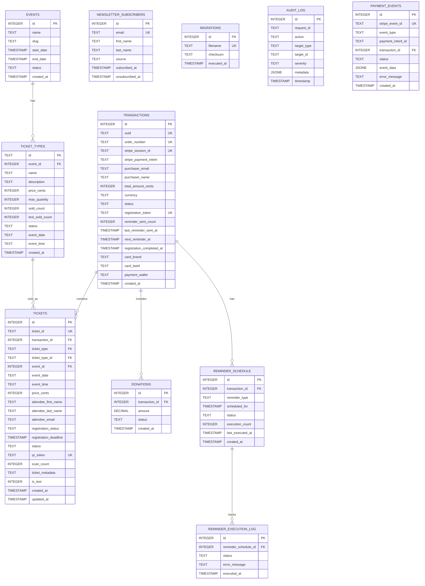

# Architecture Diagrams

Visual system architecture documentation for A Lo Cubano Boulder Fest.

## Table of Contents

1. [System Architecture Overview](#system-architecture-overview)
2. [Payment Flow Diagram](#payment-flow-diagram)
3. [Ticket Lifecycle Diagram](#ticket-lifecycle-diagram)
4. [Database Schema (ERD)](#database-schema-erd)
5. [Authentication Flows](#authentication-flows)
6. [Service Layer Architecture](#service-layer-architecture)
7. [Theme System Architecture](#theme-system-architecture)

## System Architecture Overview


**Key Architectural Decisions:**

- **Serverless-First**: All backend logic runs on Vercel serverless functions
- **Vanilla JavaScript**: Zero framework dependencies on frontend
- **Async Singleton Pattern**: All services use Promise-based lazy initialization
- **Direct Database Access**: Services use `getDatabaseClient()` for consistency
- **Edge Caching**: Static assets served via Vercel CDN
- **Progressive Enhancement**: Service Worker for offline capabilities

## Payment Flow Diagram


**Payment Flow Key Points:**

1. **Idempotency**: `createOrRetrieveTickets()` handles webhook retries safely
2. **Metadata Validation**: Stripe metadata validated against database state (security)
3. **Atomic Operations**: Batch database operations ensure consistency
4. **Payment Method Tracking**: Card details stored for receipts
5. **Dual Processing**: Both webhook and checkout-success use same service
6. **Reservation Fulfillment**: Temporary reservations converted to tickets
7. **Registration Deadlines**: Calculated based on event timing (7 days before, with fallbacks)

## Ticket Lifecycle Diagram


**Ticket Status Fields:**

- **status** (User-facing):
  - `valid`: Ticket active and usable
  - `flagged_for_review`: Validation failed (security)
  - `used`: Event completed
  - `cancelled`: Refunded
  - `transferred`: Ownership changed

- **registration_status** (Internal):
  - `pending`: Awaiting registration
  - `completed`: Registration finished
  - `overdue`: Deadline passed

**Key Lifecycle Events:**

1. **Purchase → Pending**: Webhook creates tickets with registration deadline
2. **Registration**: User completes attendee information (name, email, dietary needs)
3. **Reminders**: Automated emails at 1hr, 24hr, 72hr, 7 days before event
4. **Activation**: Tickets become active as event date approaches
5. **Wallet Pass Generation**: Apple/Google wallet passes with QR codes
6. **QR Validation**: Entry scanning with JWT verification
7. **Completion**: Ticket marked as used after event

## Database Schema (ERD)



**Schema Design Principles:**

1. **Normalization**: 3NF compliance for data integrity
2. **UUIDs for External IDs**: Transactions use UUID for public references
3. **Cents Storage**: All prices stored as integers to avoid floating point issues
4. **Status Tracking**: Comprehensive status fields for workflow management
5. **JSONB Metadata**: Flexible metadata storage for extensibility
6. **Audit Trail**: Complete audit logging for compliance
7. **Idempotency**: Unique constraints prevent duplicate processing

**Critical Indexes:**

- `transactions.stripe_session_id` (UNIQUE)
- `transactions.order_number` (UNIQUE)
- `transactions.registration_token` (UNIQUE)
- `tickets.ticket_id` (UNIQUE)
- `tickets.qr_token` (UNIQUE)
- `tickets.transaction_id` (FK index)
- `reminder_schedule.transaction_id, scheduled_for` (Cron query optimization)

## Authentication Flows

### Admin Authentication


### QR Code Authentication


### Wallet Pass Authentication


**Authentication Security Features:**

1. **Admin**: bcrypt password hashing + JWT sessions (24h)
2. **QR Codes**: JWT tokens with ticket ID + expiry
3. **Wallet Passes**: Separate JWT tokens for pass generation
4. **Registration Tokens**: UUID-based tokens for batch registration
5. **Audit Logging**: All authentication attempts logged
6. **Rate Limiting**: Protection against brute force attacks

## Service Layer Architecture


**Promise-Based Lazy Singleton Pattern:**

```javascript
class AsyncService {
  constructor() {
    this.instance = null;
    this.initialized = false;
    this.initializationPromise = null;
  }

  async ensureInitialized() {
    // Fast path: already initialized
    if (this.initialized && this.instance) {
      return this.instance;
    }

    // Wait for in-progress initialization
    if (this.initializationPromise) {
      return this.initializationPromise;
    }

    // Start new initialization
    this.initializationPromise = this._performInitialization();

    try {
      return await this.initializationPromise;
    } catch (error) {
      this.initializationPromise = null; // Enable retry
      throw error;
    }
  }
}
```

**Service Layer Benefits:**

1. **Race Condition Prevention**: Single initialization per service
2. **Connection Pooling**: Reuses database connections
3. **Error Recovery**: Failed initializations can retry
4. **Serverless Optimization**: Connection recycling for Vercel
5. **Testability**: Services can be mocked and reset
6. **Observability**: Centralized logging and monitoring

## Theme System Architecture


**Theme System Features:**

1. **Hybrid Approach**: Admin always dark, main site user-controlled
2. **FOUC Prevention**: Synchronous theme application on load
3. **Performance Caching**: DOM references and storage cached
4. **System Integration**: Respects OS dark mode preference
5. **Accessibility**: ARIA attributes and keyboard support
6. **Component Integration**: Custom events for theme changes

**CSS Variable System:**

```css
:root {
  /* Light theme (default) */
  --color-text-primary: #1a1a1a;
  --color-background: #ffffff;
  --color-blue: #5b6bb5;
}

[data-theme="dark"] {
  /* Dark theme overrides */
  --color-text-primary: #e5e5e5;
  --color-background: #0a0a0a;
  --color-blue: #7a8fd5;
}
```

**Performance Metrics:**

- Theme application: < 5ms (synchronous)
- Storage access: Cached for 100ms
- Theme toggle: < 20ms (RAF batching)
- System change detection: Event-driven (no polling)

## Data Flow Patterns

### Cart to Checkout Flow

```mermaid
graph LR
    subgraph "Client State"
        Cart[Cart Manager<br/>localStorage]
        CartState[Cart State<br/>{tickets, donations, totals}]
    end

    subgraph "Checkout Process"
        Selector[Payment Selector]
        CreateSession[Create Checkout API]
        Stripe[Stripe Checkout]
    end

    subgraph "Server Processing"
        Webhook[Stripe Webhook]
        TicketCreation[Ticket Creation Service]
        Database[(Database)]
    end

    Cart --> CartState
    CartState -->|User clicks checkout| Selector
    Selector -->|User selects payment| CreateSession
    CreateSession -->|Create session with metadata| Stripe
    Stripe -->|User completes payment| Webhook
    Webhook -->|Verify & process| TicketCreation
    TicketCreation -->|Atomic operations| Database
    Database -->|Confirmation email| User[User Email]
```

### Gallery Virtual Scrolling

```mermaid
graph TB
    subgraph "Frontend"
        Viewport[Visible Viewport]
        VirtualList[Virtual List Manager]
        IO[Intersection Observer]
    end

    subgraph "API Layer"
        GalleryAPI[/api/gallery]
        Cache[HTTP Cache 24h]
    end

    subgraph "Backend"
        DriveService[Google Drive Service]
        Drive[Google Drive API]
    end

    Viewport --> IO
    IO -->|Items entering viewport| VirtualList
    VirtualList -->|Load more| GalleryAPI
    GalleryAPI --> Cache
    Cache -->|Cache miss| DriveService
    DriveService -->|Fetch images| Drive
    Drive -->|Image metadata| DriveService
    DriveService -->|Cached response| GalleryAPI
    GalleryAPI -->|Images batch| VirtualList
    VirtualList -->|Render visible items| Viewport
```

**Virtual Scrolling Performance:**

- Render only visible items (20-30 at a time)
- Intersection Observer for lazy loading
- Progressive image loading (AVIF → WebP → JPEG)
- Google Drive CDN for image delivery
- 24-hour HTTP cache for metadata
- 1000+ images with smooth scrolling

## Notes on Architecture

**Why Vanilla JavaScript?**

- Zero framework overhead (faster load times)
- Direct browser API access (Service Worker, Intersection Observer)
- Simpler deployment (no build tools for frontend)
- Long-term stability (no framework version migrations)
- Smaller bundle size (critical for mobile)

**Why Serverless?**

- Auto-scaling for ticket sales spikes
- Pay-per-execution pricing
- Zero DevOps maintenance
- Global edge network (Vercel)
- Instant deployments

**Why Turso (LibSQL)?**

- SQLite compatibility (local development)
- Edge replication (low latency)
- Built-in connection pooling
- Cost-effective for read-heavy workloads
- Full SQL feature set

**Security Considerations:**

- Stripe metadata validation against database
- JWT authentication for QR codes and wallets
- bcrypt password hashing for admin
- HMAC signature validation for webhooks
- Parameterized queries (SQL injection prevention)
- Rate limiting on all public endpoints
- Comprehensive audit logging
