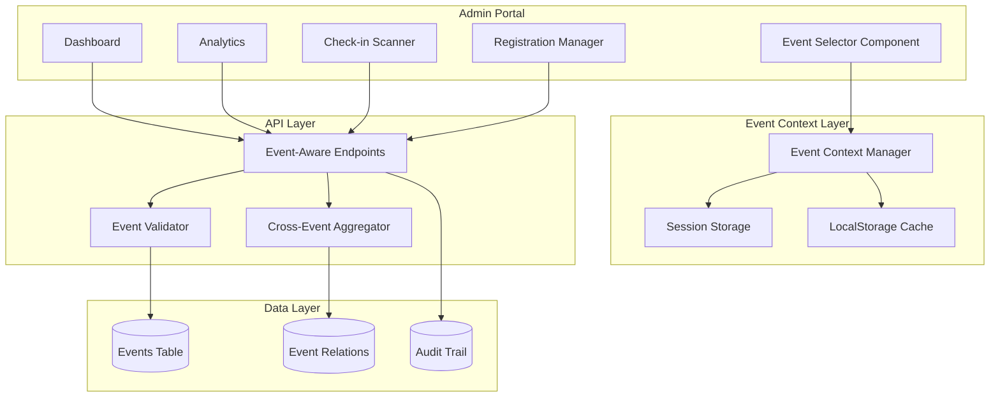
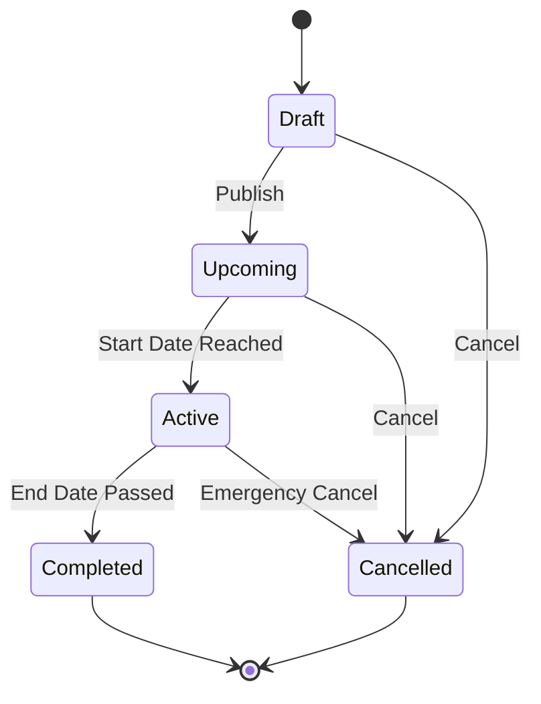

# Multi-Event Architecture Design

## Executive Summary

This document outlines the comprehensive architecture for transforming the A Lo Cubano Boulder Fest admin portal from a single-event system to a multi-event platform supporting multiple festival types across different years. The design enables managing Weekender events (smaller throughout the year) and the main annual festival, with complete event isolation and comparison capabilities.

## System Context

### Business Context

- **Current State**: Single global event system with no event differentiation
- **Target State**: Multi-event platform supporting various festival types and years
- **Key Drivers**: Business expansion to host multiple events per year
- **Success Metrics**: Event isolation, cross-event analytics, scalable to 50+ events

### Technical Context

- **Database**: SQLite (dev) / Turso (production)
- **Backend**: Vercel serverless functions
- **Frontend**: Vanilla JavaScript with ES6 modules
- **Auth**: JWT-based admin authentication

## Architecture Overview

### High-Level Architecture



## Detailed Design

### Database Schema Changes

```sql
-- Core Events Table
CREATE TABLE events (
    id INTEGER PRIMARY KEY AUTOINCREMENT,
    slug TEXT NOT NULL UNIQUE,
    name TEXT NOT NULL,
    type TEXT NOT NULL CHECK(type IN ('festival', 'weekender', 'workshop', 'special')),
    status TEXT NOT NULL DEFAULT 'draft' CHECK(status IN ('draft', 'upcoming', 'active', 'completed', 'cancelled')),
    
    -- Event Details
    description TEXT,
    venue_name TEXT,
    venue_address TEXT,
    venue_city TEXT DEFAULT 'Boulder',
    venue_state TEXT DEFAULT 'CO',
    venue_zip TEXT,
    
    -- Event Dates
    start_date DATE NOT NULL,
    end_date DATE NOT NULL,
    year INTEGER GENERATED ALWAYS AS (CAST(strftime('%Y', start_date) AS INTEGER)) STORED,
    
    -- Capacity and Pricing
    max_capacity INTEGER,
    early_bird_end_date DATE,
    regular_price_start_date DATE,
    
    -- Display and Ordering
    display_order INTEGER DEFAULT 0,
    is_featured BOOLEAN DEFAULT FALSE,
    is_visible BOOLEAN DEFAULT TRUE,
    
    -- Metadata
    created_at DATETIME DEFAULT CURRENT_TIMESTAMP,
    updated_at DATETIME DEFAULT CURRENT_TIMESTAMP,
    created_by TEXT,
    
    -- Configuration
    config JSON, -- Flexible event-specific settings
    
    -- Indexes for performance
    INDEX idx_events_slug (slug),
    INDEX idx_events_type (type),
    INDEX idx_events_year (year),
    INDEX idx_events_status (status),
    INDEX idx_events_dates (start_date, end_date)
);

-- Event Settings Table (Key-Value Store)
CREATE TABLE event_settings (
    id INTEGER PRIMARY KEY AUTOINCREMENT,
    event_id INTEGER NOT NULL REFERENCES events(id) ON DELETE CASCADE,
    key TEXT NOT NULL,
    value TEXT,
    created_at DATETIME DEFAULT CURRENT_TIMESTAMP,
    updated_at DATETIME DEFAULT CURRENT_TIMESTAMP,
    UNIQUE(event_id, key),
    INDEX idx_event_settings_lookup (event_id, key)
);

-- Update Tickets Table
ALTER TABLE tickets ADD COLUMN event_id INTEGER REFERENCES events(id);
CREATE INDEX idx_tickets_event ON tickets(event_id);

-- Update Transactions Table  
ALTER TABLE transactions ADD COLUMN event_id INTEGER REFERENCES events(id);
CREATE INDEX idx_transactions_event ON transactions(event_id);

-- Update Newsletter Subscribers
ALTER TABLE newsletter_subscribers ADD COLUMN event_id INTEGER REFERENCES events(id);
CREATE INDEX idx_newsletter_event ON newsletter_subscribers(event_id);

-- Event Access Control
CREATE TABLE event_access (
    id INTEGER PRIMARY KEY AUTOINCREMENT,
    event_id INTEGER NOT NULL REFERENCES events(id) ON DELETE CASCADE,
    user_email TEXT NOT NULL,
    role TEXT DEFAULT 'viewer' CHECK(role IN ('viewer', 'manager', 'admin')),
    granted_at DATETIME DEFAULT CURRENT_TIMESTAMP,
    granted_by TEXT,
    UNIQUE(event_id, user_email),
    INDEX idx_event_access_user (user_email),
    INDEX idx_event_access_event (event_id)
);

-- Event Audit Log
CREATE TABLE event_audit_log (
    id INTEGER PRIMARY KEY AUTOINCREMENT,
    event_id INTEGER REFERENCES events(id),
    action TEXT NOT NULL,
    entity_type TEXT,
    entity_id TEXT,
    user_email TEXT,
    ip_address TEXT,
    user_agent TEXT,
    details JSON,
    created_at DATETIME DEFAULT CURRENT_TIMESTAMP,
    INDEX idx_audit_event (event_id),
    INDEX idx_audit_user (user_email),
    INDEX idx_audit_created (created_at)
);
```

### API Endpoint Modifications

#### Event Management Endpoints

```javascript
// GET /api/events - List all events
{
  query: {
    type?: 'festival' | 'weekender' | 'workshop' | 'special',
    year?: number,
    status?: 'draft' | 'upcoming' | 'active' | 'completed' | 'cancelled',
    include_hidden?: boolean
  },
  response: {
    events: Event[],
    current_event_id: number,
    total: number
  }
}

// GET /api/events/:eventId - Get specific event
{
  params: { eventId: string },
  response: Event
}

// POST /api/events - Create new event (admin only)
{
  body: {
    name: string,
    type: string,
    start_date: string,
    end_date: string,
    venue_name: string,
    max_capacity?: number
  },
  response: Event
}

// PUT /api/events/:eventId - Update event
{
  params: { eventId: string },
  body: Partial<Event>,
  response: Event
}

// POST /api/events/:eventId/duplicate - Clone event
{
  params: { eventId: string },
  body: {
    name: string,
    start_date: string,
    end_date: string
  },
  response: Event
}
```

#### Event-Filtered Endpoints

All existing endpoints will support event filtering:

```javascript
// Modified endpoint signatures
GET /api/admin/dashboard?event_id=123
GET /api/admin/registrations?event_id=123
GET /api/admin/analytics?event_id=123&compare_with=456
GET /api/tickets/validate?event_id=123

// Headers for event context
X-Event-ID: 123
X-Event-Slug: boulderfest-2026

// Response headers
X-Event-Name: A Lo Cubano Boulder Fest 2026
X-Event-Type: festival
```

### Event Context Management

```javascript
// EventContextManager.js
class EventContextManager {
  constructor() {
    this.currentEvent = null;
    this.availableEvents = [];
    this.storage = window.localStorage;
    this.session = window.sessionStorage;
    this.STORAGE_KEY = 'admin_current_event';
    this.CACHE_KEY = 'admin_events_cache';
    this.CACHE_TTL = 5 * 60 * 1000; // 5 minutes
  }

  async initialize() {
    // Load cached events
    const cached = this.loadCachedEvents();
    if (cached && !this.isCacheExpired(cached)) {
      this.availableEvents = cached.events;
    } else {
      await this.fetchEvents();
    }

    // Restore last selected event or use default
    const savedEventId = this.storage.getItem(this.STORAGE_KEY);
    if (savedEventId) {
      await this.selectEvent(savedEventId);
    } else {
      await this.selectDefaultEvent();
    }
  }

  async fetchEvents() {
    const response = await fetch('/api/events', {
      headers: { 'Authorization': `Bearer ${this.getAuthToken()}` }
    });
    
    const data = await response.json();
    this.availableEvents = data.events;
    
    // Cache events
    this.storage.setItem(this.CACHE_KEY, JSON.stringify({
      events: data.events,
      timestamp: Date.now()
    }));
    
    return data.events;
  }

  async selectEvent(eventId) {
    const event = this.availableEvents.find(e => e.id === eventId);
    if (!event) {
      throw new Error(`Event ${eventId} not found`);
    }

    this.currentEvent = event;
    this.storage.setItem(this.STORAGE_KEY, eventId);
    
    // Emit event change
    window.dispatchEvent(new CustomEvent('eventChanged', {
      detail: { event, previousEvent: this.currentEvent }
    }));
    
    // Update all API calls to include event context
    this.injectEventContext();
    
    return event;
  }

  async selectDefaultEvent() {
    // Priority: Active > Upcoming > Most Recent
    const active = this.availableEvents.find(e => e.status === 'active');
    const upcoming = this.availableEvents.find(e => e.status === 'upcoming');
    const mostRecent = this.availableEvents.sort((a, b) => 
      new Date(b.start_date) - new Date(a.start_date)
    )[0];
    
    const defaultEvent = active || upcoming || mostRecent;
    if (defaultEvent) {
      await this.selectEvent(defaultEvent.id);
    }
  }

  injectEventContext() {
    // Intercept all fetch calls to add event context
    const originalFetch = window.fetch;
    window.fetch = async (url, options = {}) => {
      if (this.currentEvent && url.startsWith('/api/')) {
        // Add event_id to query params
        const urlObj = new URL(url, window.location.origin);
        if (!urlObj.searchParams.has('event_id')) {
          urlObj.searchParams.set('event_id', this.currentEvent.id);
        }
        
        // Add event headers
        options.headers = {
          ...options.headers,
          'X-Event-ID': this.currentEvent.id,
          'X-Event-Slug': this.currentEvent.slug
        };
        
        return originalFetch(urlObj.toString(), options);
      }
      return originalFetch(url, options);
    };
  }

  getCurrentEvent() {
    return this.currentEvent;
  }

  getAvailableEvents() {
    return this.availableEvents;
  }

  clearEventContext() {
    this.currentEvent = null;
    this.storage.removeItem(this.STORAGE_KEY);
    this.storage.removeItem(this.CACHE_KEY);
  }

  loadCachedEvents() {
    const cached = this.storage.getItem(this.CACHE_KEY);
    return cached ? JSON.parse(cached) : null;
  }

  isCacheExpired(cache) {
    return Date.now() - cache.timestamp > this.CACHE_TTL;
  }

  getAuthToken() {
    return this.storage.getItem('admin_token');
  }
}

export default new EventContextManager();
```

### UI Component Design

```javascript
// EventSelector.js
class EventSelector {
  constructor() {
    this.container = null;
    this.contextManager = null;
  }

  async render(containerId) {
    this.container = document.getElementById(containerId);
    this.contextManager = await import('./EventContextManager.js').then(m => m.default);
    
    await this.contextManager.initialize();
    this.buildUI();
    this.attachEventListeners();
  }

  buildUI() {
    const events = this.contextManager.getAvailableEvents();
    const currentEvent = this.contextManager.getCurrentEvent();
    
    this.container.innerHTML = `
      <div class="event-selector">
        <div class="event-selector-current">
          <label class="event-selector-label">Current Event</label>
          <div class="event-selector-display">
            <span class="event-name">${currentEvent?.name || 'Select Event'}</span>
            <span class="event-type">${currentEvent?.type || ''}</span>
            <span class="event-dates">
              ${currentEvent ? this.formatDateRange(currentEvent) : ''}
            </span>
          </div>
        </div>
        
        <div class="event-selector-dropdown">
          <button class="event-selector-trigger" aria-expanded="false">
            <span>Change Event</span>
            <svg class="event-selector-icon"><!-- Chevron icon --></svg>
          </button>
          
          <div class="event-selector-menu" hidden>
            <div class="event-selector-search">
              <input 
                type="text" 
                placeholder="Search events..." 
                class="event-search-input"
              />
            </div>
            
            <div class="event-selector-groups">
              ${this.renderEventGroups(events)}
            </div>
            
            <div class="event-selector-actions">
              <button class="btn-create-event">+ New Event</button>
              <button class="btn-compare-events">Compare Events</button>
            </div>
          </div>
        </div>
        
        <div class="event-selector-stats">
          <span class="event-stat">
            <strong>${currentEvent?.ticket_count || 0}</strong> tickets
          </span>
          <span class="event-stat">
            <strong>${currentEvent?.revenue || 0}</strong> revenue
          </span>
        </div>
      </div>
    `;
  }

  renderEventGroups(events) {
    // Group events by year and type
    const grouped = events.reduce((acc, event) => {
      const year = new Date(event.start_date).getFullYear();
      if (!acc[year]) acc[year] = [];
      acc[year].push(event);
      return acc;
    }, {});

    return Object.entries(grouped)
      .sort(([a], [b]) => b - a) // Sort years descending
      .map(([year, yearEvents]) => `
        <div class="event-group">
          <h4 class="event-group-title">${year}</h4>
          <ul class="event-list">
            ${yearEvents.map(event => `
              <li class="event-item" data-event-id="${event.id}">
                <div class="event-item-content">
                  <span class="event-item-name">${event.name}</span>
                  <span class="event-item-badge ${event.status}">
                    ${event.status}
                  </span>
                </div>
                <div class="event-item-meta">
                  <span class="event-item-type">${event.type}</span>
                  <span class="event-item-dates">
                    ${this.formatDateRange(event)}
                  </span>
                </div>
              </li>
            `).join('')}
          </ul>
        </div>
      `).join('');
  }

  attachEventListeners() {
    // Toggle dropdown
    const trigger = this.container.querySelector('.event-selector-trigger');
    const menu = this.container.querySelector('.event-selector-menu');
    
    trigger.addEventListener('click', () => {
      const isOpen = trigger.getAttribute('aria-expanded') === 'true';
      trigger.setAttribute('aria-expanded', !isOpen);
      menu.hidden = isOpen;
    });

    // Event selection
    this.container.addEventListener('click', async (e) => {
      const eventItem = e.target.closest('.event-item');
      if (eventItem) {
        const eventId = parseInt(eventItem.dataset.eventId);
        await this.contextManager.selectEvent(eventId);
        this.buildUI(); // Rebuild to show new selection
        window.location.reload(); // Reload to fetch new event data
      }
    });

    // Search functionality
    const searchInput = this.container.querySelector('.event-search-input');
    searchInput?.addEventListener('input', (e) => {
      this.filterEvents(e.target.value);
    });

    // Close dropdown when clicking outside
    document.addEventListener('click', (e) => {
      if (!this.container.contains(e.target)) {
        trigger.setAttribute('aria-expanded', 'false');
        menu.hidden = true;
      }
    });

    // Listen for event changes from other sources
    window.addEventListener('eventChanged', (e) => {
      this.buildUI();
    });
  }

  filterEvents(searchTerm) {
    const items = this.container.querySelectorAll('.event-item');
    const term = searchTerm.toLowerCase();
    
    items.forEach(item => {
      const name = item.querySelector('.event-item-name').textContent.toLowerCase();
      const type = item.querySelector('.event-item-type').textContent.toLowerCase();
      const visible = name.includes(term) || type.includes(term);
      item.style.display = visible ? '' : 'none';
    });

    // Hide empty groups
    const groups = this.container.querySelectorAll('.event-group');
    groups.forEach(group => {
      const visibleItems = group.querySelectorAll('.event-item:not([style*="none"])');
      group.style.display = visibleItems.length > 0 ? '' : 'none';
    });
  }

  formatDateRange(event) {
    const start = new Date(event.start_date);
    const end = new Date(event.end_date);
    const formatter = new Intl.DateTimeFormat('en-US', { 
      month: 'short', 
      day: 'numeric' 
    });
    
    if (start.getTime() === end.getTime()) {
      return formatter.format(start);
    }
    
    return `${formatter.format(start)} - ${formatter.format(end)}`;
  }
}

export default EventSelector;
```

### CSS Styles for Event Selector

```css
/* Event Selector Component */
.event-selector {
  display: flex;
  align-items: center;
  gap: 1.5rem;
  padding: 1rem;
  background: var(--admin-bg-secondary);
  border-radius: 0.5rem;
  margin-bottom: 2rem;
}

.event-selector-current {
  flex: 1;
}

.event-selector-label {
  display: block;
  font-size: 0.875rem;
  color: var(--admin-text-secondary);
  margin-bottom: 0.25rem;
}

.event-selector-display {
  display: flex;
  align-items: baseline;
  gap: 1rem;
}

.event-name {
  font-size: 1.25rem;
  font-weight: 600;
  color: var(--admin-text-primary);
}

.event-type {
  padding: 0.125rem 0.5rem;
  background: var(--admin-accent-primary);
  color: white;
  border-radius: 0.25rem;
  font-size: 0.75rem;
  text-transform: uppercase;
}

.event-dates {
  color: var(--admin-text-secondary);
  font-size: 0.875rem;
}

.event-selector-dropdown {
  position: relative;
}

.event-selector-trigger {
  display: flex;
  align-items: center;
  gap: 0.5rem;
  padding: 0.5rem 1rem;
  background: var(--admin-bg-primary);
  border: 1px solid var(--admin-border);
  border-radius: 0.375rem;
  color: var(--admin-text-primary);
  cursor: pointer;
  transition: all 0.2s;
}

.event-selector-trigger:hover {
  background: var(--admin-bg-hover);
  border-color: var(--admin-accent-primary);
}

.event-selector-menu {
  position: absolute;
  top: 100%;
  right: 0;
  margin-top: 0.5rem;
  width: 320px;
  background: var(--admin-bg-primary);
  border: 1px solid var(--admin-border);
  border-radius: 0.5rem;
  box-shadow: 0 10px 25px rgba(0, 0, 0, 0.3);
  z-index: 1000;
  max-height: 500px;
  overflow-y: auto;
}

.event-selector-search {
  padding: 1rem;
  border-bottom: 1px solid var(--admin-border);
}

.event-search-input {
  width: 100%;
  padding: 0.5rem;
  background: var(--admin-bg-secondary);
  border: 1px solid var(--admin-border);
  border-radius: 0.375rem;
  color: var(--admin-text-primary);
}

.event-selector-groups {
  max-height: 300px;
  overflow-y: auto;
}

.event-group {
  padding: 0.75rem 1rem;
  border-bottom: 1px solid var(--admin-border);
}

.event-group:last-child {
  border-bottom: none;
}

.event-group-title {
  font-size: 0.75rem;
  font-weight: 600;
  color: var(--admin-text-secondary);
  text-transform: uppercase;
  margin-bottom: 0.5rem;
}

.event-list {
  list-style: none;
  padding: 0;
  margin: 0;
}

.event-item {
  padding: 0.5rem;
  margin: 0 -0.5rem;
  cursor: pointer;
  border-radius: 0.375rem;
  transition: background 0.2s;
}

.event-item:hover {
  background: var(--admin-bg-hover);
}

.event-item-content {
  display: flex;
  align-items: center;
  justify-content: space-between;
  margin-bottom: 0.25rem;
}

.event-item-name {
  font-weight: 500;
  color: var(--admin-text-primary);
}

.event-item-badge {
  padding: 0.125rem 0.375rem;
  border-radius: 0.25rem;
  font-size: 0.625rem;
  text-transform: uppercase;
  font-weight: 600;
}

.event-item-badge.active {
  background: var(--admin-success);
  color: white;
}

.event-item-badge.upcoming {
  background: var(--admin-info);
  color: white;
}

.event-item-badge.completed {
  background: var(--admin-text-secondary);
  color: white;
}

.event-item-badge.draft {
  background: var(--admin-warning);
  color: var(--admin-text-primary);
}

.event-item-meta {
  display: flex;
  gap: 1rem;
  font-size: 0.75rem;
  color: var(--admin-text-secondary);
}

.event-selector-actions {
  padding: 1rem;
  border-top: 1px solid var(--admin-border);
  display: flex;
  gap: 0.5rem;
}

.event-selector-actions button {
  flex: 1;
  padding: 0.5rem;
  border-radius: 0.375rem;
  font-size: 0.875rem;
  cursor: pointer;
  transition: all 0.2s;
}

.btn-create-event {
  background: var(--admin-accent-primary);
  color: white;
  border: none;
}

.btn-compare-events {
  background: transparent;
  color: var(--admin-accent-primary);
  border: 1px solid var(--admin-accent-primary);
}

.event-selector-stats {
  display: flex;
  gap: 1.5rem;
}

.event-stat {
  display: flex;
  flex-direction: column;
  align-items: center;
  padding: 0.5rem 1rem;
  background: var(--admin-bg-primary);
  border-radius: 0.375rem;
}

.event-stat strong {
  font-size: 1.25rem;
  color: var(--admin-accent-primary);
}
```

## Implementation Roadmap

### Phase 1: Foundation (Week 1-2)

- [ ] Create database migration for events table
- [ ] Implement event management API endpoints
- [ ] Build EventContextManager class
- [ ] Add event_id to existing tables
- [ ] Create event selector UI component

### Phase 2: Integration (Week 3-4)

- [ ] Update all admin API endpoints for event filtering
- [ ] Integrate event selector into admin pages
- [ ] Implement event context persistence
- [ ] Add event switching functionality
- [ ] Update dashboard statistics for per-event data

### Phase 3: Enhancement (Week 5-6)

- [ ] Add cross-event comparison views
- [ ] Implement event cloning functionality
- [ ] Build event access control system
- [ ] Create audit logging for event actions
- [ ] Add bulk operations across events

### Phase 4: Optimization (Week 7-8)

- [ ] Performance tuning for multi-event queries
- [ ] Implement event data caching
- [ ] Add event archival functionality
- [ ] Create event migration tools
- [ ] Build comprehensive event analytics

## Migration Strategy

### Step 1: Database Migration

```sql
-- Migration: Add events table and migrate existing data
BEGIN TRANSACTION;

-- Create events table
CREATE TABLE events (...);

-- Create default event for existing data
INSERT INTO events (
  slug, name, type, status, start_date, end_date, venue_name
) VALUES (
  'boulderfest-2026',
  'A Lo Cubano Boulder Fest 2026',
  'festival',
  'upcoming',
  '2026-05-15',
  '2026-05-17',
  'Avalon Ballroom'
);

-- Get the default event ID
SELECT @default_event_id := id FROM events WHERE slug = 'boulderfest-2026';

-- Add event_id columns
ALTER TABLE tickets ADD COLUMN event_id INTEGER;
ALTER TABLE transactions ADD COLUMN event_id INTEGER;
ALTER TABLE newsletter_subscribers ADD COLUMN event_id INTEGER;

-- Populate event_id with default event
UPDATE tickets SET event_id = @default_event_id;
UPDATE transactions SET event_id = @default_event_id;
UPDATE newsletter_subscribers SET event_id = @default_event_id;

-- Add foreign key constraints
ALTER TABLE tickets ADD CONSTRAINT fk_tickets_event 
  FOREIGN KEY (event_id) REFERENCES events(id);
  
ALTER TABLE transactions ADD CONSTRAINT fk_transactions_event 
  FOREIGN KEY (event_id) REFERENCES events(id);
  
ALTER TABLE newsletter_subscribers ADD CONSTRAINT fk_newsletter_event 
  FOREIGN KEY (event_id) REFERENCES events(id);

-- Create indexes
CREATE INDEX idx_tickets_event ON tickets(event_id);
CREATE INDEX idx_transactions_event ON transactions(event_id);
CREATE INDEX idx_newsletter_event ON newsletter_subscribers(event_id);

COMMIT;
```

### Step 2: API Backward Compatibility

```javascript
// Middleware to ensure backward compatibility
function ensureEventContext(req, res, next) {
  // If no event_id provided, use default current event
  if (!req.query.event_id && !req.headers['x-event-id']) {
    // Get current active event or most recent
    const defaultEvent = await getDefaultEvent();
    req.query.event_id = defaultEvent.id;
    req.eventContext = defaultEvent;
  } else {
    const eventId = req.query.event_id || req.headers['x-event-id'];
    req.eventContext = await getEvent(eventId);
  }
  
  next();
}
```

### Step 3: Gradual UI Migration

```javascript
// Feature flag for multi-event UI
const ENABLE_MULTI_EVENT = process.env.ENABLE_MULTI_EVENT === 'true';

if (ENABLE_MULTI_EVENT) {
  // Show event selector
  eventSelector.render('event-selector-container');
} else {
  // Hide selector, use default event
  eventContextManager.selectDefaultEvent();
}
```

## Non-Functional Requirements

### Performance

- Event switching: < 100ms
- Dashboard load with event filter: < 500ms
- Cross-event analytics: < 2s for 1 year of data
- Event search: < 50ms for 100+ events

### Scalability

- Support 50+ events per year
- Handle 10,000+ tickets per event
- Manage 100+ concurrent admin users
- Store 5+ years of historical data

### Security

- Event-level access control
- Audit trail for all event operations
- Data isolation between events
- Role-based permissions per event

### Usability

- Single-click event switching
- Persistent event selection
- Clear visual event context
- Keyboard navigation support

## Risk Assessment

| Risk | Impact | Probability | Mitigation |
|------|--------|-------------|------------|
| Data migration failure | High | Low | Comprehensive backup, rollback plan |
| Performance degradation | Medium | Medium | Query optimization, caching strategy |
| User confusion | Medium | Medium | Clear UI, training materials |
| API breaking changes | High | Low | Backward compatibility layer |
| Event data corruption | High | Low | Audit logs, validation rules |

## Testing Strategy

### Unit Tests

```javascript
describe('EventContextManager', () => {
  test('initializes with default event', async () => {
    const manager = new EventContextManager();
    await manager.initialize();
    expect(manager.getCurrentEvent()).toBeDefined();
  });

  test('persists event selection', async () => {
    const manager = new EventContextManager();
    await manager.selectEvent(123);
    expect(localStorage.getItem('admin_current_event')).toBe('123');
  });

  test('injects event context into API calls', async () => {
    const manager = new EventContextManager();
    await manager.selectEvent(123);
    
    const mockFetch = jest.fn();
    global.fetch = mockFetch;
    
    await fetch('/api/admin/dashboard');
    
    expect(mockFetch).toHaveBeenCalledWith(
      expect.stringContaining('event_id=123'),
      expect.objectContaining({
        headers: expect.objectContaining({
          'X-Event-ID': '123'
        })
      })
    );
  });
});
```

### Integration Tests

```javascript
describe('Multi-Event API', () => {
  test('filters data by event', async () => {
    const event1 = await createEvent({ name: 'Event 1' });
    const event2 = await createEvent({ name: 'Event 2' });
    
    await createTicket({ event_id: event1.id });
    await createTicket({ event_id: event2.id });
    
    const response1 = await fetch(`/api/admin/dashboard?event_id=${event1.id}`);
    const data1 = await response1.json();
    
    expect(data1.stats.total_tickets).toBe(1);
  });

  test('enforces event access control', async () => {
    const restrictedEvent = await createEvent({ name: 'Restricted' });
    
    const response = await fetch(`/api/admin/dashboard?event_id=${restrictedEvent.id}`, {
      headers: { 'Authorization': 'Bearer limited_user_token' }
    });
    
    expect(response.status).toBe(403);
  });
});
```

### E2E Tests

```javascript
describe('Event Selector E2E', () => {
  test('switches between events', async () => {
    await page.goto('/admin/dashboard');
    
    // Open event selector
    await page.click('.event-selector-trigger');
    
    // Select different event
    await page.click('[data-event-id="2"]');
    
    // Verify dashboard updates
    await page.waitForSelector('.dashboard-title:has-text("Weekender Event")');
    
    // Verify persistence on reload
    await page.reload();
    expect(await page.textContent('.event-name')).toBe('Weekender Event');
  });
});
```

## Success Metrics

- **Event Isolation**: 100% data separation between events
- **Performance**: No degradation vs single-event system
- **Adoption**: 90% of admins using event selector within 1 month
- **Accuracy**: Zero cross-event data leakage incidents
- **Efficiency**: 50% reduction in time to manage multiple events

## Appendix

### Event Configuration Schema

```json
{
  "event_config": {
    "ticket_types": [
      {
        "id": "full-pass",
        "name": "Full Festival Pass",
        "price_tiers": [
          { "name": "early_bird", "price": 75, "end_date": "2026-03-01" },
          { "name": "regular", "price": 95, "end_date": "2026-05-01" },
          { "name": "door", "price": 110 }
        ]
      }
    ],
    "features": {
      "workshops": true,
      "performances": true,
      "social_dancing": true,
      "live_music": false
    },
    "capacity_limits": {
      "total": 500,
      "vip": 50,
      "workshop": 100
    },
    "email_templates": {
      "confirmation": "festival_confirmation_2026",
      "reminder": "festival_reminder_2026"
    }
  }
}
```

### Event Status Transitions



### Database Query Examples

```sql
-- Get event statistics
SELECT 
  e.id,
  e.name,
  e.type,
  COUNT(DISTINCT t.id) as total_tickets,
  COUNT(DISTINCT t.transaction_id) as total_orders,
  SUM(t.price_cents) / 100.0 as total_revenue,
  COUNT(CASE WHEN t.checked_in_at IS NOT NULL THEN 1 END) as checked_in
FROM events e
LEFT JOIN tickets t ON e.id = t.event_id
WHERE e.id = ?
GROUP BY e.id;

-- Compare events
SELECT 
  e.name,
  e.type,
  e.year,
  COUNT(t.id) as tickets,
  SUM(t.price_cents) / 100.0 as revenue
FROM events e
LEFT JOIN tickets t ON e.id = t.event_id
WHERE e.id IN (?, ?, ?)
GROUP BY e.id
ORDER BY e.start_date DESC;

-- Event access check
SELECT 
  ea.role,
  ea.granted_at,
  e.name,
  e.status
FROM event_access ea
JOIN events e ON ea.event_id = e.id
WHERE ea.user_email = ? AND e.id = ?;
```

## References

- [Event Sourcing Pattern](https://docs.microsoft.com/en-us/azure/architecture/patterns/event-sourcing)
- [Multi-tenancy Architecture](https://docs.aws.amazon.com/wellarchitect/latest/saas-lens/multi-tenant-architecture.html)
- [Context Propagation in Microservices](https://www.nginx.com/blog/service-mesh-context-propagation/)