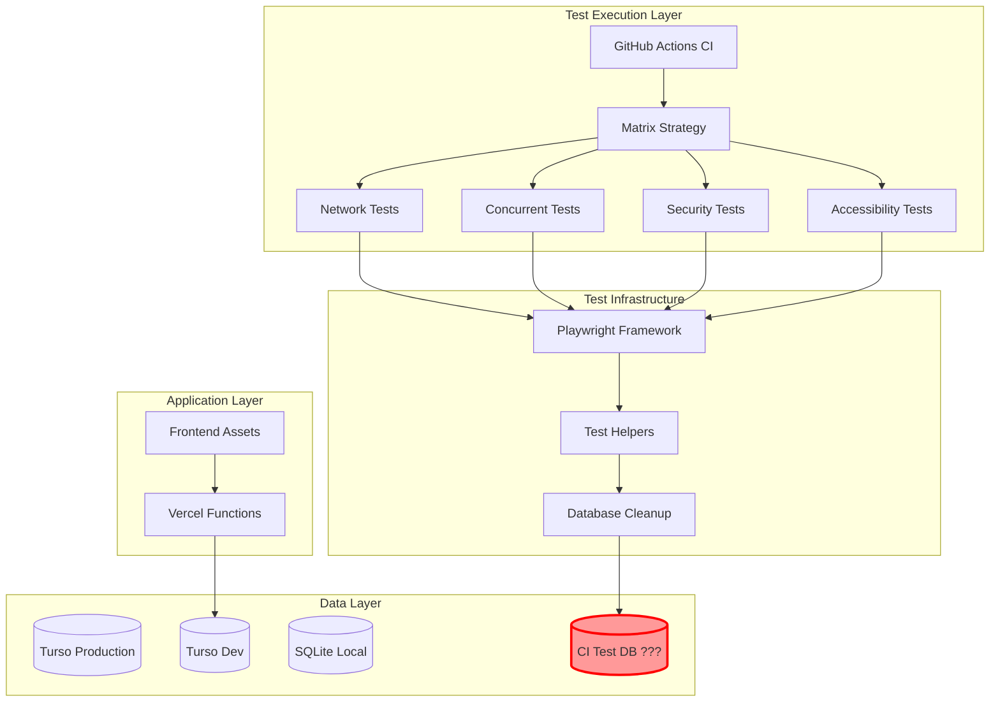
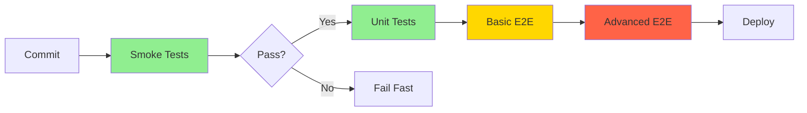

# Phase 4 Advanced E2E Testing Architecture Analysis

## Executive Summary

The Phase 4 Advanced E2E Testing implementation is experiencing CI/CD failures due to architectural misalignment between the test infrastructure expectations and the CI environment configuration. While the implementation is technically sound, there are critical gaps in database strategy, environment configuration, and test execution patterns that need addressing.

## System Context

### Business Context

- **Business Drivers**: Festival website reliability during high-traffic ticket sales periods
- **Key Stakeholders**: Development team, QA, Festival organizers, Ticket purchasers
- **Success Metrics**: 100% test pass rate in CI, <10 minute CI execution time, Zero production incidents

### Technical Context

- **Current State**: 38 advanced E2E test scenarios failing in CI due to database configuration issues
- **Technology Stack**: Playwright, Vitest, Turso/SQLite, GitHub Actions, Vercel
- **Integration Points**: Turso cloud database, Stripe API, Brevo email service, Google Drive API

## Architecture Overview

### High-Level Architecture



### Component Architecture

| Component | Current State | Issue | Recommendation |
|-----------|--------------|-------|----------------|
| CI Database | Missing | No E2E test database configured | Implement SQLite-based CI database |
| Test Data Isolation | Partial | Using dev Turso instance | Dedicated test instance per run |
| Module System | Mixed | ES modules with CommonJS deps | Standardize on ES modules |
| Environment Config | Incomplete | Missing E2E-specific vars in CI | GitHub Environment secrets |

## Detailed Design

### Root Cause Analysis

#### 1. Database Configuration Mismatch

```yaml
# Current (Failing)
env:
  TURSO_DATABASE_URL: ${{ secrets.TURSO_TEST_DATABASE_URL }}  # Not configured
  TURSO_AUTH_TOKEN: ${{ secrets.TURSO_TEST_AUTH_TOKEN }}      # Not configured

# Issue: Tests expect E2E_TURSO_* variables but CI provides TURSO_*
# Code expects: process.env.E2E_TURSO_DATABASE_URL
# CI provides: process.env.TURSO_DATABASE_URL
```

#### 2. Module System Conflicts

```javascript
// Original (Fixed)
const { createClient } = require('@libsql/client');  // CommonJS

// Fixed
import { createClient } from '@libsql/client';       // ES Module

// Remaining Issue: Mixed module systems in dependencies
```

#### 3. Environment Variable Gaps

```javascript
// Test expects
databaseUrl = process.env.TURSO_DATABASE_URL || 'file:data/test.db';

// But checks for E2E mode using different variables
if (!process.env.E2E_TEST_MODE) {
    throw new Error('E2E mode not enabled');
}
```

### Strategic Recommendations

#### 1. Hybrid Database Strategy

```yaml
# CI Database Configuration
database:
  strategy: "hybrid"
  
  local_tests:
    type: "sqlite"
    path: "file:./data/ci-test.db"
    isolation: "per-test-suite"
    cleanup: "automatic"
  
  integration_tests:
    type: "turso"
    instance: "dedicated-ci"
    url: "${{ secrets.CI_TURSO_DATABASE_URL }}"
    token: "${{ secrets.CI_TURSO_AUTH_TOKEN }}"
    
  fallback:
    enabled: true
    order: ["turso", "sqlite", "memory"]
```

#### 2. Staged Testing Approach



#### 3. Environment Configuration Matrix

| Environment | Database | Secrets Source | Test Scope |
|-------------|----------|---------------|------------|
| Local Dev | SQLite | .env.local | All tests |
| CI PR | SQLite | GitHub Secrets | Critical path |
| CI Main | Turso CI | GitHub Environment | Full suite |
| Staging | Turso Staging | Vercel Environment | Smoke tests |
| Production | Turso Prod | Vercel Environment | Health checks |

## Implementation Roadmap

### Phase 1: Immediate Fixes (Day 1)

```bash
# 1. Update GitHub workflow to use SQLite for CI
- name: Setup test environment
  run: |
    mkdir -p data
    touch data/ci-test.db
    echo "TURSO_DATABASE_URL=file:./data/ci-test.db" >> .env.local
    echo "E2E_TEST_MODE=true" >> .env.local

# 2. Add fallback in database-cleanup.js
this.databaseUrl = process.env.TURSO_DATABASE_URL || 
                   process.env.E2E_TURSO_DATABASE_URL || 
                   'file:data/test.db';

# 3. Configure GitHub Secrets (via UI)
TURSO_TEST_DATABASE_URL=libsql://ci-test-instance.turso.io
TURSO_TEST_AUTH_TOKEN=<generated-token>
```

### Phase 2: CI Optimization (Days 2-3)

```yaml
# Implement conditional test execution
jobs:
  determine-tests:
    outputs:
      run-advanced: ${{ steps.check.outputs.advanced }}
    steps:
      - id: check
        run: |
          if [[ "${{ github.ref }}" == "refs/heads/main" ]]; then
            echo "advanced=true" >> $GITHUB_OUTPUT
          else
            echo "advanced=false" >> $GITHUB_OUTPUT
          fi
  
  advanced-e2e-tests:
    if: needs.determine-tests.outputs.run-advanced == 'true'
    # ... rest of job
```

### Phase 3: Test Architecture Refactor (Week 2)

```javascript
// Implement test data factory with isolation
class TestEnvironment {
  constructor(config) {
    this.dbStrategy = config.database || 'sqlite';
    this.testRunId = `E2E_${Date.now()}_${process.pid}`;
    this.isolated = config.isolated !== false;
  }
  
  async setup() {
    if (this.dbStrategy === 'sqlite') {
      await this.setupSQLite();
    } else if (this.dbStrategy === 'turso') {
      await this.setupTurso();
    }
    await this.seedTestData();
  }
  
  async teardown() {
    if (this.isolated) {
      await this.cleanupByTestRunId(this.testRunId);
    }
  }
}
```

### Phase 4: Long-term Improvements (Month 2)

- Implement test result caching
- Add performance budgets for test execution
- Create test stability dashboard
- Implement automatic test retry with exponential backoff

## Risk Assessment

| Risk | Impact | Probability | Mitigation |
|------|--------|-------------|------------|
| Turso CI instance costs | Medium | High | Use SQLite for most tests, Turso only for integration |
| Test flakiness | High | Medium | Implement retry logic and better isolation |
| CI time exceeding 10 min | Medium | Medium | Parallel execution, test sharding |
| Database state corruption | High | Low | Automated backup before test runs |
| Secret exposure | High | Low | Use GitHub Environments, rotate regularly |

## Non-Functional Requirements

### Performance

- **Test Execution**: < 10 minutes for full suite
- **Parallel Execution**: 4 concurrent test suites
- **Database Operations**: < 100ms for cleanup operations

### Reliability

- **Test Stability**: > 99% pass rate (excluding legitimate failures)
- **Retry Logic**: Max 2 retries for network-related failures
- **Isolation**: Complete data isolation between test runs

### Security

- **Secrets Management**: GitHub Environments with approval for production
- **Database Access**: Read-only for most tests, write for specific scenarios
- **API Keys**: Separate test keys with limited scope

## Decision Points

### ADR-001: SQLite for CI Testing

**Status**: Proposed

**Context**: CI tests failing due to missing Turso credentials. Need reliable test database.

**Decision**: Use SQLite for all CI E2E tests, Turso only for staging validation.

**Consequences**:
- ✅ No external dependencies for CI
- ✅ Faster test execution
- ✅ Cost reduction
- ⚠️ Potential SQL dialect differences
- ❌ No distributed database testing

### ADR-002: Test Sharding Strategy

**Status**: Proposed

**Context**: 38 tests taking too long when run sequentially.

**Decision**: Shard tests by category with matrix strategy.

**Consequences**:
- ✅ Parallel execution
- ✅ Faster feedback
- ⚠️ Increased CI complexity
- ❌ Higher resource usage

## Validation Checklist

- [ ] SQLite database setup in CI
- [ ] Environment variables properly configured
- [ ] Test isolation verified
- [ ] Cleanup mechanisms working
- [ ] All 38 tests passing locally
- [ ] CI execution under 10 minutes
- [ ] No test data leakage between runs
- [ ] Proper error messages for configuration issues

## Immediate Action Items

1. **Configure GitHub Secrets** (Priority: CRITICAL)
   ```bash
   # Add to GitHub repository settings
   TURSO_TEST_DATABASE_URL=file:./data/ci-test.db
   TURSO_TEST_AUTH_TOKEN=not-needed-for-sqlite
   E2E_TEST_MODE=true
   ```

2. **Update database-cleanup.js** (Priority: HIGH)
   ```javascript
   // Add multiple fallback options
   const dbUrl = process.env.TURSO_DATABASE_URL || 
                 process.env.E2E_TURSO_DATABASE_URL ||
                 process.env.CI ? 'file:./data/ci-test.db' : 'file:data/test.db';
   ```

3. **Fix workflow environment setup** (Priority: HIGH)
   ```yaml
   - name: Setup test database
     run: |
       mkdir -p data
       npm run migrate:up -- --database=file:./data/ci-test.db
   ```

## Success Criteria

- ✅ All 38 advanced E2E tests passing in CI
- ✅ CI pipeline completing in < 10 minutes
- ✅ Zero flaky tests over 10 consecutive runs
- ✅ Test data properly isolated and cleaned up
- ✅ Clear documentation for adding new tests

## Conclusion

The Phase 4 E2E testing implementation is architecturally sound but requires tactical adjustments for CI/CD compatibility. The recommended hybrid database strategy with SQLite for CI and Turso for staging provides the optimal balance of reliability, performance, and cost. Immediate implementation of the Phase 1 fixes will unblock development, while the longer-term roadmap ensures scalability and maintainability.