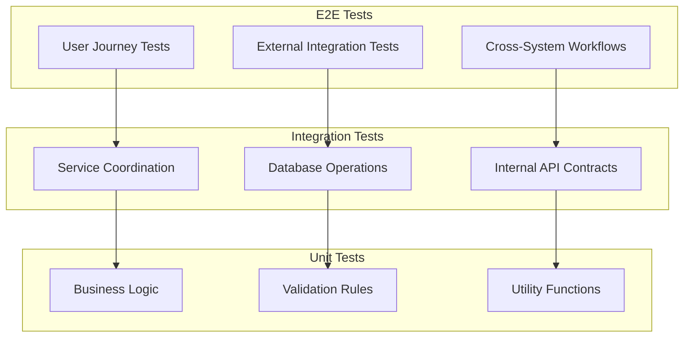

# Test Boundaries Architecture Document

## Executive Summary

This document defines the architectural boundaries between integration and E2E tests for the A Lo Cubano Boulder Fest system. It establishes clear principles for test scope determination and provides specific guidance for critical system components including QR token generation, Gallery API, security monitoring, and email webhook processing.

## System Context

### Business Context

- Event ticketing platform with real-time validation requirements
- Security-critical admin operations
- External service integrations (Stripe, Brevo, Google Drive)
- Mobile-first user experience with wallet pass support

### Technical Context

- Serverless architecture on Vercel
- SQLite database with Turso for production
- External API dependencies requiring careful test isolation
- JWT-based authentication and authorization

## Architecture Overview

### Test Strategy Layers



## Core Principles for Test Boundaries

### Integration Test Principles

1. **Mock External Services**: All third-party APIs should be mocked
2. **Real Database Operations**: Use test database for actual SQL execution
3. **Service Coordination**: Test interaction between internal services
4. **Fast Execution**: Should complete in seconds, not minutes
5. **Deterministic Results**: No dependency on external service availability

### E2E Test Principles

1. **Real User Journeys**: Complete workflows from user perspective
2. **External Services Active**: Use real or sandbox external services
3. **Production-like Environment**: Deploy to Vercel preview for testing
4. **Accept Slower Execution**: Network latency is acceptable
5. **Non-deterministic Acceptable**: May fail due to external factors

## Detailed Analysis by Component

### 1. QR Token Generation with JWT

#### Integration Test Scope

```javascript
// What to test in integration
describe('QR Token Service Integration', () => {
  test('should generate JWT with correct claims', async () => {
    // Test JWT generation logic with mocked time
    const token = await qrService.generateToken(ticketId);
    const decoded = jwt.verify(token, TEST_SECRET);
    expect(decoded.ticketId).toBe(ticketId);
    expect(decoded.exp).toBeGreaterThan(Date.now());
  });

  test('should store token in database', async () => {
    // Test database storage with test DB
    const token = await qrService.getOrCreateToken(ticketId);
    const result = await db.query('SELECT * FROM qr_tokens WHERE ticket_id = ?', [ticketId]);
    expect(result.rows[0].token).toBe(token);
  });

  test('should validate token format and expiry', async () => {
    // Test validation logic without external dependencies
    const expiredToken = generateExpiredToken();
    const result = await qrService.validateToken(expiredToken);
    expect(result.valid).toBe(false);
    expect(result.reason).toBe('TOKEN_EXPIRED');
  });
});
```

**Integration Test Coverage:**
- JWT generation and signing logic
- Token storage in database
- Token validation rules
- Expiry handling
- Database transaction integrity

#### E2E Test Scope

```javascript
// What to test in E2E
test('complete QR code validation flow', async ({ page }) => {
  // Test full journey from QR scan to check-in
  await page.goto('/admin/checkin');
  await page.fill('[data-testid="qr-input"]', validQRCode);
  await page.click('[data-testid="validate-btn"]');

  // Verify wallet pass generation
  await expect(page.locator('.wallet-pass-link')).toBeVisible();

  // Test actual QR code image generation
  const qrImage = await page.locator('.qr-code-image');
  await expect(qrImage).toHaveAttribute('src', /^data:image\/png/);
});
```

**E2E Test Coverage:**
- Complete check-in workflow
- QR code image rendering
- Wallet pass generation with real Apple/Google services
- Multi-device validation scenarios

### 2. Gallery API with Google Drive

#### Integration Test Scope

```javascript
// What to test in integration
describe('Gallery Service Integration', () => {
  test('should cache Google Drive responses', async () => {
    // Mock Google Drive API responses
    const mockDriveData = generateMockGalleryData();
    googleDriveMock.setResponse(mockDriveData);

    // Test caching logic
    const result1 = await galleryService.getPhotos();
    const result2 = await galleryService.getPhotos();
    expect(googleDriveMock.callCount).toBe(1); // Should use cache
  });

  test('should handle pagination correctly', async () => {
    // Test pagination logic with mocked data
    const page1 = await galleryService.getPhotos({ page: 1, limit: 20 });
    const page2 = await galleryService.getPhotos({ page: 2, limit: 20 });
    expect(page1.items).not.toEqual(page2.items);
  });

  test('should transform Drive data to gallery format', async () => {
    // Test data transformation logic
    const driveFile = createMockDriveFile();
    const galleryItem = galleryService.transformToGalleryItem(driveFile);
    expect(galleryItem).toHaveProperty('thumbnailUrl');
    expect(galleryItem).toHaveProperty('fullSizeUrl');
  });
});
```

**Integration Test Coverage:**
- Caching mechanisms
- Data transformation logic
- Pagination handling
- Error recovery strategies
- Database cache storage

#### E2E Test Scope

```javascript
// What to test in E2E
test('gallery browsing with real images', async ({ page }) => {
  await page.goto('/gallery');

  // Test lazy loading with real Google Drive images
  await page.evaluate(() => window.scrollTo(0, document.body.scrollHeight));
  await expect(page.locator('.gallery-item')).toHaveCount(greaterThan(20));

  // Test image optimization proxy
  const image = page.locator('.gallery-item img').first();
  await expect(image).toHaveAttribute('src', /\/api\/image-proxy/);

  // Verify Google Drive API health
  const response = await page.request.get('/api/google-drive-health');
  expect(response.ok()).toBeTruthy();
});
```

**E2E Test Coverage:**
- Real Google Drive API integration
- Image loading and optimization
- Virtual scrolling performance
- API rate limiting handling
- Network error resilience

### 3. Security Monitoring Coordination

#### Integration Test Scope

```javascript
// What to test in integration
describe('Security Monitoring Integration', () => {
  test('should coordinate between audit and alert services', async () => {
    // Test service coordination with mocked alerts
    const alertMock = jest.fn();
    securityService.setAlertHandler(alertMock);

    // Trigger suspicious activity
    await simulateFailedLogins(6);

    // Verify audit logs created
    const auditLogs = await auditService.getRecentLogs();
    expect(auditLogs).toHaveLength(6);

    // Verify alert service called
    expect(alertMock).toHaveBeenCalledWith({
      type: 'MULTIPLE_FAILED_LOGINS',
      severity: 'HIGH'
    });
  });

  test('should track session lifecycle', async () => {
    // Test session monitoring without external services
    const sessionId = await authService.createSession('admin');
    await authService.validateSession(sessionId);
    await authService.endSession(sessionId);

    const events = await auditService.getSessionEvents(sessionId);
    expect(events).toContainEqual(
      expect.objectContaining({ event_type: 'SESSION_CREATED' }),
      expect.objectContaining({ event_type: 'SESSION_VALIDATED' }),
      expect.objectContaining({ event_type: 'SESSION_ENDED' })
    );
  });
});
```

**Integration Test Coverage:**
- Service-to-service communication
- Audit log generation
- Alert triggering logic
- Session state management
- Rate limiting coordination

#### E2E Test Scope

```javascript
// What to test in E2E
test('security incident response flow', async ({ page, context }) => {
  // Test complete security workflow
  // Attempt multiple failed logins
  for (let i = 0; i < 5; i++) {
    await page.goto('/admin/login');
    await page.fill('[name="password"]', 'wrong-password');
    await page.click('[type="submit"]');
  }

  // Verify account lockout
  await expect(page.locator('.error-message')).toContainText('Account temporarily locked');

  // Check if security alert email was sent (via webhook)
  const webhookResponse = await page.request.get('/api/test/email-webhook-received');
  expect(webhookResponse.json()).toContainEqual(
    expect.objectContaining({
      subject: expect.stringContaining('Security Alert')
    })
  );
});
```

**E2E Test Coverage:**
- End-to-end security workflows
- Real email notifications via Brevo
- Cross-browser session handling
- IP-based rate limiting
- Security dashboard updates

### 4. Email Webhook Processing

#### Integration Test Scope

```javascript
// What to test in integration
describe('Email Webhook Integration', () => {
  test('should process bounce webhook', async () => {
    // Test webhook processing with mocked payload
    const bouncePayload = createBrevoWebhookPayload('bounce');

    const response = await testRequest('POST', '/api/email/brevo-webhook',
      bouncePayload,
      { 'x-brevo-signature': generateTestSignature(bouncePayload) }
    );

    // Verify database update
    const subscriber = await db.query(
      'SELECT * FROM email_subscribers WHERE email = ?',
      [bouncePayload.email]
    );
    expect(subscriber.rows[0].status).toBe('bounced');
    expect(subscriber.rows[0].bounce_count).toBe(1);
  });

  test('should validate webhook signatures', async () => {
    // Test signature validation logic
    const payload = createBrevoWebhookPayload('delivered');
    const invalidSignature = 'invalid-signature';

    const response = await testRequest('POST', '/api/email/brevo-webhook',
      payload,
      { 'x-brevo-signature': invalidSignature }
    );

    expect(response.status).toBe(401);
    expect(response.data.error).toContain('Invalid signature');
  });
});
```

**Integration Test Coverage:**
- Webhook signature validation
- Event type processing
- Database updates
- Error handling
- Idempotency handling

#### E2E Test Scope

```javascript
// What to test in E2E
test('complete email subscription lifecycle', async ({ page }) => {
  const testEmail = `test-${Date.now()}@example.com`;

  // Subscribe via form
  await page.goto('/');
  await page.fill('[name="email"]', testEmail);
  await page.click('[data-testid="subscribe-btn"]');

  // Wait for Brevo to process
  await page.waitForTimeout(5000);

  // Trigger test email from Brevo
  await page.request.post('/api/test/trigger-brevo-email', {
    data: { email: testEmail, template: 'welcome' }
  });

  // Verify webhook received
  await expect(async () => {
    const events = await page.request.get(`/api/test/email-events/${testEmail}`);
    const data = await events.json();
    expect(data.events).toContainEqual(
      expect.objectContaining({ event: 'delivered' })
    );
  }).toPass({ timeout: 30000 });
});
```

**E2E Test Coverage:**
- Full email lifecycle (subscribe → send → deliver → open)
- Real Brevo API integration
- Webhook delivery reliability
- Email template rendering
- Unsubscribe flow

## Implementation Roadmap

### Phase 1: Foundation (Current Sprint)

- [x] Establish test boundary principles
- [ ] Refactor existing tests to proper boundaries
- [ ] Create mock service layer for integrations
- [ ] Implement test data factories

### Phase 2: Integration Test Enhancement (Next Sprint)

- [ ] Add comprehensive service mocks
- [ ] Implement database seeding strategies
- [ ] Create integration test helpers
- [ ] Add contract testing between services

### Phase 3: E2E Test Optimization (Following Sprint)

- [ ] Optimize Vercel preview deployment speed
- [ ] Implement parallel E2E execution
- [ ] Add visual regression testing
- [ ] Create E2E test data cleanup

## Risk Assessment

| Risk | Impact | Probability | Mitigation |
|------|--------|-------------|------------|
| Flaky E2E tests due to external services | High | Medium | Implement retry logic and service health checks |
| Integration tests becoming too complex | Medium | Medium | Maintain clear boundary definitions |
| Test execution time increasing | Medium | High | Parallel execution and test segmentation |
| Mock drift from real services | High | Low | Regular contract validation tests |

## Testing Standards

### File Organization

```
tests/
├── unit/               # Pure logic tests, no I/O
├── integration/        # Service coordination tests
│   ├── services/      # Individual service tests
│   ├── api/           # API endpoint tests
│   └── database/      # Database operation tests
└── e2e/               # User journey tests
    └── flows/         # Complete workflow tests
```

### Naming Conventions

- **Unit**: `[component].test.js`
- **Integration**: `[service]-integration.test.js`
- **E2E**: `[user-journey].test.js`

### Assertion Guidelines

```javascript
// Integration tests: Focus on contracts
expect(response).toMatchObject({
  status: 200,
  data: expect.objectContaining({
    id: expect.any(String),
    createdAt: expect.any(String)
  })
});

// E2E tests: Focus on user-visible outcomes
await expect(page.locator('.success-message')).toBeVisible();
await expect(page).toHaveURL('/success');
```

## Decision Summary

### Integration Tests Should Test

1. **Service Logic**: Business rules and data transformations
2. **Database Operations**: CRUD operations with test database
3. **Internal Coordination**: Service-to-service communication
4. **Error Handling**: Recovery strategies and fallbacks
5. **Caching**: Cache population and invalidation

### E2E Tests Should Test

1. **User Journeys**: Complete workflows from user perspective
2. **External Integrations**: Real API calls to Stripe, Brevo, Google
3. **Browser Behavior**: JavaScript execution, form submissions
4. **Performance**: Page load times, API response times
5. **Cross-System Flows**: Webhook processing, email delivery

## Validation Checklist

Before implementing test changes:

- [ ] Test clearly fits into integration OR E2E category
- [ ] External dependencies properly mocked in integration tests
- [ ] E2E tests use Vercel preview deployment
- [ ] Test execution time is appropriate for category
- [ ] Test names clearly indicate scope and purpose
- [ ] Assertions focus on appropriate level of detail

## References

- [Testing Best Practices](https://martinfowler.com/articles/practical-test-pyramid.html)
- [Integration Test Patterns](https://www.thoughtworks.com/insights/blog/integration-test-pyramid)
- [E2E Testing Strategy](https://www.cypress.io/blog/2021/05/13/e2e-testing-best-practices/)