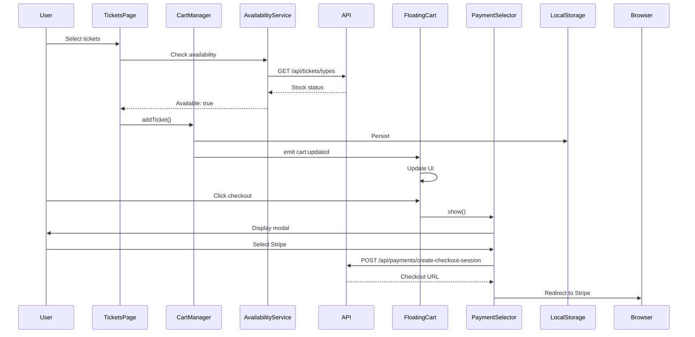
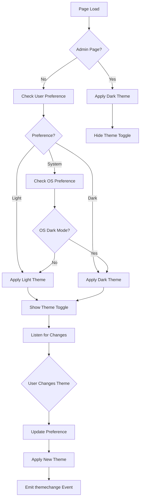
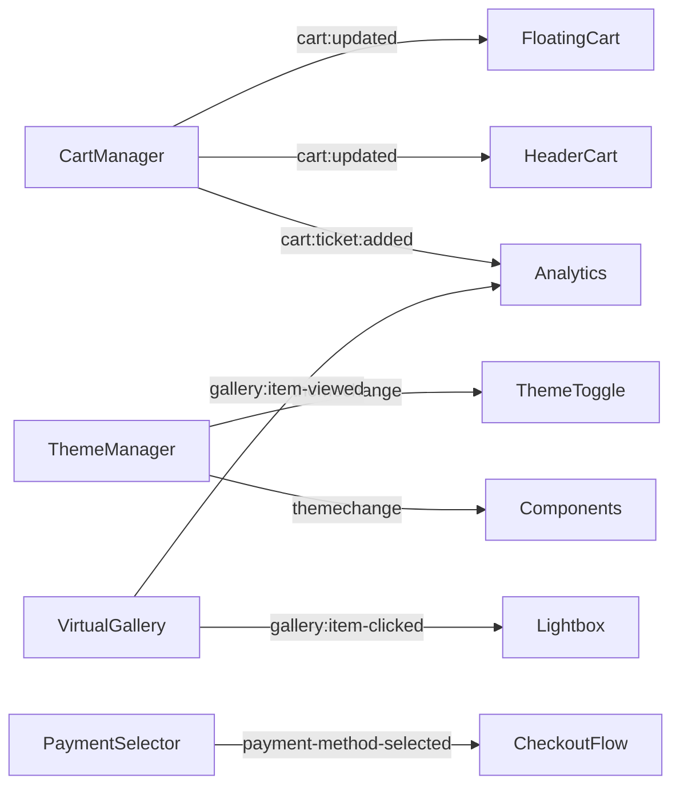
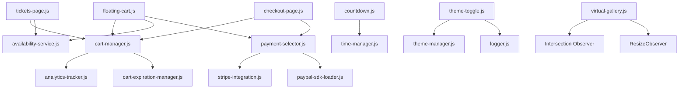

# Frontend Architecture - A Lo Cubano Boulder Fest

## Overview

The A Lo Cubano Boulder Fest frontend is built with **vanilla JavaScript ES6 modules** - no framework dependencies. This architecture emphasizes performance, progressive enhancement, and accessibility while maintaining simplicity and developer experience.

### Technology Stack

- **Core**: Vanilla JavaScript ES6 modules
- **Design System**: Typography-forward with Bebas Neue, Playfair Display, Space Mono
- **Architecture**: Component-based with event-driven communication
- **State Management**: LocalStorage + EventEmitter pattern
- **Styling**: CSS Variables + Mobile-first responsive design
- **Progressive Enhancement**: Works without JavaScript, enhanced with JS

### Key Architectural Principles

1. **No Framework Dependencies**: Pure JavaScript for maximum control and minimal overhead
2. **Event-Driven Architecture**: Components communicate via custom events
3. **Progressive Enhancement**: Core functionality works without JS
4. **Mobile-First Design**: 44px touch targets, slide-in navigation
5. **Performance Optimized**: Lazy loading, virtual scrolling, debouncing
6. **Accessibility First**: ARIA labels, keyboard navigation, screen reader support

## Module Organization

```text
/js/
├── Core Components (6 modules)
│   ├── floating-cart.js              # Shopping cart with page-specific visibility
│   ├── countdown.js                  # Timezone-aware countdown timer
│   ├── theme-manager.js              # Theme detection and management
│   ├── theme-toggle.js               # Three-state theme toggle
│   ├── header-cart.js                # Header cart synchronization
│   └── checkout-form.js              # Checkout form validation
│
├── Component Library (2 modules)
│   ├── virtual-gallery.js            # Virtual scrolling gallery (1000+ images)
│   └── payment-selector.js           # Payment method selection modal
│
├── Utility Libraries (9 modules)
│   ├── lib/
│   │   ├── availability-service.js   # Real-time inventory checking
│   │   ├── cart-manager.js           # Cart state management
│   │   ├── cart-expiration-manager.js # Reservation expiration
│   │   ├── analytics-tracker.js      # Event tracking
│   │   ├── logger.js                 # Client-side logging
│   │   ├── modal-utils.js            # Modal management
│   │   ├── stripe-integration.js     # Stripe SDK wrapper
│   │   ├── inventory-checker.js      # Inventory validation
│   │   └── payment-form-validator.js # Payment form validation
│
└── Page Scripts (4 modules)
    ├── tickets-page.js               # Ticket selection page
    ├── checkout-page.js              # Checkout page
    ├── donations-page.js             # Donations page
    └── gallery-page.js               # Gallery page
```

## Core Component Documentation

### Module: floating-cart.js

**Purpose**: Manages floating cart panel with intelligent page-specific visibility rules

**Public API**:

```javascript
// Initialize floating cart
initializeFloatingCart(cartManager)

// Cart visibility rules (automatically applied)
// - Always visible: /tickets, /donations
// - Visible with items: /about, /artists, /schedule, /gallery
// - Never visible: /404, /index.html
```

**State Management**:

- Uses localStorage key: `alocubano_cart`
- Synchronizes across tabs/windows
- Persists cart through page refreshes
- Automatic cleanup of expired items

**Events Emitted**:

- `cart:updated` - Cart state changed
- `cart:item-added` - Item added to cart
- `cart:item-removed` - Item removed from cart
- `cart:cleared` - Cart cleared
- `floating-cart-initialized` - Cart UI ready

**Usage Example**:

```javascript
import { initializeFloatingCart } from '/js/floating-cart.js';
import { getCartManager } from '/js/lib/cart-manager.js';

// Initialize cart manager
const cartManager = getCartManager();
await cartManager.initialize();

// Initialize floating cart
initializeFloatingCart(cartManager);

// Listen for cart updates
document.addEventListener('cart:updated', (e) => {
  console.log('Cart updated:', e.detail);
});
```

**Dependencies**:

- `/js/lib/cart-manager.js` - State management
- `/js/lib/availability-service.js` - Inventory validation
- `/js/components/payment-selector.js` - Checkout flow
- `/js/lib/stripe-integration.js` - Payment processing

**Performance Notes**:

- Debounced cart updates (300ms)
- Cached DOM queries
- RequestAnimationFrame for smooth animations
- Virtual scrolling for large carts

---

### Module: countdown.js

**Purpose**: Timezone-aware countdown timer for Mountain Time (America/Denver) events

**Public API**:

```javascript
// Create countdown timer
new CountdownTimer(targetDate, options)

// Helper for Boulder Fest 2026
createBoulderFest2026Countdown(elementIds, options)

// Helper for Weekender 2025
createWeekender2025Countdown(elementIds, options)

// Generic countdown creator
createCountdown(targetDate, elementIds, options)
```

**Options**:

```javascript
{
  showTimezone: true,        // Display timezone indicator
  autoStart: true,           // Start timer immediately
  updateInterval: 1000,      // Update frequency (ms)
  onUpdate: (time, formatted) => {},  // Update callback
  onComplete: () => {}       // Completion callback
}
```

**Mountain Time Handling**:

- Automatic DST detection (MST vs MDT)
- Mountain Standard Time (MST): UTC-7
- Mountain Daylight Time (MDT): UTC-6
- Proper timezone abbreviation display

**Usage Example**:

```javascript
import { createBoulderFest2026Countdown } from '/js/countdown.js';

// Create countdown for Boulder Fest 2026
const timer = createBoulderFest2026Countdown(
  {
    days: 'countdown-days',
    hours: 'countdown-hours',
    minutes: 'countdown-minutes',
    seconds: 'countdown-seconds',
    timezone: 'countdown-timezone'
  },
  {
    onComplete: () => {
      console.log('Event started!');
    }
  }
);

// Stop timer
timer.stop();

// Get time remaining
const remaining = timer.getTimeRemaining();
// { total: 123456789, days: 1, hours: 10, minutes: 30, seconds: 45, expired: false }
```

**Dependencies**:

- `/js/time-manager.js` - Mountain Time utilities

---

### Module: theme-manager.js

**Purpose**: Hybrid theme system - admin always dark, main site user-controlled

**Public API**:

```javascript
import { getTheme, setTheme, getCurrentTheme, getUserPreference, THEMES } from '/js/theme-manager.js';

// Get current active theme
const theme = getCurrentTheme(); // 'light' or 'dark'

// Get user preference (main site only)
const preference = getUserPreference(); // 'system', 'light', or 'dark'

// Set theme (main site only - admin pages reject this)
setTheme(THEMES.DARK);

// Check if on admin page
const isAdmin = isAdminPage(); // true/false
```

**Theme Constants**:

```javascript
THEMES = {
  LIGHT: 'light',
  DARK: 'dark',
  SYSTEM: 'system'
}
```

**Architecture**:

- **Admin Pages**: Always dark theme (non-configurable)
- **Main Site**: User-controlled (system/light/dark)
- **Storage**: localStorage key `theme-preference`
- **FOUC Prevention**: Synchronous theme application

**Events Emitted**:

```javascript
// Listen for theme changes
document.addEventListener('themechange', (e) => {
  console.log('Theme changed:', e.detail);
  // {
  //   theme: 'dark',
  //   isAdminPage: false,
  //   userPreference: 'system',
  //   previousTheme: 'light'
  // }
});
```

**Performance Optimizations**:

- Cached DOM queries
- Debounced localStorage access (100ms)
- RequestAnimationFrame for smooth transitions
- Performance marks for monitoring

**Usage Example**:

```javascript
import { setTheme, THEMES, getCurrentTheme } from '/js/theme-manager.js';

// Set dark theme
setTheme(THEMES.DARK);

// Get current theme
const current = getCurrentTheme(); // 'dark'

// Listen for system preference changes (auto-applied)
window.matchMedia('(prefers-color-scheme: dark)').addEventListener('change', (e) => {
  console.log('System preference changed:', e.matches ? 'dark' : 'light');
});
```

---

### Module: theme-toggle.js

**Purpose**: Three-state theme toggle component (System/Light/Dark)

**Public API**:

```javascript
import { initializeThemeToggle, getCurrentPreference, setPreference } from '/js/theme-toggle.js';

// Initialize toggle
const toggle = initializeThemeToggle('#theme-toggle-container');
// Returns: { element, preference, effectiveTheme }

// Get current preference
const preference = getCurrentPreference(); // 'system', 'light', or 'dark'

// Set preference programmatically
setPreference('dark');

// Destroy toggle
destroyThemeToggle();
```

**Features**:

- Inline SVG icons (monitor, sun, moon)
- ARIA radiogroup pattern
- Keyboard navigation (arrows, Home, End)
- Visual active states
- Hidden on admin pages

**Events Emitted**:

```javascript
// Listen for preference changes
document.addEventListener('themepreferencechange', (e) => {
  console.log('Preference changed:', e.detail);
  // {
  //   preference: 'dark',
  //   effectiveTheme: 'dark',
  //   timestamp: 1234567890
  // }
});
```

**Usage Example**:

```javascript
import { initializeThemeToggle } from '/js/theme-toggle.js';

// Initialize in container
const toggle = initializeThemeToggle('#theme-toggle');

// Toggle will auto-update when user selects an option
// No additional code needed for basic functionality
```

**Dependencies**:

- `/js/theme-manager.js` - Core theme logic
- `/js/lib/logger.js` - Logging utilities

---

### Module: cart-manager.js

**Purpose**: Unified cart management for tickets and donations

**Public API**:

```javascript
import { getCartManager } from '/js/lib/cart-manager.js';

const cartManager = getCartManager();

// Initialize cart
await cartManager.initialize();

// Ticket operations
await cartManager.addTicket({
  ticketType: 'full-pass',
  price: 15000, // Price in cents
  name: 'Full Weekend Pass',
  eventId: 'boulder-fest-2026',
  eventName: 'Boulder Fest 2026',
  eventDate: '2026-05-15T00:00:00-06:00',
  venue: 'Avalon Ballroom',
  quantity: 1
});

await cartManager.updateTicketQuantity('full-pass', 2);
await cartManager.removeTicket('full-pass');

// Donation operations
await cartManager.addDonation(25.00, false); // amount, isTest
await cartManager.removeDonation('donation_id');

// Cart state
const state = cartManager.getState();
// {
//   tickets: { ... },
//   donations: [ ... ],
//   totals: { tickets, donations, total, itemCount, donationCount },
//   isEmpty: false,
//   metadata: { createdAt, updatedAt, sessionId }
// }

// Clear cart
await cartManager.clear();

// Checkout session
await cartManager.startCheckoutSession(); // 15 minute timer
await cartManager.endCheckoutSession(true); // completed: true/false
```

**Events Emitted**:

- `cart:initialized` - Cart ready
- `cart:updated` - State changed
- `cart:ticket:added` - Ticket added
- `cart:ticket:updated` - Ticket quantity changed
- `cart:ticket:removed` - Ticket removed
- `cart:donation:added` - Donation added
- `cart:donation:removed` - Donation removed
- `cart:cleared` - Cart cleared
- `cart:synced` - Synced from another tab

**Storage**:

- localStorage key: `alocubano_cart`
- Automatic migration from old formats
- Cross-tab synchronization
- Atomic operations with queue

**Usage Example**:

```javascript
import { getCartManager } from '/js/lib/cart-manager.js';

const cart = getCartManager();
await cart.initialize();

// Add ticket
await cart.addTicket({
  ticketType: 'saturday',
  price: 7500,
  name: 'Saturday Pass',
  eventId: 'boulder-fest-2026',
  eventName: 'Boulder Fest 2026',
  eventDate: '2026-05-16',
  quantity: 2
});

// Listen for updates
cart.addEventListener('cart:updated', (e) => {
  console.log('Cart total:', e.detail.totals.total);
});
```

**Dependencies**:

- `/js/lib/analytics-tracker.js` - Event tracking
- `/js/lib/cart-expiration-manager.js` - Checkout timers

---

### Module: availability-service.js

**Purpose**: Real-time ticket availability checking

**Public API**:

```javascript
import { getAvailabilityService } from '/js/lib/availability-service.js';

const service = getAvailabilityService();

// Check specific ticket availability
const result = await service.checkAvailability('full-pass', 2);
// {
//   available: true,
//   remaining: 10,
//   status: 'available',
//   message: 'Tickets available'
// }

// Get all ticket availability
const all = await service.getAllAvailability();
// Map<ticketType, { available, remaining, status, maxQuantity, soldCount }>

// Start polling for updates
service.startPolling(30000); // Poll every 30 seconds
service.stopPolling();

// Add listener for availability updates
service.addListener((tickets) => {
  console.log('Availability updated:', tickets);
});
service.removeListener(callback);

// Clear cache
service.clearCache();

// Cleanup
service.destroy();
```

**Caching**:

- 30-second cache timeout
- Automatic refresh on polling
- Returns stale data on API failure

**Polling**:

- Default 30-second interval
- Clears cache before fetch
- Notifies all listeners on update

**Usage Example**:

```javascript
import { getAvailabilityService } from '/js/lib/availability-service.js';

const availability = getAvailabilityService();

// Check before adding to cart
const check = await availability.checkAvailability('full-pass', 2);

if (!check.available) {
  alert(check.message); // "Only 1 ticket remaining"
} else {
  await cartManager.addTicket({ ... });
}

// Start live updates
availability.startPolling();
availability.addListener((tickets) => {
  updateTicketListUI(tickets);
});
```

---

### Module: virtual-gallery.js

**Purpose**: High-performance virtual scrolling gallery for 1000+ images

**Public API**:

```javascript
import { VirtualGalleryManager } from '/js/components/virtual-gallery.js';

const gallery = new VirtualGalleryManager(container, {
  itemHeight: 250,
  itemsPerRow: 'auto', // or specific number
  bufferSize: 5,
  loadingPlaceholder: '/images/placeholder.svg',
  enableLightbox: true,
  enableAnalytics: true,
  imageFormats: ['avif', 'webp', 'jpeg'],
  quality: 80
});

// Load photos
await gallery.loadPhotos([
  {
    id: 'photo-1',
    src: 'https://drive.google.com/...',
    alt: 'Dance floor',
    title: 'Opening Night',
    thumbnail: '...'
  }
]);

// Scroll to specific photo
gallery.scrollToPhoto(5, true); // index, smooth

// Refresh gallery
gallery.refresh();

// Get performance metrics
const metrics = gallery.getMetrics();
// {
//   renderCount, recycleCount, totalScrollEvents,
//   averageRenderTime, uptime, visibleItems,
//   pooledItems, memoryUsage: { domItems, images, total }
// }

// Cleanup
gallery.destroy();
```

**Events Emitted**:

- `gallery:manager-initialized` - Gallery ready
- `gallery:photos-loaded` - Photos loaded
- `gallery:initialized` - Initial render complete
- `gallery:rendered` - Frame rendered
- `gallery:item-viewed` - Item visible in viewport
- `gallery:item-clicked` - Item clicked
- `gallery:resized` - Container resized

**Performance Features**:

- Virtual scrolling with buffer zones
- DOM element recycling (max 20 pooled)
- Intersection Observer for lazy loading
- AVIF → WebP → JPEG format negotiation
- RequestAnimationFrame for smooth scrolling
- Automatic responsive layout

**Usage Example**:

```javascript
import { VirtualGalleryManager } from '/js/components/virtual-gallery.js';

const container = document.getElementById('gallery-container');
const gallery = new VirtualGalleryManager(container, {
  itemHeight: 300,
  bufferSize: 3,
  imageFormats: ['avif', 'webp']
});

// Fetch photos from API
const response = await fetch('/api/gallery?year=2025');
const data = await response.json();

// Load into gallery
await gallery.loadPhotos(data.items);

// Listen for clicks
container.addEventListener('gallery:item-clicked', (e) => {
  console.log('Clicked:', e.detail.photo);
});
```

**Dependencies**:

- Intersection Observer API
- ResizeObserver API (optional)
- window.LightboxManager (optional)

---

### Module: payment-selector.js

**Purpose**: Payment method selection modal (Stripe/PayPal)

**Public API**:

```javascript
import { getPaymentSelector } from '/js/components/payment-selector.js';

const selector = getPaymentSelector();

// Initialize
selector.init(cartManager, {
  eventDate: '2026-05-15T00:00:00-06:00'
});

// Show selector
await selector.show((selectedMethod) => {
  console.log('Selected:', selectedMethod); // 'stripe' or 'paypal'
});

// Cleanup
selector.destroy();
```

**Features**:

- Environment-aware (disables Stripe in production if needed)
- PayPal availability detection
- Mobile-optimized PayPal redirect (app vs web)
- ARIA accessibility (radiogroup pattern)
- Focus trap for keyboard users
- Screen reader announcements

**Environment Detection**:

```javascript
// Checks /api/config/environment
// Uses VERCEL_ENV for reliable detection
// - production: Stripe disabled by default
// - preview/development: All methods enabled
```

**Events Emitted**:

- `payment-method-selected` - Method chosen
- Custom events via modal interactions

**Usage Example**:

```javascript
import { getPaymentSelector } from '/js/components/payment-selector.js';
import { getCartManager } from '/js/lib/cart-manager.js';

const cart = getCartManager();
const selector = getPaymentSelector();

selector.init(cart, {
  eventDate: '2026-05-15T00:00:00-06:00'
});

// Show on checkout
document.getElementById('checkout-btn').addEventListener('click', async () => {
  const method = await selector.show();
  console.log('Payment method:', method);
});
```

**Dependencies**:

- `/js/lib/stripe-integration.js` - Stripe processing
- `/js/lib/paypal-sdk-loader.js` - PayPal SDK
- `/api/config/environment` - Environment detection

---

## Frontend System Architecture

### Cart System Lifecycle



### Theme System Integration



### Event Communication Architecture



## Frontend Module Dependencies



## Frontend Best Practices

### ES6 Module Pattern

```javascript
// ✅ CORRECT: Named exports for utilities
export function initializeComponent() { ... }
export { CONSTANTS, helper };

// ✅ CORRECT: Singleton pattern
let instance = null;
export function getInstance() {
  if (!instance) instance = new Service();
  return instance;
}

// ✅ CORRECT: Default export for main component
export default class Component { ... }
```

### Event-Driven Communication

```javascript
// ✅ CORRECT: Custom events for cross-component communication
class CartManager extends EventTarget {
  updateCart() {
    // Update logic
    this.dispatchEvent(new CustomEvent('cart:updated', {
      detail: this.getState()
    }));

    // Also dispatch on document for global listeners
    document.dispatchEvent(new CustomEvent('cart:updated', {
      detail: this.getState()
    }));
  }
}

// Listen for events
cartManager.addEventListener('cart:updated', handler);
document.addEventListener('cart:updated', handler);
```

### State Management (localStorage)

```javascript
// ✅ CORRECT: Validate and sanitize localStorage data
loadFromStorage() {
  try {
    const stored = localStorage.getItem('cart');
    if (stored) {
      const data = JSON.parse(stored);
      if (this.isValid(data)) {
        this.state = data;
      }
    }
  } catch (error) {
    console.error('Failed to load:', error);
    // Continue with empty state
  }
}
```

### Error Handling

```javascript
// ✅ CORRECT: Graceful degradation
async function loadData() {
  try {
    const data = await fetchAPI();
    return data;
  } catch (error) {
    console.error('Failed to load:', error);
    // Return cached data or empty state
    return getCachedData() || getEmptyState();
  }
}
```

### Progressive Enhancement

```javascript
// ✅ CORRECT: Feature detection
if ('IntersectionObserver' in window) {
  // Use Intersection Observer
  this.observer = new IntersectionObserver(callback);
} else {
  // Fallback to scroll events
  window.addEventListener('scroll', fallbackHandler);
}
```

### Accessibility (ARIA)

```javascript
// ✅ CORRECT: Proper ARIA attributes
<button
  aria-label="Remove item from cart"
  aria-describedby="item-description"
  role="button"
  tabindex="0"
>
  Remove
</button>

// Screen reader announcements
function announceToScreenReader(message) {
  const announcer = document.getElementById('sr-announcer');
  announcer.textContent = message;
}
```

## Performance Optimization Patterns

### Debouncing

```javascript
function debounce(func, delay) {
  let timeoutId;
  return function(...args) {
    clearTimeout(timeoutId);
    timeoutId = setTimeout(() => func.apply(this, args), delay);
  };
}

// Usage
const debouncedSave = debounce(saveToStorage, 300);
```

### Throttling

```javascript
function throttle(func, limit) {
  let inThrottle;
  return function(...args) {
    if (!inThrottle) {
      func.apply(this, args);
      inThrottle = true;
      setTimeout(() => inThrottle = false, limit);
    }
  };
}

// Usage
const throttledScroll = throttle(handleScroll, 16); // 60fps
```

### RequestAnimationFrame

```javascript
// ✅ CORRECT: Use RAF for visual updates
function updateUI(data) {
  requestAnimationFrame(() => {
    element.textContent = data.value;
    element.classList.add('updated');
  });
}
```

### Cached DOM Queries

```javascript
// ✅ CORRECT: Cache expensive queries
class Component {
  constructor() {
    this.cache = {
      container: null,
      buttons: null
    };
  }

  getContainer() {
    if (!this.cache.container) {
      this.cache.container = document.querySelector('.container');
    }
    return this.cache.container;
  }
}
```

## Testing Frontend Modules

### Unit Testing

```javascript
// Test cart manager
describe('CartManager', () => {
  let cart;

  beforeEach(async () => {
    cart = getCartManager();
    await cart.initialize();
  });

  it('adds ticket to cart', async () => {
    await cart.addTicket({
      ticketType: 'test',
      price: 1000,
      name: 'Test Ticket',
      eventId: 'test-event',
      quantity: 1
    });

    const state = cart.getState();
    expect(state.tickets['test']).toBeDefined();
    expect(state.totals.itemCount).toBe(1);
  });
});
```

### Integration Testing

```javascript
// Test cart and availability integration
describe('Cart with Availability', () => {
  it('prevents adding out-of-stock tickets', async () => {
    const availability = getAvailabilityService();
    const cart = getCartManager();

    const check = await availability.checkAvailability('sold-out', 1);
    expect(check.available).toBe(false);

    // Should throw or prevent addition
    await expect(cart.addTicket({
      ticketType: 'sold-out',
      // ...
    })).rejects.toThrow();
  });
});
```

### E2E Testing

```javascript
// Playwright test
test('complete checkout flow', async ({ page }) => {
  await page.goto('/tickets');

  // Select ticket
  await page.click('[data-ticket-type="full-pass"]');
  await page.click('[data-action="add-to-cart"]');

  // Verify cart updated
  await expect(page.locator('.cart-total')).toHaveText('$150.00');

  // Checkout
  await page.click('[data-testid="checkout-button"]');
  await page.click('[data-method="stripe"]');

  // Should redirect to Stripe
  await expect(page).toHaveURL(/checkout\.stripe\.com/);
});
```

## Debugging Frontend Modules

### Gallery Debugging

```javascript
// Enable debug mode
window.enableGalleryDebug();

// Get cache stats
window.galleryDebugAPI.getCacheStats();

// Clear cache
window.galleryDebugAPI.clearCache();
```

### Cart Debugging

```javascript
// View cart state
console.log('Cart:', JSON.parse(localStorage.getItem('alocubano_cart')));

// Force show cart
document.querySelector('.floating-cart').style.display = 'block';

// Get cart manager debug info
const cart = getCartManager();
console.log(cart.getDebugInfo());
```

### Theme Debugging

```javascript
import { getCurrentTheme, getPerformanceMetrics } from '/js/theme-manager.js';

console.log('Current theme:', getCurrentTheme());
console.log('Theme performance:', getPerformanceMetrics());
```

## Browser Compatibility

### Supported Browsers

- Chrome/Edge 90+
- Firefox 88+
- Safari 14+
- Mobile Safari 14+
- Chrome Android 90+

### Polyfills/Fallbacks

- Intersection Observer: Scroll event fallback
- ResizeObserver: Window resize fallback
- Fetch API: Required (no fallback)
- LocalStorage: Required (no fallback)
- Custom Events: Required (no fallback)

## Security Considerations

### XSS Prevention

```javascript
// ✅ CORRECT: Sanitize user input
function escapeHtml(unsafe) {
  return unsafe
    .replace(/&/g, '&amp;')
    .replace(/</g, '&lt;')
    .replace(/>/g, '&gt;')
    .replace(/"/g, '&quot;')
    .replace(/'/g, '&#039;');
}

// Use textContent, not innerHTML
element.textContent = userInput;
```

### localStorage Security

```javascript
// ✅ CORRECT: Validate data from localStorage
function loadCart() {
  try {
    const data = JSON.parse(localStorage.getItem('cart'));

    // Validate structure
    if (!isValidCart(data)) {
      throw new Error('Invalid cart data');
    }

    // Sanitize values
    return sanitizeCart(data);
  } catch {
    return getEmptyCart();
  }
}
```

## Migration Guide

### From jQuery to Vanilla JS

```javascript
// ❌ OLD: jQuery
$('#button').on('click', handler);
$('.items').html(content);

// ✅ NEW: Vanilla JS
document.getElementById('button').addEventListener('click', handler);
document.querySelector('.items').innerHTML = content;
```

### From Frameworks to Vanilla

```javascript
// ❌ OLD: React state
const [count, setCount] = useState(0);

// ✅ NEW: Event-driven state
class Counter extends EventTarget {
  constructor() {
    super();
    this.count = 0;
  }

  increment() {
    this.count++;
    this.dispatchEvent(new CustomEvent('countchange', {
      detail: { count: this.count }
    }));
  }
}
```

## Future Enhancements

### Planned Features

1. **Service Worker**: Offline support and background sync
2. **Web Components**: Encapsulated, reusable components
3. **Virtual List**: More advanced virtual scrolling
4. **Image Optimization**: Client-side image processing
5. **Performance Monitoring**: Real-time performance tracking

### Performance Goals

- First Contentful Paint (FCP): < 1s
- Largest Contentful Paint (LCP): < 2.5s
- Time to Interactive (TTI): < 3s
- Cumulative Layout Shift (CLS): < 0.1
- First Input Delay (FID): < 100ms

## Additional Resources

- [Theme System Documentation](../THEME_SYSTEM.md)
- [API Documentation](../api/README.md)
- [Donations System](../DONATIONS_SYSTEM.md)
- [Performance Optimization](../PERFORMANCE_OPTIMIZATION.md)
- [Accessibility Guide](../ACCESSIBILITY.md)

## Support

For questions or issues:

- Email: alocubanoboulderfest@gmail.com
- Documentation: /docs/frontend/
- Code Review: Open GitHub issue
