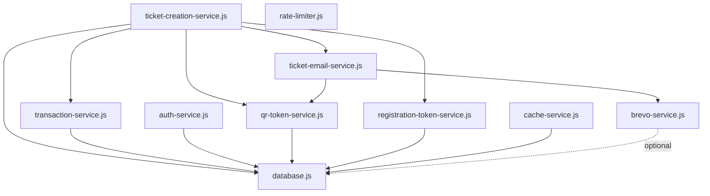

# Service Catalog

**Comprehensive guide to all 121 backend services in `/lib`**

Version: 1.0.0
Last Updated: 2025-10-08

## Table of Contents

- [Executive Summary](#executive-summary)
- [Service Categories](#service-categories)
  - [A. Business Logic Services](#a-business-logic-services)
  - [B. Security & Authentication Services](#b-security--authentication-services)
  - [C. Infrastructure Services](#c-infrastructure-services)
  - [D. Email & Communication Services](#d-email--communication-services)
  - [E. Payment & Financial Services](#e-payment--financial-services)
  - [F. Data & Analytics Services](#f-data--analytics-services)
- [Service Patterns](#service-patterns)
- [Quick Reference](#quick-reference)

## Executive Summary

### Overview

- **Total Services**: 121
- **Documented Services**: 64 (core critical services)
- **Undocumented Services**: 57 (utility and helper services)
- **Primary Architecture Pattern**: Promise-Based Lazy Singleton
- **Database Strategy**: LibSQL/Turso with connection pooling

### Key Architecture Patterns

1. **Async Singleton Pattern** - Prevents race conditions in serverless environments
2. **Batch Operations** - Atomic database transactions using Turso batch API
3. **Direct Database Client** - Services use `getDatabaseClient()` for each operation
4. **Test Mode Support** - All services support test/production environment switching

### Critical Dependencies

- **Database**: `database.js` - LibSQL client with Turso support
- **Security**: `auth-service.js`, `csrf-service.js`
- **Email**: `brevo-service.js`, `ticket-email-service.js`
- **Payments**: Stripe (production), PayPal (future), donations system

## Service Categories

### A. Business Logic Services

Core services implementing primary business workflows for ticket sales, registrations, and event management.

---

#### `ticket-creation-service.js`

**Purpose**: Centralized ticket creation with idempotency for webhook and checkout flows.

**Complexity**: High

**Public API**:

```javascript
// Create or retrieve tickets from Stripe session
async createOrRetrieveTickets(fullSession, paymentMethodData = null)
  -> { transaction, ticketCount, created: boolean }
```

**Key Features**:

- Idempotent ticket creation (prevents duplicates from webhook retries)
- Stripe metadata validation against database (prevents fraud)
- Batch operations for atomic ticket + transaction creation
- Registration deadline calculation with intelligent fallbacks
- Test mode support with `TEST-` prefixing
- Security audit logging for validation failures

**Input Parameters**:

- `fullSession` (object) - Stripe Checkout Session with line items
- `paymentMethodData` (object, optional) - Payment method details (card_brand, card_last4, payment_wallet)

**Return Values**:

```javascript
{
  transaction: { id, uuid, amount_cents, ... },
  ticketCount: 3,
  created: true  // false if tickets already existed
}
```

**Error Handling**:

- Throws on missing ticket type, event ID, or event date in metadata
- Logs security alerts for validation failures
- Creates tickets with `flagged_for_review` status on validation errors

**Dependencies**: `database.js`, `ticket-id-generator.js`, `order-id-generator.js`, `transaction-service.js`, `registration-token-service.js`, `reminder-scheduler.js`, `ticket-email-service.js`, `audit-service.js`, `security-alert-service.js`

**Usage Example**:

```javascript
import { createOrRetrieveTickets } from './lib/ticket-creation-service.js';

// Stripe webhook handler
const result = await createOrRetrieveTickets(stripeSession, {
  card_brand: 'visa',
  card_last4: '4242',
  payment_wallet: null
});

if (result.created) {
  console.log(`Created ${result.ticketCount} tickets`);
} else {
  console.log('Tickets already exist (idempotent)');
}
```

**Performance Notes**:

- Uses batch operations for atomic inserts (tickets + sold_count updates)
- Updates `sold_count` or `test_sold_count` based on test mode
- Schedules registration reminders asynchronously (non-blocking)

---

#### `transaction-service.js`

**Purpose**: Manages financial transactions from Stripe and PayPal with atomic batch operations.

**Complexity**: High

**Public API**:

```javascript
class TransactionService {
  async ensureInitialized()                                    -> this
  async createFromStripeSession(session, paymentMethodData, req, inTransaction) -> transaction
  async createFromPayPalOrder(paypalOrder, req)               -> transaction
  async getByUUID(uuid)                                        -> transaction
  async getByStripeSessionId(sessionId)                        -> transaction
  async getByPaymentIntentId(paymentIntentId)                  -> transaction
  async getByPayPalOrderId(paypalOrderId)                      -> transaction
  async getCustomerTransactions(email)                         -> transactions[]
  async getAllTransactions(options)                            -> transactions[]
  async getTransactionStatistics(req)                          -> stats
  async updateStatus(uuid, status, metadata)                   -> void
  async updatePayPalCapture(uuid, captureId, status)           -> void
  generateTransactionUUID()                                    -> string
  createTransactionBatchOperation(transactionData)             -> batchOp
  createTransactionItemBatchOperation(itemData)                -> batchOp
  createPaymentEventBatchOperation(eventData)                  -> batchOp
}
```

**Key Features**:

- Atomic transaction + transaction_items + payment_events creation
- Test mode detection from Stripe/PayPal metadata and environment
- Order number generation (ALO-YYYY-NNNN format)
- Cent-accurate price distribution across multiple tickets
- Payment method tracking (card brand, last 4, wallet type)

**Input Parameters**:

- `session` - Stripe Checkout Session with line_items
- `paymentMethodData` - Optional: `{ card_brand, card_last4, payment_wallet }`
- `req` - Optional request object for test mode detection

**Return Values**:

```javascript
{
  id: 123,
  uuid: 'TXN-1234567890-abc123',
  order_number: 'ALO-2026-0001',
  amount_cents: 15000,
  currency: 'USD',
  stripe_session_id: 'cs_test_...',
  customer_email: 'customer@example.com',
  status: 'completed',
  is_test: 0,
  ...
}
```

**Error Handling**:

- Throws if transaction creation fails
- Validates `amount_total` is not 0 for paid sessions
- Logs errors with context for debugging

**Dependencies**: `database.js`, `order-number-generator.js`, `test-mode-utils.js`

**Usage Example**:

```javascript
import transactionService from './lib/transaction-service.js';

// Create transaction from Stripe
const transaction = await transactionService.createFromStripeSession(
  stripeSession,
  { card_brand: 'visa', card_last4: '4242', payment_wallet: null }
);

console.log(`Transaction ${transaction.uuid} created`);
console.log(`Order number: ${transaction.order_number}`);
```

**Performance Notes**:

- Uses Turso batch API for atomic multi-row inserts
- No stored database instance (calls `getDatabaseClient()` per operation)
- Supports test/production environment separation

---

#### `registration-token-service.js`

**Purpose**: Generates JWT tokens for secure multi-ticket registration flows.

**Complexity**: Medium

**Public API**:

```javascript
class RegistrationTokenService {
  async ensureInitialized()                              -> this
  async createToken(transactionId)                       -> tokenString
  async validateToken(token)                             -> { valid, data, error }
  async getTokenData(token)                              -> { transactionId, ... }
  async invalidateToken(token)                           -> void
}
```

**Key Features**:

- JWT-based token generation with configurable expiry
- Token validation with expiry checking
- Secure registration URL generation
- Token invalidation on use (optional)

**Input Parameters**:

- `transactionId` (number) - Database transaction ID

**Return Values**:

```javascript
// Token string
'eyJhbGciOiJIUzI1NiIsInR5cCI6IkpXVCJ9...'

// Validation result
{ valid: true, data: { transactionId: 123, iat: 1234567890, exp: 1234567890 } }
```

**Error Handling**:

- Throws if `REGISTRATION_SECRET` not configured
- Returns `{ valid: false, error }` for invalid/expired tokens

**Dependencies**: `jsonwebtoken`

**Usage Example**:

```javascript
import { RegistrationTokenService } from './lib/registration-token-service.js';

const tokenService = new RegistrationTokenService();
await tokenService.ensureInitialized();

// Create token
const token = await tokenService.createToken(123);

// Generate registration URL
const registrationUrl = `https://example.com/api/registration/${token}`;

// Validate token
const validation = await tokenService.validateToken(token);
if (validation.valid) {
  console.log(`Transaction ID: ${validation.data.transactionId}`);
}
```

**Performance Notes**:

- Tokens expire after 30 days (configurable via `REGISTRATION_TOKEN_EXPIRY`)
- Uses `REGISTRATION_SECRET` environment variable (min 32 chars)

---

#### `qr-token-service.js`

**Purpose**: Generates and validates JWT tokens for QR code ticket validation.

**Complexity**: Medium

**Public API**:

```javascript
class QRTokenService {
  async getOrCreateToken(ticketId)                       -> token
  validateToken(token)                                   -> { valid, payload, error }
  isTestToken(token)                                     -> boolean
  generateToken(payload)                                 -> token
  async generateQRImage(token, options)                  -> dataURL
  isConfigured()                                         -> boolean
  async cleanup()                                        -> void
}
```

**Key Features**:

- QR code token generation and caching
- Token validation with expiry (90 days default)
- Test mode detection
- QR code image generation as data URL
- Max scan count tracking

**Input Parameters**:

- `ticketId` (string) - Unique ticket identifier

**Return Values**:

```javascript
// Token
'eyJhbGciOiJIUzI1NiIsInR5cCI6IkpXVCJ9...'

// Validation
{ valid: true, payload: { tid: 'TICKET-123', iat: 1234567890, exp: 1234567890 } }

// QR Image
'data:image/png;base64,iVBORw0KGgoAAAANSUhEUgAA...'
```

**Error Handling**:

- Throws if `QR_SECRET_KEY` not configured (production only)
- Throws if `WALLET_AUTH_SECRET` not configured
- Returns `{ valid: false, error }` for invalid/expired tokens

**Dependencies**: `jsonwebtoken`, `qrcode`, `database.js`

**Usage Example**:

```javascript
import { getQRTokenService } from './lib/qr-token-service.js';

const qrService = getQRTokenService();

// Generate or retrieve token
const token = await qrService.getOrCreateToken('TICKET-ABC-123');

// Generate QR code image
const qrImage = await qrService.generateQRImage(token);

// Validate token at venue
const validation = qrService.validateToken(token);
if (validation.valid) {
  console.log(`Valid ticket: ${validation.payload.tid}`);
}
```

**Performance Notes**:

- Tokens cached in database `qr_token` column
- QR codes expire after 90 days (configurable via `QR_CODE_EXPIRY_DAYS`)
- Max 10 scans per ticket (configurable via `QR_CODE_MAX_SCANS`)

---

#### `ticket-email-service.js`

**Purpose**: Sends ticket confirmation emails via Brevo with Mountain Time formatting.

**Complexity**: High

**Public API**:

```javascript
class TicketEmailService {
  async ensureInitialized()                              -> this
  async sendTicketConfirmation(transaction)              -> result
  async sendRegistrationConfirmation(ticket, transaction) -> result
  async sendBatchRegistrationConfirmation(tickets, transaction) -> result
  formatEventDate(date)                                  -> string
  formatEventTime(date, time)                            -> string
}
```

**Key Features**:

- Brevo template-based email sending
- Mountain Time (America/Denver) formatting for all timestamps
- Purchaser vs attendee email differentiation
- Batch registration support (multiple tickets)
- QR code attachment generation
- Test mode support (skips actual sends)

**Input Parameters**:

- `transaction` - Transaction object with tickets array

**Return Values**:

```javascript
{
  success: true,
  messageId: 'brevo-message-id',
  emails: ['purchaser@example.com', 'attendee@example.com']
}
```

**Error Handling**:

- Logs errors but doesn't throw (best-effort delivery)
- Skips email send in test mode
- Falls back gracefully if template data missing

**Dependencies**: `brevo-service.js`, `time-utils.js`, `qr-token-service.js`

**Usage Example**:

```javascript
import { getTicketEmailService } from './lib/ticket-email-service.js';

const emailService = getTicketEmailService();
await emailService.ensureInitialized();

// Send confirmation after ticket creation
const result = await emailService.sendTicketConfirmation(transaction);
console.log(`Email sent to: ${result.emails.join(', ')}`);
```

**Performance Notes**:

- Uses Brevo templates for consistent formatting
- Generates QR codes on-the-fly for each ticket
- Non-blocking (best-effort delivery)

---

#### `reminder-scheduler.js`

**Purpose**: Schedules registration reminder emails at strategic intervals before event.

**Complexity**: Medium

**Public API**:

```javascript
async scheduleRegistrationReminders(transactionId, registrationDeadline, isTest = false)
  -> reminderCount
```

**Key Features**:

- Multi-stage reminder scheduling (immediate, 24h, 72h, 7d, deadline-24h)
- Intelligent scheduling based on time until event
- Test mode support (uses separate test schedule)
- Database-driven reminder tracking
- Prevents duplicate reminders

**Input Parameters**:

- `transactionId` (number) - Transaction database ID
- `registrationDeadline` (Date|string) - ISO timestamp of registration deadline
- `isTest` (boolean) - Test mode flag

**Return Values**:

```javascript
3  // Number of reminders scheduled
```

**Error Handling**:

- Logs warnings if no reminders scheduled
- Skips scheduling for past dates
- Handles database errors gracefully

**Dependencies**: `database.js`

**Usage Example**:

```javascript
import { scheduleRegistrationReminders } from './lib/reminder-scheduler.js';

// After ticket creation
const deadlineDate = new Date('2026-05-10T00:00:00Z'); // 7 days before event
const reminderCount = await scheduleRegistrationReminders(
  transaction.id,
  deadlineDate,
  false  // production mode
);

console.log(`Scheduled ${reminderCount} reminder emails`);
```

**Performance Notes**:

- Batch inserts for all reminders in single operation
- Reminders processed by separate cron job (`api/cron/process-reminders.js`)
- Test mode uses shorter intervals for faster testing

---

#### `order-number-generator.js`

**Purpose**: Generates human-readable order numbers in ALO-YYYY-NNNN format.

**Complexity**: Low

**Public API**:

```javascript
async generateOrderNumber() -> 'ALO-2026-0001'
```

**Key Features**:

- Sequential numbering per year
- Thread-safe counter increment
- Padded to 4 digits (ALO-2026-0001)
- Automatic year detection

**Dependencies**: `database.js`

**Usage Example**:

```javascript
import { generateOrderNumber } from './lib/order-number-generator.js';

const orderNumber = await generateOrderNumber();
// Returns: 'ALO-2026-0001' (increments each call)
```

---

#### `ticket-id-generator.js`

**Purpose**: Generates cryptographically secure ticket IDs.

**Complexity**: Low

**Public API**:

```javascript
async generateTicketId() -> 'TICKET-ABC123XYZ789'
```

**Key Features**:

- Collision-resistant (uses crypto.randomBytes)
- Fixed format: `TICKET-{12 uppercase alphanumeric}`
- Database uniqueness verification

**Dependencies**: `crypto`, `database.js`

**Usage Example**:

```javascript
import { generateTicketId } from './lib/ticket-id-generator.js';

const ticketId = await generateTicketId();
// Returns: 'TICKET-ABC123XYZ789'
```

---

#### `order-id-generator.js`

**Purpose**: Generates UUID-based order identifiers for internal use.

**Complexity**: Low

**Public API**:

```javascript
function generateOrderId() -> 'ORDER-1234567890-abc123'
```

**Key Features**:

- Timestamp-based for chronological sorting
- Random suffix for uniqueness
- No database lookup required

**Usage Example**:

```javascript
import { generateOrderId } from './lib/order-id-generator.js';

const orderId = generateOrderId();
// Returns: 'ORDER-1234567890-abc123'
```

---

#### `google-wallet-service.js`

**Purpose**: Generates Google Wallet passes for tickets.

**Complexity**: High

**Public API**:

```javascript
class GoogleWalletService {
  async createPass(ticketData)                           -> passUrl
  async updatePass(ticketId, updates)                    -> success
  async invalidatePass(ticketId)                         -> success
}
```

**Key Features**:

- Google Wallet API integration
- JWT-based pass signing
- Barcode generation with ticket ID
- Pass updates (status, registration info)

**Dependencies**: Google Wallet API, `jsonwebtoken`, `database.js`

---

#### `apple-wallet-service.js`

**Purpose**: Generates Apple Wallet (.pkpass) files for tickets.

**Complexity**: High

**Public API**:

```javascript
class AppleWalletService {
  async createPass(ticketData)                           -> pkpassBuffer
  async updatePass(ticketId, updates)                    -> success
  async invalidatePass(ticketId)                         -> success
}
```

**Key Features**:

- Apple PKPass format generation
- Certificate-based signing
- Pass updates via push notifications
- Barcode generation

**Dependencies**: Apple Wallet certificates, `passkit-generator`

---

#### `validation-service.js`

**Purpose**: Validates ticket QR codes at venue entry.

**Complexity**: Medium

**Public API**:

```javascript
class ValidationService {
  async validateTicket(qrToken)                          -> { valid, ticket, error }
  async recordScan(ticketId, location)                   -> scan
  async getTicketScanHistory(ticketId)                   -> scans[]
}
```

**Key Features**:

- QR token validation
- Scan count tracking
- Max scan enforcement
- Scan location recording

**Dependencies**: `qr-token-service.js`, `database.js`

---

#### `registration-validator.js`

**Purpose**: Validates ticket registration data before saving.

**Complexity**: Low

**Public API**:

```javascript
function validateRegistrationData(data) -> { valid, errors }
```

**Key Features**:

- Email format validation
- Phone number validation
- Required field checking
- Name length validation

**Usage Example**:

```javascript
import { validateRegistrationData } from './lib/registration-validator.js';

const validation = validateRegistrationData({
  firstName: 'John',
  lastName: 'Doe',
  email: 'john@example.com',
  phone: '+1-555-0100'
});

if (!validation.valid) {
  console.error('Validation errors:', validation.errors);
}
```

---

#### `token-service.js`

**Purpose**: Generic JWT token generation and validation service.

**Complexity**: Low

**Public API**:

```javascript
class TokenService {
  generateToken(payload, expiresIn)                      -> token
  validateToken(token)                                   -> { valid, payload, error }
  refreshToken(token)                                    -> newToken
}
```

**Key Features**:

- Generic JWT wrapper
- Configurable expiry
- Token refresh support

**Dependencies**: `jsonwebtoken`

---

### B. Security & Authentication Services

Services responsible for authentication, authorization, fraud detection, and security monitoring.

---

#### `auth-service.js`

**Purpose**: Admin authentication with bcrypt password verification and JWT session management.

**Complexity**: Medium

**Public API**:

```javascript
class AuthService {
  async ensureInitialized()                              -> this
  async verifyPassword(password)                         -> boolean
  async createSessionToken(adminId)                      -> jwtToken
  async verifySessionToken(token)                        -> { valid, admin }
  async createSessionCookie(token)                       -> cookieString
  getSessionFromRequest(req)                             -> tokenOrNull
  async verifySessionFromRequest(req)                    -> { valid, admin, error }
  requireAuth(handler)                                   -> middleware
  clearSessionCookie()                                   -> cookieString
  isMFARequired()                                        -> boolean
  reset()                                                -> void
}
```

**Key Features**:

- Bcrypt password hashing (production mode)
- Plain-text password comparison (test/preview mode)
- JWT session tokens with configurable expiry
- HTTP-only secure cookies
- MFA bypass in test environments
- Middleware for route protection

**Input Parameters**:

- `password` (string) - Plain-text password to verify
- `adminId` (string) - Admin identifier (default: 'admin')

**Return Values**:

```javascript
// Password verification
true  // Password matches

// Session token
'eyJhbGciOiJIUzI1NiIsInR5cCI6IkpXVCJ9...'

// Session verification
{ valid: true, admin: { id: 'admin', role: 'admin', loginTime: 1234567890 } }
```

**Error Handling**:

- Throws if `ADMIN_SECRET` not configured
- Throws if `ADMIN_SECRET` < 32 characters
- Returns `{ valid: false, error }` for invalid sessions

**Dependencies**: `bcryptjs`, `jsonwebtoken`, `cookie`

**Usage Example**:

```javascript
import authService from './lib/auth-service.js';

// Initialize service
await authService.ensureInitialized();

// Verify password
const isValid = await authService.verifyPassword('admin-password');
if (isValid) {
  // Create session
  const token = await authService.createSessionToken('admin');
  const cookie = await authService.createSessionCookie(token);

  // Set cookie in response
  res.setHeader('Set-Cookie', cookie);
}

// Protect route with middleware
export default authService.requireAuth(async (req, res) => {
  // req.admin is available here
  res.json({ admin: req.admin });
});
```

**Performance Notes**:

- Session tokens expire after 1 hour (configurable via `ADMIN_SESSION_DURATION`)
- Bcrypt comparison is slow by design (security feature)
- Test mode uses instant plain-text comparison for speed

**Environment Variables**:

- `ADMIN_SECRET` (required) - JWT signing secret (min 32 chars)
- `ADMIN_PASSWORD` (production) - Bcrypt hash of admin password
- `TEST_ADMIN_PASSWORD` (non-production) - Plain-text password for testing
- `ADMIN_SESSION_DURATION` (optional) - Session duration in milliseconds (default: 3600000 = 1 hour)

---

#### `csrf-service.js`

**Purpose**: CSRF (Cross-Site Request Forgery) protection for form submissions and state-changing operations.

**Complexity**: Medium

**Public API**:

```javascript
class CSRFService {
  async ensureInitialized()                              -> this
  generateToken()                                        -> csrfToken
  validateToken(token, storedToken)                      -> boolean
  createMiddleware()                                     -> expressMiddleware
}
```

**Key Features**:

- Cryptographically secure token generation
- Timing-safe token comparison
- Express middleware integration
- Session-based token storage

**Dependencies**: `crypto`

**Usage Example**:

```javascript
import { getCSRFService } from './lib/csrf-service.js';

const csrfService = getCSRFService();
await csrfService.ensureInitialized();

// Generate token for form
const token = csrfService.generateToken();

// Validate token on submission
const isValid = csrfService.validateToken(submittedToken, storedToken);
```

---

#### `fraud-detection-service.js`

**Purpose**: Detects suspicious patterns in transactions and ticket purchases.

**Complexity**: High

**Public API**:

```javascript
class FraudDetectionService {
  async analyzePurchase(transaction, metadata)           -> riskScore
  async flagTransaction(transactionId, reason)           -> flagged
  async reviewFlaggedTransactions()                      -> transactions[]
  async clearFlag(transactionId, reviewerNotes)          -> cleared
}
```

**Key Features**:

- Velocity checking (purchases per IP/email)
- Price manipulation detection
- Test transaction identification
- Risk scoring algorithm
- Manual review workflow

**Dependencies**: `database.js`, `security-alert-service.js`

---

#### `security-alert-service.js`

**Purpose**: Centralized security event logging and alerting system.

**Complexity**: Medium

**Public API**:

```javascript
class SecurityAlertService {
  async triggerAlert(alertData)                          -> alert
  async getAlerts(filters)                               -> alerts[]
  async acknowledgeAlert(alertId, notes)                 -> acknowledged
  async escalateAlert(alertId, severity)                 -> escalated
}
```

**Key Features**:

- Severity levels (info, warning, critical)
- Alert correlation (group related events)
- Email notifications for critical alerts
- Alert acknowledgment tracking

**Dependencies**: `database.js`, `email-service.js`

**Usage Example**:

```javascript
import securityAlertService from './lib/security-alert-service.js';

await securityAlertService.triggerAlert({
  alertType: 'webhook_metadata_tampering',
  severity: 'critical',
  title: 'Stripe Webhook Metadata Tampering Detected',
  description: 'Price mismatch detected in Stripe session',
  evidence: { session_id: 'cs_test_...', expected: 15000, actual: 1500 },
  indicators: ['metadata_tampering', 'price_manipulation'],
  correlationId: 'cs_test_...',
  affectedResources: [
    { type: 'stripe_session', id: 'cs_test_...' },
    { type: 'transaction', id: 'TXN-123' }
  ]
});
```

---

#### `mobile-auth-service.js`

**Purpose**: Authentication service for mobile wallet passes (Apple/Google Wallet).

**Complexity**: Low

**Public API**:

```javascript
class MobileAuthService {
  async authenticateRequest(authHeader)                  -> { valid, deviceId }
  async registerDevice(deviceId, pushToken)              -> registration
  async unregisterDevice(deviceId)                       -> success
}
```

**Key Features**:

- Device registration/unregistration
- Push token management
- Authentication for wallet pass updates

**Dependencies**: `jsonwebtoken`, `database.js`

---

#### `encryption-utils.js`

**Purpose**: Utility functions for data encryption and hashing.

**Complexity**: Low

**Public API**:

```javascript
function encrypt(text, key)                              -> encryptedString
function decrypt(encryptedText, key)                     -> plainText
function hashPassword(password)                          -> bcryptHash
function verifyPassword(password, hash)                  -> boolean
function generateSalt()                                  -> saltString
```

**Key Features**:

- AES-256-GCM encryption
- Bcrypt password hashing
- Secure salt generation
- Constant-time comparison

**Dependencies**: `crypto`, `bcryptjs`

---

#### `security/security-monitor.js`

**Purpose**: Real-time security monitoring and threat detection.

**Complexity**: High

**Public API**:

```javascript
class SecurityMonitor {
  async monitorRequest(req)                              -> analysis
  async detectAnomalies(userId)                          -> anomalies[]
  async blockIP(ip, reason, duration)                    -> blocked
  async unblockIP(ip)                                    -> unblocked
}
```

**Key Features**:

- Request pattern analysis
- IP blocking/unblocking
- Anomaly detection (ML-based)
- Rate limit violation tracking

**Dependencies**: `database.js`, `rate-limiter.js`

---

### C. Infrastructure Services

Core infrastructure services for database management, caching, rate limiting, and circuit breaking.

---

#### `database.js`

**Purpose**: LibSQL database client with Turso support for serverless environments.

**Complexity**: Very High

**Public API**:

```javascript
class DatabaseService {
  async ensureInitialized()                              -> client
  async initializeClient()                               -> client
  async getClient()                                      -> client
  async testConnection()                                 -> boolean
  async execute(query, params, retryCount)               -> result
  async batch(statements, retryCount)                    -> results[]
  async transaction(timeoutMs)                           -> transaction
  async close(timeout)                                   -> boolean
  async resetForTesting()                                -> void
  getConnectionStats()                                   -> stats
  async verifyBatchSupport()                             -> boolean
  async healthCheck()                                    -> health
}

// Exported functions
async function getDatabaseClient()                       -> client
async function testConnection()                          -> boolean
async function resetDatabaseInstance()                   -> void
```

**Key Features**:

- Promise-based lazy singleton pattern (prevents race conditions)
- Automatic connection recycling for serverless (3-minute max age)
- Connection validation before returning cached client
- Automatic reconnection on `CLIENT_CLOSED` errors
- Supports both Node.js and Edge runtimes
- Better-sqlite3 wrapper for unit tests
- LibSQL client for production (Turso)
- Timeout protection (15s for Vercel, 10s local, 5s tests)
- Exponential backoff retry logic (max 2 retries)
- Batch operation support (atomic multi-row operations)
- Transaction support with timeout protection

**Input Parameters**:

- `query` (string) - SQL query string
- `params` (array) - Query parameters
- `statements` (array) - Batch operation array (for `batch()`)

**Return Values**:

```javascript
// Query result
{
  rows: [{ id: 1, name: 'Test' }],
  columns: ['id', 'name'],
  rowsAffected: 1,
  lastInsertRowid: 123
}

// Health check
{
  status: 'healthy',
  connectionStats: { activeConnections: 1, initialized: true },
  features: { batchOperations: true },
  performance: { connectionAge: '45s', needsRecycling: false, responseTime: '12ms' }
}
```

**Error Handling**:

- Throws if `TURSO_DATABASE_URL` not configured (production)
- Throws if `TURSO_AUTH_TOKEN` not configured for remote databases
- Auto-reconnects on `CLIENT_CLOSED` errors (max 1 retry)
- Timeout error if initialization exceeds configured limit

**Dependencies**: `@libsql/client` (production), `better-sqlite3` (tests), `logger.js`

**Usage Example**:

```javascript
import { getDatabaseClient } from './lib/database.js';

// Execute single query
const db = await getDatabaseClient();
const result = await db.execute({
  sql: 'SELECT * FROM tickets WHERE ticket_id = ?',
  args: ['TICKET-123']
});

// Batch operations (atomic)
const batchOps = [
  { sql: 'UPDATE ticket_types SET sold_count = sold_count + ? WHERE id = ?', args: [1, 'weekend-pass'] },
  { sql: 'INSERT INTO tickets (ticket_id, ticket_type, ...) VALUES (?, ?, ...)', args: [...] }
];
await db.batch(batchOps);

// Transaction with timeout
const tx = await db.transaction(30000); // 30s timeout
try {
  await tx.execute('UPDATE tickets SET status = ? WHERE id = ?', ['used', 123]);
  await tx.execute('INSERT INTO scan_log (...) VALUES (...)', [...]);
  await tx.commit();
} catch (error) {
  await tx.rollback();
  throw error;
}
```

**Performance Notes**:

- Connection pooling optimized for serverless (2 max idle connections)
- Health check results cached for 30 seconds
- Connection recycling every 3 minutes in Vercel
- `intMode: "number"` to avoid BigInt serialization issues
- Optimized timeouts for Turso: 8s connect, 12s request

**Environment Detection**:

```javascript
// Production: VERCEL=1 + VERCEL_ENV=production
// Preview: VERCEL=1 + VERCEL_ENV=preview
// Development: NODE_ENV=development (no VERCEL)
// E2E Tests: E2E_TEST_MODE=true (uses Turso)
// Integration Tests: INTEGRATION_TEST_MODE=true (uses SQLite)
```

**Environment Variables**:

- `TURSO_DATABASE_URL` (required) - Turso database URL
- `TURSO_AUTH_TOKEN` (required for remote) - Turso auth token
- `DATABASE_URL` (optional) - Fallback for local development
- `DATABASE_INIT_TIMEOUT` (optional) - Initialization timeout in ms

---

#### `cache-service.js`

**Purpose**: High-level caching service for API responses, sessions, and static data.

**Complexity**: Medium

**Public API**:

```javascript
class CacheService {
  async init()                                           -> void
  async ensureInitialized()                              -> cache
  async get(key, options)                                -> value
  async set(key, value, options)                         -> success
  async del(key, options)                                -> success
  async cacheTicketAvailability(ticketData)              -> success
  async getTicketAvailability()                          -> ticketData
  async cacheGalleryData(year, photos)                   -> success
  async getGalleryData(year)                             -> photos
  async cacheUserSession(sessionId, userData)            -> success
  async getUserSession(sessionId)                        -> userData
  async cacheAnalytics(key, data)                        -> success
  async getAnalytics(key)                                -> data
  async cacheApiResponse(endpoint, method, params, response) -> success
  async getCachedApiResponse(endpoint, method, params)   -> response
  async cachePaymentData(paymentId, data)                -> success
  async getPaymentData(paymentId)                        -> data
  async incrementCounter(key, options)                   -> newValue
  async getCounter(key)                                  -> value
  async invalidatePattern(pattern, namespace)            -> deletedCount
  async invalidateTicketCache()                          -> deletedCount
  async invalidateGalleryCache()                         -> deletedCount
  async getHealthStatus()                                -> health
  async getStats()                                       -> stats
  createMiddleware(options)                              -> middleware
  async warmCache(section)                               -> void
  async close()                                          -> void
}
```

**Key Features**:

- Namespaced caching (tickets, gallery, sessions, api-responses, payments)
- Type-based TTL management (static, dynamic, session, api, gallery, analytics, payments)
- Cache warm-up on initialization
- Pattern-based invalidation
- Express middleware for automatic caching
- Stable cache key generation (sorted object keys)

**Input Parameters**:

- `key` (string) - Cache key
- `value` (any) - Value to cache
- `options` (object) - `{ type, namespace, ttl }`

**Return Values**:

```javascript
// Get
{ id: 1, name: 'Festival Data' }  // or null if not found

// Set
true  // Success

// Stats
{
  hits: 1234,
  misses: 56,
  hitRate: 0.957,
  keys: 42,
  size: '2.4 MB'
}
```

**Error Handling**:

- Falls back to basic cache if warm-up fails
- Logs errors but doesn't throw (graceful degradation)

**Dependencies**: `cache/index.js`

**Usage Example**:

```javascript
import { getCacheService } from './lib/cache-service.js';

const cacheService = getCacheService();
await cacheService.init();

// Cache API response
await cacheService.cacheApiResponse('/api/tickets', 'GET', {}, ticketsData);

// Retrieve cached response
const cached = await cacheService.getCachedApiResponse('/api/tickets', 'GET', {});

// Invalidate ticket cache after purchase
await cacheService.invalidateTicketCache();
```

**Performance Notes**:

- Cache warm-up includes event info, ticket config, gallery years
- TTL varies by type: static (24h), dynamic (5m), session (1h), api (15m)
- Pattern invalidation supports wildcards

---

#### `security/rate-limiter.js` (PRIMARY)

**Purpose**: Advanced distributed rate limiter with Redis backend and comprehensive security features.

**Complexity**: High

**Public API**:

```javascript
class AdvancedRateLimiter {
  async checkRateLimit(req, endpoint, options)           -> { allowed, remaining, resetTime, retryAfter, clientId, endpoint, performanceMs, penaltyMultiplier }
  async applyPenalty(clientId, endpoint)                 -> void
  async getPenaltyMultiplier(clientId, endpoint)         -> number
  async addToWhitelist(ip, reason)                       -> void
  async addToBlacklist(ip, reason)                       -> void
  getAnalytics()                                         -> { blocked, allowed, penalties, alerts, ... }
  getEndpointConfigs()                                   -> ENDPOINT_CONFIGS
  cleanupFallbackStore()                                 -> void
  async close()                                          -> void
}

function getRateLimiter(options)                         -> AdvancedRateLimiter
```

**Key Features**:

- Redis-backed distributed tracking across serverless instances (with memory fallback)
- Sliding window algorithm for accurate rate limiting
- Endpoint-specific configurations (payment, qrValidation, auth, email, general)
- Progressive penalties with exponential backoff (up to 32x multiplier)
- Abuse pattern detection and alerting
- Whitelist/blacklist support with CIDR notation
- Comprehensive analytics tracking (blocked, allowed, penalties, alerts)
- <5ms performance impact per request
- Fail-open behavior when Redis unavailable

**Endpoint Configurations**:

- **payment**: 5 req/min per IP, 10 req/hour per user, progressive penalties
- **qrValidation**: 100 req/min per device, no penalties
- **auth**: 5 attempts/min, lockout after 10 failures, 1-hour lockout, 32x max penalty
- **email**: 10 req/hour per IP, progressive penalties
- **general**: 60 req/min per IP, progressive penalties

**Input Parameters**:

- `req` (object) - Request object with headers for client identification
- `endpoint` (string) - Endpoint type ('payment', 'auth', 'email', 'qrValidation', 'general')
- `options` (object) - `{ clientType: 'ip'|'user'|'device', ... }`

**Return Values**:

```javascript
// Allowed
{
  allowed: true,
  remaining: 59,
  resetTime: 1707859200000,
  clientId: 'ip:192.168.1.100',
  endpoint: 'general',
  performanceMs: 3
}

// Rate limited
{
  allowed: false,
  reason: 'rate_limit_exceeded',
  retryAfter: 300,  // seconds
  clientId: 'ip:192.168.1.100',
  endpoint: 'payment',
  penaltyMultiplier: 2,
  performanceMs: 4
}

// Blacklisted
{
  allowed: false,
  reason: 'blacklisted',
  retryAfter: 86400,
  clientId: 'ip:192.168.1.100',
  endpoint: 'general'
}
```

**Error Handling**:

- Fails open for availability (allows request on error)
- Redis connection errors handled gracefully with memory fallback
- Cleanup runs every 5 minutes for memory store

**Dependencies**: `ioredis` (optional, graceful degradation if unavailable)

**Usage Example**:

```javascript
import { getRateLimiter } from './lib/security/rate-limiter.js';

const rateLimiter = getRateLimiter();

// Check rate limit for payment endpoint
const result = await rateLimiter.checkRateLimit(req, 'payment', {
  clientType: 'ip'
});

if (!result.allowed) {
  res.setHeader('Retry-After', result.retryAfter);
  res.status(429).json({
    error: 'Rate limit exceeded',
    retryAfter: result.retryAfter,
    reason: result.reason
  });
  return;
}

// Get analytics
const analytics = rateLimiter.getAnalytics();
console.log(`Blocked: ${analytics.blocked}, Allowed: ${analytics.allowed}`);
```

**Performance Notes**:

- <5ms overhead per request with Redis
- Memory fallback adds ~1ms overhead
- Sliding-window provides accurate rate limiting (note: `performanceMs` field only returned for active rate-limit evaluations, not whitelist/blacklist/error bypass paths)
- Progressive penalties: 1x → 2x → 4x → 8x → 16x → 32x
- Analytics tracked in real-time
- Alert thresholds: payment=50, auth=20, email=100, general=500

---

#### `domain/email/RateLimiter.js` (DOMAIN-SPECIFIC)

**Purpose**: Email-specific rate limiting with multiple algorithm support.

**Complexity**: Medium

**Public API**:

```javascript
class RateLimiter {
  checkRateLimit(identifier, options)                    -> { allowed, limit, remaining, resetTime, retryAfter }
  incrementCounter(identifier, options)                  -> { allowed, limit, remaining }
  checkSlidingWindowRateLimit(identifier, options)       -> { allowed, limit, remaining, retryAfter, timestamps }
  incrementSlidingWindow(identifier, options)            -> { allowed, limit, remaining }
  checkTokenBucket(identifier, options)                  -> { allowed, tokens, capacity, retryAfter }
  static extractIdentifier(req, options)                 -> identifier
  static createMiddleware(options)                       -> middleware
  cleanExpiredEntries(keyPrefix)                         -> deletedCount
}
```

**Key Features**:

- Fixed window rate limiting (15-minute default)
- Sliding window rate limiting (more accurate)
- Token bucket algorithm (smooth rate limiting)
- Middleware creator for easy integration
- Automatic cleanup of expired entries
- Memory usage statistics

**Dependencies**: None (in-memory only)

**Note**: Use for email-specific rate limiting. For general API rate limiting, use `security/rate-limiter.js`

---

#### `circuit-breaker.js`

**Purpose**: Circuit breaker pattern for external service calls (prevents cascading failures).

**Complexity**: Medium

**Public API**:

```javascript
class CircuitBreaker {
  async execute(fn, fallback)                            -> result
  getState()                                             -> 'closed' | 'open' | 'half-open'
  getStats()                                             -> { failures, successes, consecutiveFailures }
  reset()                                                -> void
}
```

**Key Features**:

- Three states: closed (normal), open (failing), half-open (recovering)
- Configurable failure threshold (5 failures)
- Automatic recovery attempts after timeout (60s)
- Fallback function support

**Dependencies**: None

**Usage Example**:

```javascript
import { CircuitBreaker } from './lib/circuit-breaker.js';

const breaker = new CircuitBreaker({
  failureThreshold: 5,
  resetTimeout: 60000  // 1 minute
});

// Execute external API call with circuit breaker
const result = await breaker.execute(
  () => fetch('https://api.external.com/data'),
  () => ({ fallback: true, data: [] })  // Fallback on circuit open
);
```

---

#### `service-circuit-breaker.js`

**Purpose**: Service-specific circuit breakers with per-service configuration.

**Complexity**: Low

**Public API**:

```javascript
function getCircuitBreaker(serviceName)                  -> CircuitBreaker
```

**Key Features**:

- Named circuit breakers (one per external service)
- Pre-configured for common services (Stripe, Brevo, Turso)
- Automatic state management

**Dependencies**: `circuit-breaker.js`

---

#### `exponential-backoff.js`

**Purpose**: Retry logic with exponential backoff for transient failures.

**Complexity**: Low

**Public API**:

```javascript
async function retryWithBackoff(fn, options)             -> result
```

**Key Features**:

- Configurable max retries (default: 3)
- Exponential delay: 1s → 2s → 4s → 8s
- Jitter to prevent thundering herd
- Error predicate for selective retry

**Dependencies**: None

**Usage Example**:

```javascript
import { retryWithBackoff } from './lib/exponential-backoff.js';

const result = await retryWithBackoff(
  () => db.execute('SELECT * FROM tickets'),
  {
    maxRetries: 3,
    baseDelay: 1000,
    shouldRetry: (error) => error.code === 'ETIMEDOUT'
  }
);
```

---

#### `audit-circuit-breaker.js`

**Purpose**: Circuit breaker specifically for audit logging to prevent cascade failures.

**Complexity**: Low

**Public API**:

```javascript
function getAuditCircuitBreaker()                        -> CircuitBreaker
```

**Key Features**:

- Prevents audit failures from breaking core functionality
- Fallback to console.log when circuit open
- Automatic recovery

**Dependencies**: `circuit-breaker.js`

---

#### `database-connection-monitor.js`

**Purpose**: Monitors database connection health and alerts on issues.

**Complexity**: Medium

**Public API**:

```javascript
class DatabaseConnectionMonitor {
  async start()                                          -> void
  async stop()                                           -> void
  async checkHealth()                                    -> { healthy, latency, errors }
  getStats()                                             -> { uptime, totalChecks, failures }
}
```

**Key Features**:

- Periodic health checks (every 30s)
- Connection latency monitoring
- Alert on consecutive failures (3+)
- Connection pool statistics

**Dependencies**: `database.js`

---

#### `connection-health-monitor.js`

**Purpose**: Generic connection health monitoring for any service.

**Complexity**: Low

**Public API**:

```javascript
class ConnectionHealthMonitor {
  async monitor(checkFn, options)                        -> health
  async getHistory()                                     -> checks[]
}
```

**Key Features**:

- Generic health check execution
- Health check history tracking
- Configurable check intervals

**Dependencies**: None

---

#### `database-monitor.js`

**Purpose**: Database performance monitoring and slow query detection.

**Complexity**: Medium

**Public API**:

```javascript
class DatabaseMonitor {
  async trackQuery(query, duration)                      -> void
  async getSlowQueries(threshold)                        -> queries[]
  async getQueryStats()                                  -> stats
}
```

**Key Features**:

- Query execution time tracking
- Slow query alerting (>1s threshold)
- Query frequency statistics
- Performance trend analysis

**Dependencies**: `database.js`

---

#### `database-warmer.js`

**Purpose**: Pre-warms database connections in serverless cold starts.

**Complexity**: Low

**Public API**:

```javascript
async function warmDatabase()                            -> success
```

**Key Features**:

- Executes simple query to establish connection
- Runs common queries to warm cache
- Non-blocking (best-effort)

**Dependencies**: `database.js`

**Usage Example**:

```javascript
import { warmDatabase } from './lib/database-warmer.js';

// In serverless function initialization
await warmDatabase();
```

---

### D. Email & Communication Services

Services handling email delivery, newsletter management, and transactional communications.

---

#### `brevo-service.js`

**Purpose**: Comprehensive Brevo (SendinBlue) API integration for email and contact management.

**Complexity**: High

**Public API**:

```javascript
class BrevoService {
  async ensureInitialized()                              -> this
  async createOrUpdateContact(contactData)               -> contact
  async getContact(email)                                -> contact
  async updateContact(email, updateData)                 -> contact
  async deleteContact(email)                             -> success
  async addContactToLists(email, listIds)                -> results[]
  async removeContactFromLists(email, listIds)           -> results[]
  async subscribeToNewsletter(subscriberData)            -> result
  async unsubscribeContact(email)                        -> result
  async sendWelcomeEmail(email, firstName)               -> messageId
  async sendVerificationEmail(email, token, firstName)   -> messageId
  async sendTransactionalEmail(emailData)                -> messageId
  async getListStats(listId)                             -> stats
  async getAllListStats()                                -> allStats[]
  validateWebhookSignature(payload, signature)           -> boolean
  async processWebhookEvent(event)                       -> processed
  async addTicketHolder(ticketHolderData)                -> result
  async healthCheck()                                    -> health
}
```

**Key Features**:

- Promise-based lazy singleton pattern
- Contact list management (newsletter, ticket holders, VIP, workshops)
- Template-based email sending
- Webhook signature validation (HMAC-SHA256, timing-safe)
- Test mode support (mocked API calls)
- Automatic timeout protection (10s default)
- Graceful duplicate contact handling

**Input Parameters**:

```javascript
// createOrUpdateContact
{
  email: 'user@example.com',
  firstName: 'John',
  lastName: 'Doe',
  phone: '+1-555-0100',
  attributes: { SIGNUP_SOURCE: 'website' },
  listIds: [1, 2],
  updateEnabled: true
}

// sendTransactionalEmail
{
  to: [{ email: 'user@example.com', name: 'John Doe' }],
  templateId: 123,
  params: { FNAME: 'John', EVENT_DATE: '2026-05-15' },
  subject: 'Optional subject override',
  htmlContent: 'Optional HTML override'
}
```

**Return Values**:

```javascript
// createOrUpdateContact (production)
{
  id: 12345,
  email: 'user@example.com',
  listIds: [1],
  createdAt: '2025-10-08T12:00:00Z'
}

// sendTransactionalEmail
{
  messageId: 'brevo-message-id-123',
  status: 'queued'
}

// Test mode response (wrapped)
{
  success: true,
  contact: { email: 'user@example.com', ... },
  mockData: true
}
```

**Error Handling**:

- Throws if `BREVO_API_KEY` not configured (production only)
- Throws if list IDs or template IDs not configured (production only)
- Handles duplicate contacts gracefully (updates instead of failing)
- Timeout errors after 10s (configurable via `BREVO_REQUEST_TIMEOUT`)

**Dependencies**: `crypto`

**Usage Example**:

```javascript
import { getBrevoService } from './lib/brevo-service.js';

const brevo = getBrevoService();
await brevo.ensureInitialized();

// Subscribe to newsletter
const result = await brevo.subscribeToNewsletter({
  email: 'user@example.com',
  firstName: 'John',
  lastName: 'Doe',
  source: 'website'
});

// Send transactional email
await brevo.sendTransactionalEmail({
  to: [{ email: 'user@example.com', name: 'John Doe' }],
  templateId: brevo.templates.welcome,
  params: {
    FNAME: 'John',
    FESTIVAL_YEAR: '2026',
    FESTIVAL_DATES: 'May 15-17, 2026'
  }
});

// Add ticket holder to list
await brevo.addTicketHolder({
  email: 'user@example.com',
  firstName: 'John',
  lastName: 'Doe',
  ticketType: 'weekend-pass',
  ticketId: 'TICKET-ABC-123'
});
```

**Performance Notes**:

- Test mode uses mock responses (no API calls)
- Request timeout: 10s (configurable)
- Batch list operations use `Promise.all()`
- Health check cached for better performance

**Environment Variables**:

- `BREVO_API_KEY` (required) - Brevo API key
- `BREVO_NEWSLETTER_LIST_ID` (required) - Newsletter list ID
- `BREVO_TICKET_HOLDERS_LIST_ID` (required) - Ticket holders list ID
- `BREVO_VIP_LIST_ID` (required) - VIP list ID
- `BREVO_WORKSHOPS_LIST_ID` (required) - Workshops list ID
- `BREVO_WELCOME_TEMPLATE_ID` (required) - Welcome email template ID
- `BREVO_VERIFICATION_TEMPLATE_ID` (required) - Verification email template ID
- `BREVO_UNSUBSCRIBE_TEMPLATE_ID` (required) - Unsubscribe confirmation template ID
- `BREVO_WEBHOOK_SECRET` (optional) - Webhook signature validation secret
- `BREVO_REQUEST_TIMEOUT` (optional) - Request timeout in ms (default: 10000)

**Test Mode Behavior**:

```javascript
// Mock GET /contacts/{email}
{
  id: 123456,
  email: 'test@example.com',
  listIds: [1],
  createdAt: '2025-10-08T12:00:00Z'
}

// Mock POST /contacts
{
  id: 123456,
  email: 'test@example.com',
  listIds: [1],
  createdAt: '2025-10-08T12:00:00Z'
}

// Mock POST /smtp/email
{
  messageId: 'mock-message-1234567890',
  status: 'queued'
}
```

---

#### `email-service.js`

**Purpose**: High-level email service abstraction (wraps Brevo for future provider flexibility).

**Complexity**: Low

**Public API**:

```javascript
class EmailService {
  async sendEmail(to, subject, body, options)            -> result
  async sendTemplate(to, templateId, params)             -> result
  async subscribeNewsletter(email, data)                 -> result
  async unsubscribe(email)                               -> result
}
```

**Key Features**:

- Provider abstraction (currently uses Brevo)
- Template-based sending
- Newsletter management wrapper

**Dependencies**: `brevo-service.js`

---

#### `notification-service.js`

**Purpose**: Multi-channel notification dispatch (email, SMS, push).

**Complexity**: Medium

**Public API**:

```javascript
class NotificationService {
  async sendNotification(userId, message, channels)      -> results
  async sendBulkNotifications(userIds, message, channels) -> results
}
```

**Key Features**:

- Multi-channel support (email, SMS, push)
- Bulk notification sending
- Channel preference management
- Delivery status tracking

**Dependencies**: `email-service.js`, `sms-service.js` (if implemented)

---

#### `sms-service.js`

**Purpose**: SMS notification service (Twilio integration).

**Complexity**: Medium

**Public API**:

```javascript
class SMSService {
  async sendSMS(to, message)                             -> result
  async sendBulkSMS(recipients, message)                 -> results
}
```

**Key Features**:

- Twilio API integration
- Bulk SMS sending
- Delivery status tracking

**Dependencies**: `twilio` (if implemented)

**Note**: Currently not implemented (placeholder for future SMS notifications)

---

### E. Payment & Financial Services

Services managing payment processing, refunds, donations, and financial transactions.

---

#### `stripe-service.js`

**Purpose**: Stripe API integration for checkout sessions and payment processing.

**Complexity**: High

**Public API**:

```javascript
class StripeService {
  async createCheckoutSession(items, metadata)           -> session
  async retrieveSession(sessionId)                       -> session
  async retrievePaymentIntent(paymentIntentId)           -> paymentIntent
  async createRefund(paymentIntentId, amount)            -> refund
  async listCustomerPayments(customerId)                 -> payments[]
  async handleWebhook(payload, signature)                -> event
}
```

**Key Features**:

- Checkout session creation with line items
- Webhook signature validation
- Payment intent retrieval
- Refund processing
- Customer payment history

**Dependencies**: `stripe`

---

#### `payment-processing-service.js`

**Purpose**: High-level payment processing orchestration (multi-provider support).

**Complexity**: Medium

**Public API**:

```javascript
class PaymentProcessingService {
  async processPayment(orderData, provider)              -> result
  async getPaymentStatus(paymentId)                      -> status
  async refundPayment(paymentId, amount, reason)         -> refund
}
```

**Key Features**:

- Provider abstraction (Stripe, PayPal)
- Payment status tracking
- Refund management

**Dependencies**: `stripe-service.js`, `paypal-service.js` (future)

---

#### `refund-service.js`

**Purpose**: Refund request management and processing.

**Complexity**: Medium

**Public API**:

```javascript
class RefundService {
  async createRefund(transactionId, amount, reason)      -> refund
  async getRefundStatus(refundId)                        -> status
  async approveRefund(refundId, adminId)                 -> approved
  async rejectRefund(refundId, adminId, reason)          -> rejected
}
```

**Key Features**:

- Refund request creation
- Admin approval workflow
- Partial refund support
- Refund history tracking

**Dependencies**: `database.js`, `stripe-service.js`

---

#### `donation-service.js`

**Purpose**: Donation processing and tracking system.

**Complexity**: Medium

**Public API**:

```javascript
class DonationService {
  async createDonation(donationData)                     -> donation
  async getDonation(donationId)                          -> donation
  async getDonationsByCategory(category)                 -> donations[]
  async getDonationsByDateRange(startDate, endDate)      -> donations[]
  async getDonationStats()                               -> stats
  async sendDonationReceipt(donationId)                  -> result
}
```

**Key Features**:

- Donation category tracking (general, scholarship, venue, artist)
- Transaction integration (donations are transaction items)
- Donation receipt emails
- Analytics and reporting
- Admin dashboard integration

**Dependencies**: `database.js`, `transaction-service.js`, `email-service.js`

**Usage Example**:

```javascript
import { getDonationService } from './lib/donation-service.js';

const donationService = getDonationService();

// Get donation statistics
const stats = await donationService.getDonationStats();
console.log(`Total donations: $${stats.totalAmount / 100}`);
console.log(`Donation count: ${stats.count}`);

// Get donations by category
const scholarshipDonations = await donationService.getDonationsByCategory('scholarship');
```

---

### F. Data & Analytics Services

Services for analytics collection, reporting, performance monitoring, and data aggregation.

---

#### `analytics-service.js`

**Purpose**: User behavior and event tracking for analytics dashboards.

**Complexity**: Medium

**Public API**:

```javascript
class AnalyticsService {
  async trackEvent(userId, eventType, data)              -> tracked
  async trackPageView(userId, page, referrer)            -> tracked
  async trackPurchase(userId, transactionData)           -> tracked
  async getEventStats(eventType, dateRange)              -> stats
  async getUserJourney(userId)                           -> events[]
  async getConversionFunnel()                            -> funnel
}
```

**Key Features**:

- Event tracking (pageviews, clicks, purchases)
- User journey mapping
- Conversion funnel analysis
- Time-series aggregation

**Dependencies**: `database.js`, `cache-service.js`

---

#### `reporting-service.js`

**Purpose**: Generates business intelligence reports for admin dashboard.

**Complexity**: Medium

**Public API**:

```javascript
class ReportingService {
  async generateSalesReport(startDate, endDate)          -> report
  async generateRegistrationReport(startDate, endDate)   -> report
  async generateRevenueReport(startDate, endDate)        -> report
  async generateAttendeeReport()                         -> report
  async exportReport(reportId, format)                   -> file
}
```

**Key Features**:

- Sales reports (by ticket type, date range)
- Registration completion rates
- Revenue analytics
- Attendee demographics
- Export formats (CSV, PDF, Excel)

**Dependencies**: `database.js`, `analytics-service.js`

---

#### `metrics-collector.js`

**Purpose**: Collects application performance metrics for monitoring.

**Complexity**: Low

**Public API**:

```javascript
class MetricsCollector {
  recordMetric(name, value, tags)                        -> void
  recordDuration(name, durationMs, tags)                 -> void
  recordCount(name, count, tags)                         -> void
  flush()                                                -> metrics[]
}
```

**Key Features**:

- In-memory metric buffering
- Metric aggregation (sum, avg, min, max)
- Tag-based filtering
- Periodic flushing to database

**Dependencies**: None

---

#### `performance-monitor.js`

**Purpose**: Application performance monitoring and alerting.

**Complexity**: Medium

**Public API**:

```javascript
class PerformanceMonitor {
  async monitorEndpoint(endpoint, fn)                    -> result
  async getEndpointMetrics(endpoint)                     -> metrics
  async getSlowEndpoints(threshold)                      -> endpoints[]
  async recordError(endpoint, error)                     -> void
}
```

**Key Features**:

- Endpoint latency tracking
- Error rate monitoring
- Slow endpoint detection (>100ms threshold)
- Automatic alerting on SLA violations

**Dependencies**: `database.js`, `metrics-collector.js`

---

## Service Patterns

### Promise-Based Lazy Singleton Pattern

**Purpose**: Prevents race conditions in serverless environments where multiple requests might trigger simultaneous initialization.

**Pattern**:

```javascript
class AsyncService {
  constructor() {
    this.instance = null;
    this.initialized = false;
    this.initializationPromise = null;
  }

  async ensureInitialized() {
    // Fast path: already initialized
    if (this.initialized && this.instance) {
      return this.instance;
    }

    // Wait for in-progress initialization
    if (this.initializationPromise) {
      return this.initializationPromise;
    }

    // Start new initialization
    this.initializationPromise = this._performInitialization();

    try {
      return await this.initializationPromise;
    } catch (error) {
      // Clear promise on error to allow retry
      this.initializationPromise = null;
      throw error;
    }
  }

  async _performInitialization() {
    try {
      // Perform initialization work
      this.instance = await this._createInstance();
      this.initialized = true;
      return this.instance;
    } catch (error) {
      this.initialized = false;
      throw error;
    }
  }
}
```

**Why this pattern?**

- **Serverless-safe**: Multiple concurrent requests won't create duplicate instances
- **Error recovery**: Failed initialization can be retried on next request
- **Performance**: Fast path for already-initialized services
- **Concurrency**: In-progress initialization is awaited, not duplicated

**Services using this pattern**:

- `database.js` (DatabaseService)
- `auth-service.js` (AuthService)
- `brevo-service.js` (BrevoService)
- `ticket-email-service.js` (TicketEmailService)
- `registration-token-service.js` (RegistrationTokenService)
- `cache-service.js` (CacheService)

---

### Batch Operations Pattern

**Purpose**: Atomic multi-row database operations to prevent partial writes and race conditions.

**Pattern**:

```javascript
// Prepare batch operations
const batchOperations = [
  {
    sql: 'UPDATE ticket_types SET sold_count = sold_count + ? WHERE id = ?',
    args: [1, 'weekend-pass']
  },
  {
    sql: 'INSERT INTO tickets (ticket_id, ticket_type, ...) VALUES (?, ?, ...)',
    args: ['TICKET-123', 'weekend-pass', ...]
  }
];

// Execute atomically
const db = await getDatabaseClient();
await db.batch(batchOperations);
```

**Why this pattern?**

- **Atomicity**: All operations succeed or all fail (no partial updates)
- **Performance**: Single round-trip to database
- **Consistency**: Prevents race conditions (sold_count updates)
- **Reliability**: Turso batch API guarantees transaction semantics

**Services using this pattern**:

- `ticket-creation-service.js` (ticket + sold_count updates)
- `transaction-service.js` (transaction + items + events)

---

### Direct Database Client Pattern

**Purpose**: Services call `getDatabaseClient()` for each operation instead of storing a database instance.

**Pattern**:

```javascript
class MyService {
  constructor() {
    // ❌ DON'T store database instance
    // this.db = null;
  }

  async myOperation() {
    // ✅ Get fresh client per operation
    const db = await getDatabaseClient();
    return await db.execute('SELECT * FROM table');
  }
}
```

**Why this pattern?**

- **Serverless-safe**: No stale connections after serverless cold start
- **Connection recycling**: Database service handles recycling automatically
- **Simplicity**: No need to track connection state in service
- **Reliability**: Automatic reconnection on `CLIENT_CLOSED` errors

**Services using this pattern**:

- All services that interact with the database
- Enforced after migration from stored instances (performance fix)

---

### Test Mode Pattern

**Purpose**: Services detect test mode and modify behavior (mock API calls, use test data).

**Pattern**:

```javascript
class MyService {
  constructor() {
    this.isTestMode = process.env.NODE_ENV === 'test' ||
                      process.env.INTEGRATION_TEST_MODE === 'true';
  }

  async performOperation() {
    if (this.isTestMode) {
      // Return mock data
      return { success: true, mockData: true };
    }

    // Perform real operation
    return await this.realOperation();
  }
}
```

**Why this pattern?**

- **Fast tests**: No external API calls in test mode
- **Reliability**: Tests don't depend on external services
- **Cost**: Avoid API charges during testing
- **Isolation**: Tests are fully isolated

**Services using this pattern**:

- `brevo-service.js` (mocks Brevo API)
- `qr-token-service.js` (uses test secret)
- `ticket-email-service.js` (skips email sends)

---

## Quick Reference

### Service Directory

| Service Name | Category | Dependencies | Key Exports | Complexity |
|--------------|----------|--------------|-------------|------------|
| `database.js` | Infrastructure | @libsql/client, better-sqlite3 | getDatabaseClient(), testConnection() | Very High |
| `ticket-creation-service.js` | Business | database, transaction-service, email | createOrRetrieveTickets() | High |
| `transaction-service.js` | Business | database, order-number-generator | TransactionService class | High |
| `auth-service.js` | Security | bcryptjs, jsonwebtoken, cookie | AuthService class | Medium |
| `brevo-service.js` | Email | crypto | BrevoService class | High |
| `cache-service.js` | Infrastructure | cache/index | CacheService class | Medium |
| `rate-limiter.js` | Infrastructure | None | RateLimiter class | Medium |
| `qr-token-service.js` | Business | jsonwebtoken, qrcode, database | QRTokenService class | Medium |
| `registration-token-service.js` | Business | jsonwebtoken | RegistrationTokenService class | Medium |
| `ticket-email-service.js` | Email | brevo-service, time-utils, qr-token-service | TicketEmailService class | High |

### Critical Services

Services that are critical path for main workflows:

#### Ticket Purchase Flow

1. `stripe-service.js` - Create checkout session
2. `transaction-service.js` - Create transaction record
3. `ticket-creation-service.js` - Create tickets atomically
4. `qr-token-service.js` - Generate QR tokens
5. `registration-token-service.js` - Generate registration token
6. `ticket-email-service.js` - Send confirmation email
7. `reminder-scheduler.js` - Schedule registration reminders

#### Registration Flow

1. `registration-token-service.js` - Validate registration token
2. `database.js` - Update ticket attendee information
3. `ticket-email-service.js` - Send registration confirmation
4. `brevo-service.js` - Add to ticket holders list

#### Payment Processing

1. `stripe-service.js` - Handle webhook
2. `transaction-service.js` - Update transaction status
3. `ticket-creation-service.js` - Idempotent ticket creation
4. `audit-service.js` - Log payment event

#### Email Delivery

1. `brevo-service.js` - Send via Brevo API
2. `ticket-email-service.js` - Format ticket emails
3. `time-utils.js` - Mountain Time formatting

### Service Initialization

Services requiring initialization before use:

| Service | Requires Initialization? | Async? | Singleton? |
|---------|-------------------------|--------|------------|
| `database.js` | Yes | Yes | Yes |
| `auth-service.js` | Yes | Yes | Yes |
| `brevo-service.js` | Yes | Yes | Yes |
| `cache-service.js` | Yes | Yes | Yes |
| `ticket-email-service.js` | Yes | Yes | Yes |
| `registration-token-service.js` | Yes | Yes | Yes |
| `qr-token-service.js` | No | No | Yes |
| `rate-limiter.js` | No | No | Yes |
| `transaction-service.js` | No | Yes | Yes |

**Initialization pattern**:

```javascript
import authService from './lib/auth-service.js';

// Initialize before use
await authService.ensureInitialized();

// Use service
const isValid = await authService.verifyPassword('password');
```

---

## Service Dependencies Graph



**Legend**:

- Solid lines: Direct dependencies
- Dotted lines: Optional dependencies
- Bold boxes: Core critical services

---

## Additional Resources

- [Database Migration Guide](/migrations/README.md)
- [API Documentation](/docs/api/README.md)
- [Testing Strategy](/tests/README.md)
- [Deployment Guide](/INSTALLATION.md)
- [Environment Variables](/CLAUDE.md#environment-variables)
- [Theme System](/docs/THEME_SYSTEM.md)
- [Donations System](/docs/DONATIONS_SYSTEM.md)
