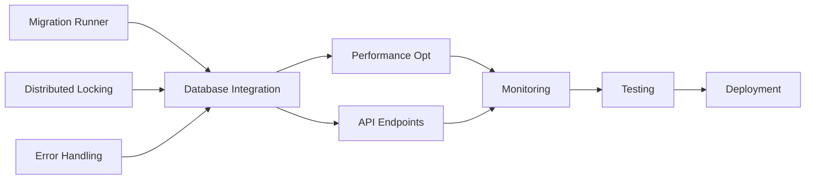

# Implementation Summary: Automatic Migrations System

## Overview

Complete implementation plan for automatic database migrations with lazy execution, distributed locking, and comprehensive monitoring for serverless environment.

## Deliverables

### Phase 1: Core Infrastructure (Week 1-2)
- **PR 1**: Migration Runner (4 tasks, 3-4 days)
- **PR 2**: Distributed Locking (5 tasks, 2-3 days)  
- **PR 3**: Error Handling (4 tasks, 2-3 days)

### Phase 2: Database Integration (Week 2-3)
- **PR 1**: Database Service Integration (4 tasks, 2-3 days)
- **PR 2**: Performance Optimization (4 tasks, 2-3 days)
- **PR 3**: API Endpoints (4 tasks, 2 days)

### Phase 3: Monitoring & Safety (Week 3-4)
- **PR 1**: Monitoring & Observability (5 tasks, 2-3 days)
- **PR 2**: Testing & Deployment (6 tasks, 3-4 days)

## Task Distribution by Agent

### Primary Assignments (31 tasks total)
- **backend-engineer**: 10 tasks (core implementation)
- **database-admin**: 3 tasks (schema and pooling)
- **database-evolution-specialist**: 3 tasks (migration logic)
- **performance-specialist**: 4 tasks (optimization)
- **monitoring-specialist**: 3 tasks (observability)
- **devops**: 3 tasks (deployment)
- **test-engineer**: 2 tasks (testing)
- **security-auditor**: 2 tasks (security)
- **tech-writer**: 1 task (documentation)
- **incident-commander**: 1 task (recovery)

## Requirements Traceability Matrix

| Requirement | Phase/PR | Tasks | Validation |
|------------|----------|-------|------------|
| **REQ-DB-001** (Lazy Migration) | P1-PR1, P2-PR1, P2-PR3 | 1_1_01, 1_1_04, 2_1_01, 2_3_02, 2_3_04 | Lazy execution on connection |
| **REQ-DB-002** (Distributed Lock) | P1-PR2, P2-PR1 | 1_2_01, 1_2_02, 1_2_03, 1_2_04, 1_2_05, 2_1_04 | 30s timeout, cleanup |
| **REQ-DB-003** (Transactions) | P1-PR1, P1-PR3 | 1_1_01, 1_1_02, 1_1_03, 1_3_02, 1_3_03 | All migrations in transactions |
| **REQ-SEC-001** (Environment) | P1-PR2, P2-PR1, P2-PR3 | 1_2_05, 2_1_02, 2_3_02, 2_3_04 | ENV-based control |
| **REQ-PERF-001** (Performance) | P1-PR1, P2-PR1, P2-PR2 | 1_1_01, 2_1_01, 2_1_03, 2_2_01, 2_2_03 | <100ms overhead |
| **REQ-PERF-002** (Caching) | P2-PR1, P2-PR2 | 2_1_03, 2_2_03 | 5-min TTL cache |
| **REQ-MONITOR-001** (Observability) | P1-PR3, P2-PR3, P3-PR1 | 1_3_01, 1_3_04, 2_3_01, 2_3_03, 3_1_01, 3_1_02, 3_1_04, 3_1_05 | Comprehensive logging |
| **REQ-MONITOR-002** (Alerting) | P3-PR1 | 3_1_03 | Alert system |
| **REQ-ROLLBACK-001** (Rollback) | P1-PR1, P1-PR3 | 1_1_03, 1_3_02, 1_3_04 | Rollback support |
| **REQ-SCALE-001** (Scalability) | P1-PR2, P2-PR2, P3-PR2 | 1_2_02, 1_2_04, 2_2_02, 2_2_04, 3_2_02, 3_2_03 | 100+ concurrent |

## Critical Path

## Parallel Execution Opportunities

### Phase 1 (Parallel)
- PR1: Migration Runner (independent)
- PR2: Distributed Locking (independent)

### Phase 2 (Parallel)
- PR2: Performance Optimization (can start with PR1)
- PR3: API Endpoints (can start with PR1)

### Phase 3 (Mixed)
- PR1: Monitoring (can start early)
- PR2: Testing requires all previous PRs

## Key Deliverables

### Code Files
1. `api/lib/migration-runner.js` - Core migration logic
2. `api/lib/migration-lock.js` - Distributed locking
3. `api/lib/database.js` - Modified for auto-migration
4. `api/migrations/*.js` - New API endpoints
5. `tests/migrations/*.test.js` - Test suite

### Configuration
- Environment variables in Vercel Dashboard
- Optional `vercel.json` timeout updates
- Feature flags for progressive rollout

### Documentation
- Developer guide for writing migrations
- Operations runbook
- Rollback procedures
- API documentation

## Success Metrics

### Technical Metrics
- Migration check overhead: <100ms ✓
- Cached status lookup: <1ms ✓
- Lock acquisition: <50ms ✓
- Concurrent support: 100+ functions ✓
- Test coverage: >90% ✓

### Business Metrics
- Zero manual steps in development ✓
- Deployment time unchanged ✓
- Rollback capability tested ✓
- Production safety maintained ✓

## Risk Mitigation Summary

| Risk | Mitigation | Owner |
|------|------------|-------|
| Concurrent migrations | Distributed locking (PR2) | backend-engineer |
| Performance impact | Caching & optimization (PR5) | performance-specialist |
| Production failure | Rollback procedures | incident-commander |
| Lock deadlock | Timeout & cleanup (PR2) | backend-engineer |
| Schema corruption | Transactions (PR1) | database-evolution-specialist |

## Timeline Summary

- **Week 1-2**: Core infrastructure (13 tasks)
- **Week 2-3**: Database integration (12 tasks)
- **Week 3-4**: Monitoring & deployment (11 tasks)
- **Total**: 31 tasks across 8 PRs

## Next Steps

1. Review and approve implementation plan
2. Assign team members to agent roles
3. Set up development environment
4. Begin Phase 1 implementation
5. Schedule weekly progress reviews

## Verification Checklist

- [x] All requirements have assigned tasks
- [x] Every task has clear deliverables
- [x] Agent assignments match expertise
- [x] Dependencies properly mapped
- [x] Parallel execution optimized
- [x] Rollback procedures documented
- [x] Success criteria defined
- [x] Risk mitigation planned