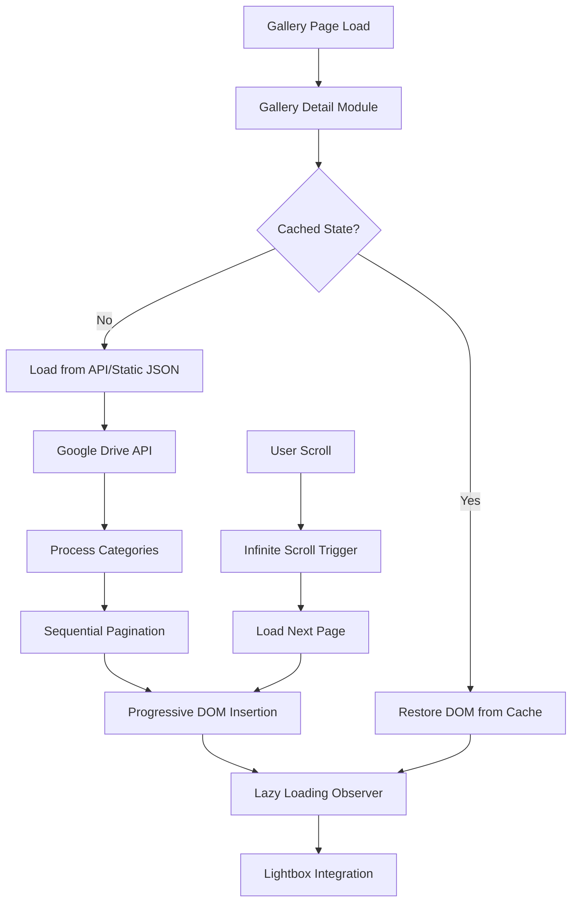

# Gallery System Component Specification

## Overview

The Gallery System is the most complex and feature-rich component of the A Lo Cubano Boulder Fest website. It provides a high-performance, categorized photo viewing experience with lazy loading, infinite scroll, lightbox functionality, and intelligent caching. The system handles thousands of photos from Google Drive with advanced state management and error handling.

## System Architecture

### Core Components

```
Gallery System
├── Gallery Detail Module (/js/gallery-detail.js) - Main controller
├── Gallery Hero Module (/js/gallery-hero.js) - Hero image management  
├── Lightbox Component (/js/components/lightbox.js) - Modal viewer
├── Lazy Loading Component (/js/components/lazy-loading.js) - Performance optimization
├── API Backend (/api/gallery.js) - Data provider
└── CSS Styles (/css/components.css) - Visual presentation
```

### Data Flow Architecture



## File Structure and Implementation

### 1. Gallery Detail Module (`/js/gallery-detail.js`)

**Purpose**: Main controller for gallery pages with advanced state management, caching, and pagination.

**Key Features**:
- Session-based state persistence (30-minute expiry)
- Category-aware sequential pagination 
- Mutex-protected concurrent request handling
- Failed image retry mechanism
- Performance metrics tracking

**Configuration** (Lines 33-47):
```javascript
const CONFIG = {
    API_ENDPOINT: '/api/gallery',
    CACHE_KEY: 'gallery_cache',
    CACHE_DURATION: 3600000, // 1 hour
    LOADING_TIMEOUT: 10000,
    PAGINATION_SIZE: 20,
    LAZY_LOAD_THRESHOLD: '200px',
    RATE_LIMIT: {
        MAX_REQUESTS: 10,
        WINDOW_MS: 60000,
        RETRY_DELAY: 2000
    }
};
```

**State Management** (Lines 49-90):
```javascript
const state = {
    loadingMutex: false,
    galleryData: null,
    currentLightboxIndex: -1,
    lightboxItems: [],
    loadedPages: 0,
    hasMorePages: true,
    allCategories: {},
    categoryCounts: {},
    displayOrder: [], // Tracks order for lightbox navigation
    workshopOffset: 0, // Category-specific pagination
    socialOffset: 0,
    failedImages: [],
    performanceMetrics: {
        loadTimes: [],
        cacheHits: 0,
        cacheMisses: 0
    }
};
```

**State Persistence** (Lines 125-255):
- `saveState()`: Persists state to sessionStorage with version control
- `restoreState()`: Restores state with migration support
- `migrateState()`: Handles version compatibility

**Sequential Pagination Algorithm** (Lines 420-472):
```javascript
function getNextPageItems(allCategories, pageSize = 20) {
    const items = [];
    let remainingSpace = pageSize;
    
    // Fill with workshops first
    if (state.workshopOffset < state.workshopTotal && remainingSpace > 0) {
        const workshopItems = allCategories.workshops.slice(
            state.workshopOffset,
            state.workshopOffset + remainingSpace
        );
        items.push(...workshopItems.map(item => ({...item, category: 'workshops'})));
        state.workshopOffset += workshopItems.length;
        remainingSpace -= workshopItems.length;
    }
    
    // Then fill remaining with socials
    if (state.socialOffset < state.socialTotal && remainingSpace > 0) {
        const socialItems = allCategories.socials.slice(
            state.socialOffset,
            state.socialOffset + remainingSpace
        );
        items.push(...socialItems.map(item => ({...item, category: 'socials'})));
        state.socialOffset += socialItems.length;
    }
    
    return items;
}
```

**Performance Optimizations**:
- Progressive DOM insertion (Lines 998-1116) - Processes items in batches of 5
- Request caching with LRU eviction (Lines 520-621)
- Rate limiting with exponential backoff
- Intersection Observer for infinite scroll

### 2. Gallery Hero Module (`/js/gallery-hero.js`)

**Purpose**: Manages hero images with immediate display and background caching.

**Key Features** (Lines 94-134):
- Immediate display of assigned hero images
- Graceful fallback to static images
- Environment-aware proxy URL generation
- Error handling with retry mechanisms

**Image Loading Logic**:
```javascript
async function loadHeroImage(heroElement) {
    try {
        const imageData = await window.ImageCacheManager.getImageForPage();
        if (imageData && imageData.url) {
            heroElement.src = imageData.url;
            heroElement.classList.add('loaded');
        } else {
            heroElement.src = '/images/hero-default.jpg';
        }
    } catch (error) {
        heroElement.src = '/images/hero-default.jpg';
    }
}
```

### 3. Lightbox Component (`/js/components/lightbox.js`)

**Purpose**: Unified modal image viewer supporting both simple galleries and advanced categorized navigation.

**Class Structure**:
```javascript
class Lightbox {
    constructor(options = {}) {
        this.currentIndex = 0;
        this.images = []; // Simple mode
        this.items = []; // Advanced mode with metadata
        this.categories = [];
        this.categoryCounts = {};
        this.advanced = options.advanced || false;
    }
}
```

**Dual Mode Support**:
- **Simple Mode** (Lines 90-146): Basic image gallery with circular navigation
- **Advanced Mode** (Lines 149-313): Category-aware navigation with metadata

**Advanced Counter Display** (Lines 306-312):
```javascript
if (this.showCounter) {
    const categoryCount = this.categoryCounts[category] || this.items.length;
    const categoryLabel = category.charAt(0).toUpperCase() + category.slice(1);
    counter.textContent = `${categoryLabel}: ${categoryIndex + 1} / ${categoryCount}`;
}
```

**Keyboard Navigation** (Lines 69-87):
- `Escape`: Close lightbox
- `Arrow Right`: Next image
- `Arrow Left`: Previous image

### 4. Lazy Loading Component (`/js/components/lazy-loading.js`)

**Purpose**: High-performance image loading with retry mechanisms and dual mode support.

**Class Configuration** (Lines 9-18):
```javascript
constructor(options = {}) {
    this.config = {
        rootMargin: options.rootMargin || '50px 0px',
        threshold: options.threshold || 0.1,
        selector: options.selector || 'img[data-src]',
        advancedSelector: '.lazy-item[data-loaded="false"]',
        maxRetries: options.maxRetries || 3
    };
}
```

**Error Handling with Exponential Backoff** (Lines 78-132):
```javascript
img.onerror = () => {
    retryInfo.retryCount++;
    
    if (retryInfo.retryCount <= this.config.maxRetries) {
        const retryDelay = Math.min(1000 * Math.pow(2, retryInfo.retryCount - 1), 5000);
        setTimeout(() => {
            const cacheBuster = `?retry=${retryInfo.retryCount}&t=${Date.now()}`;
            img.src = src + cacheBuster;
        }, retryDelay);
    } else {
        // Show retry button for manual recovery
        img.onclick = (e) => {
            e.stopPropagation();
            this.retrySimpleImage(img);
        };
    }
};
```

**Factory Methods** (Lines 300-315):
```javascript
static createSimple(options = {}) {
    return new LazyLoader({ ...options, advanced: false });
}

static createAdvanced(options = {}) {
    return new LazyLoader({ 
        ...options, 
        advanced: true,
        rootMargin: '100px 0px'
    });
}
```

### 5. API Backend (`/api/gallery.js`)

**Purpose**: Serverless function providing gallery data from Google Drive with caching and validation.

**Security Features** (Lines 33-54):
- CORS with domain restrictions
- Input sanitization and validation
- Rate limiting protection

**Data Processing**:
- Validates year (2020-2030 range)
- Supports category filtering (workshops, socials, performances)
- Implements pagination with offset/limit
- Provides thumbnail and view URLs

**Google Drive Integration**:
```javascript
const getDriveClient = () => {
    const auth = new google.auth.GoogleAuth({
        credentials: {
            client_email: process.env.GOOGLE_SERVICE_ACCOUNT_EMAIL,
            private_key: process.env.GOOGLE_PRIVATE_KEY?.replace(/\\n/g, '\n'),
        },
        scopes: ['https://www.googleapis.com/auth/drive.readonly'],
    });
    return google.drive({ version: 'v3', auth });
};
```

## CSS Architecture (`/css/components.css`)

### Gallery Layout System

**Grid Configuration** (Lines 338-350):
```css
.gallery-grid {
    display: grid;
    grid-template-columns: repeat(auto-fill, minmax(250px, 1fr));
    gap: var(--space-md);
    content-visibility: auto; /* Performance optimization */
    contain-intrinsic-size: 300px;
}

.gallery-detail-grid {
    grid-template-columns: repeat(auto-fill, minmax(250px, 1fr));
    gap: var(--space-lg);
}
```

**Gallery Item Structure** (Lines 381-400):
```css
.gallery-item {
    position: relative;
    overflow: hidden;
    aspect-ratio: 4/3; /* Natural photo ratio */
    cursor: pointer;
    transition: transform 0.2s ease-in-out, box-shadow 0.2s ease-in-out;
}

.gallery-item:hover {
    transform: translateY(-2px);
    box-shadow: 0 4px 20px rgba(0, 0, 0, 0.1);
}
```

### Lazy Loading States

**Placeholder Design** (Lines 55-85):
```css
.lazy-placeholder {
    position: relative;
    background: var(--color-gray-100);
    min-height: 200px;
    display: flex;
    align-items: center;
    justify-content: center;
    border-radius: 4px;
}

.lazy-image {
    transition: opacity 0.3s ease-in-out;
    width: 100%;
    height: auto;
    object-fit: cover;
}
```

### Lightbox Modal System

**Full-Screen Modal** (Lines 403-421):
```css
.lightbox {
    position: fixed;
    top: 0;
    left: 0;
    width: 100%;
    height: 100%;
    background-color: rgba(0, 0, 0, 0.8);
    display: none;
    z-index: var(--z-modal);
    opacity: 0;
    transition: opacity var(--transition-base);
}

.lightbox.is-open {
    display: flex;
    opacity: 1;
}
```

**Navigation Controls** (Lines 432-468):
```css
.lightbox-close,
.lightbox-prev,
.lightbox-next {
    position: absolute;
    color: var(--color-white);
    font-size: var(--font-size-3xl);
    width: 50px;
    height: 50px;
    cursor: pointer;
    transition: opacity var(--transition-base);
}
```

### Loading States and Animations

**Spinner Animation** (Lines 29-42):
```css
.loading-spinner {
    width: 48px;
    height: 48px;
    border: 4px solid rgba(255, 255, 255, 0.2);
    border-top: 4px solid var(--color-white);
    border-radius: 50%;
    animation: spin 1s linear infinite;
}

@keyframes spin {
    0% { transform: rotate(0deg); }
    100% { transform: rotate(360deg); }
}
```

**Skeleton Loading** (Lines 513-526):
```css
.skeleton {
    background: linear-gradient(90deg, 
        var(--color-gray-100) 25%, 
        var(--color-gray-200) 50%, 
        var(--color-gray-100) 75%);
    background-size: 200% 100%;
    animation: loading 1.5s infinite;
}
```

## HTML Structure (`/pages/gallery-2025.html`)

### Page Layout

**Gallery Container Structure** (Lines 64-86):
```html
<section class="section-typographic gallery-detail-section" data-gallery-year="2025">
    <div class="container">
        <div class="gallery-loading" id="gallery-detail-loading">
            <p class="font-mono">Loading festival memories...</p>
        </div>
        
        <div id="gallery-detail-content" style="display: none;">
            <!-- Workshops Section -->
            <div class="gallery-section" id="workshops-section">
                <h2 class="text-display">WORKSHOPS</h2>
                <div class="gallery-grid gallery-detail-grid" id="workshops-gallery">
                    <!-- Images loaded dynamically -->
                </div>
            </div>
            
            <!-- Socials Section -->
            <div class="gallery-section" id="socials-section">
                <h2 class="text-display">SOCIALS</h2>
                <div class="gallery-grid gallery-detail-grid" id="socials-gallery">
                    <!-- Images loaded dynamically -->
                </div>
            </div>
        </div>
    </div>
</section>
```

## User Interaction Patterns

### Navigation Flow

1. **Gallery Hub** → **Year Selection** → **Category Browsing**
2. **Infinite Scroll** → **Lazy Loading** → **Lightbox Viewing**
3. **Category Switching** → **State Persistence** → **Resume Browsing**

### Lightbox Interaction

**Click Handlers** (Gallery Detail Lines 1226-1261):
```javascript
function setupGalleryItemHandlers(item, data) {
    const displayIndex = parseInt(item.dataset.index);
    
    item.addEventListener('click', (e) => {
        e.preventDefault();
        e.stopPropagation();
        
        if (state.displayOrder.length > displayIndex) {
            openLightbox(state.displayOrder, displayIndex);
        }
    });
    
    item.style.cursor = 'pointer';
}
```

**Lightbox Navigation**:
- **Mouse**: Click navigation buttons or background to close
- **Keyboard**: Arrow keys for navigation, Escape to close
- **Touch**: Swipe gestures on mobile (handled by CSS touch events)

### Error Recovery

**Failed Image Handling**:
1. **Automatic Retry**: Up to 3 attempts with exponential backoff
2. **Manual Retry**: Click-to-retry button after failures
3. **Fallback Display**: Error state with retry options
4. **State Persistence**: Failed images tracked across sessions

## Performance Optimizations

### Caching Strategy

**Multi-Level Caching**:
1. **Browser Cache**: Standard HTTP caching for images
2. **Request Cache**: In-memory API response caching (5 minutes)
3. **Session Storage**: Gallery state persistence (30 minutes)
4. **Local Storage**: Long-term data caching (1 hour)

**Cache Management** (Gallery Detail Lines 537-607):
```javascript
async cachedFetch(url, options = {}) {
    const cacheKey = `${url}:${JSON.stringify(options)}`;
    const cached = state.requestCache.get(cacheKey);
    
    if (cached && (Date.now() - cached.timestamp) < CONFIG.REQUEST_CACHE_DURATION) {
        return cached.response;
    }
    
    const response = await fetch(url, options);
    if (response.ok) {
        state.requestCache.set(cacheKey, {
            response: response.clone(),
            timestamp: Date.now()
        });
    }
    return response;
}
```

### Loading Optimizations

**Progressive Loading**:
- **Batch DOM Insertion**: 5 items per batch to prevent UI blocking
- **Intersection Observer**: 200px threshold for lazy loading
- **Image Prefetching**: Background loading of next page items
- **Content Visibility**: CSS containment for off-screen items

**Memory Management**:
- **Observer Cleanup**: Proper disconnection of observers
- **Cache Eviction**: LRU strategy for request cache
- **State Cleanup**: Automatic cleanup on page navigation

### Mobile Optimizations

**Responsive Behavior**:
```css
@media (max-width: 768px) {
    .gallery-grid {
        grid-template-columns: repeat(auto-fill, minmax(150px, 1fr));
        gap: var(--space-sm);
    }
    
    .lazy-placeholder {
        min-height: 150px;
    }
    
    .loading-spinner {
        width: 36px;
        height: 36px;
    }
}
```

**Touch Interactions**:
- **Tap Targets**: Minimum 44px touch targets
- **Scroll Performance**: GPU-accelerated transforms
- **Loading States**: Optimized spinners and progress indicators

## API Integration

### Google Drive Integration

**Authentication Flow**:
1. Service account credentials from environment variables
2. OAuth 2.0 with drive.readonly scope
3. File metadata extraction with thumbnail generation
4. Proxy URLs for image serving

**Data Structure**:
```json
{
    "totalCount": 150,
    "categories": {
        "workshops": [
            {
                "id": "1ABC123",
                "name": "workshop-001.jpg",
                "thumbnailUrl": "/api/image-proxy/1ABC123",
                "viewUrl": "/api/image-proxy/1ABC123",
                "category": "workshops"
            }
        ],
        "socials": [...]
    },
    "hasMore": true,
    "offset": 0,
    "limit": 20
}
```

### Error Handling

**API Error Recovery**:
- **Rate Limit**: Exponential backoff with jitter
- **Network Errors**: Retry with timeout increases
- **Authentication**: Graceful fallback to static content
- **Data Validation**: Schema validation with error messages

## State Management

### Session Persistence

**State Schema** (Gallery Detail Lines 130-150):
```javascript
const persistedState = {
    version: CONFIG.STATE_VERSION,
    timestamp: Date.now(),
    allCategories: state.allCategories,
    categoryCounts: state.categoryCounts,
    workshopOffset: state.workshopOffset,
    socialOffset: state.socialOffset,
    totalItemsAvailable: state.totalItemsAvailable,
    itemsDisplayed: state.itemsDisplayed,
    hasCompleteDataset: state.hasCompleteDataset,
    displayOrder: state.displayOrder,
    failedImages: state.failedImages
};
```

**State Migration** (Lines 160-185):
```javascript
function migrateState(state, fromVersion) {
    if (fromVersion === 1) {
        state.version = 2;
        state.categoryItemCounts = state.categoryItemCounts || { workshops: 0, socials: 0 };
        
        if (state.displayOrder && Array.isArray(state.displayOrder)) {
            state.displayOrder.forEach(item => {
                if (item.categoryIndex === undefined && item.category) {
                    item.categoryIndex = calculateCategoryIndex(item);
                }
            });
        }
    }
}
```

### Real-Time Updates

**State Synchronization**:
- **DOM Restoration**: Rebuilds interface from saved state
- **Observer Re-initialization**: Restores lazy loading observers
- **Event Handler Binding**: Re-attaches click handlers to restored items
- **Lightbox Preparation**: Reconstructs navigation arrays

## Debug and Monitoring

### Debug Interface

**Debug Console** (Gallery Detail Lines 1520-1590):
```javascript
window.galleryDebug = {
    getState: () => state,
    getPerformanceStats: () => RequestManager.getPerformanceStats(),
    clearRequestCache: () => RequestManager.clearCache(),
    retryFailedImages: () => lazyLoader.retryAllFailedImages(),
    logCurrentState: () => {
        console.group('🔍 Gallery Debug Info');
        console.log('📊 Performance Stats:', RequestManager.getPerformanceStats());
        console.log('📋 State Overview:', {...});
        console.groupEnd();
    }
};
```

**Performance Monitoring**:
- **Load Time Tracking**: API request timing
- **Cache Hit Ratios**: Performance metrics
- **Error Tracking**: Failed image monitoring
- **Memory Usage**: State size monitoring

### Production Monitoring

**Error Reporting**:
- **Console Logging**: Structured debug information
- **Performance Metrics**: Load time analysis
- **User Experience**: Failed image recovery tracking
- **API Health**: Request success/failure rates

## Browser Compatibility

### Modern Browser Features

**Required APIs**:
- **Intersection Observer**: Lazy loading (fallback available)
- **Fetch API**: HTTP requests (polyfill recommended)
- **ES6 Modules**: Component architecture
- **CSS Grid**: Layout system (flexbox fallback)
- **CSS Custom Properties**: Design tokens

**Progressive Enhancement**:
- **Intersection Observer Fallback**: Immediate loading for unsupported browsers
- **Fetch Polyfill**: XMLHttpRequest fallback
- **CSS Grid Fallback**: Flexbox layout for older browsers

### Accessibility

**ARIA Support**:
```html
<button class="lightbox-close" aria-label="Close lightbox">&times;</button>
<button class="lightbox-prev" aria-label="Previous image">‹</button>
<button class="lightbox-next" aria-label="Next image">›</button>
```

**Keyboard Navigation**:
- **Tab Navigation**: Focusable elements
- **Arrow Keys**: Lightbox navigation
- **Escape Key**: Modal dismissal
- **Enter/Space**: Activation

**Screen Reader Support**:
- **Alt Text**: Descriptive image descriptions
- **Live Regions**: Dynamic content announcements
- **Focus Management**: Proper focus trapping in modals

## Testing Strategy

### Unit Testing

**Core Functions**:
- State management and persistence
- Pagination algorithm correctness
- Cache management and eviction
- Error handling and recovery

### Integration Testing

**Component Interaction**:
- Gallery → Lightbox flow
- Lazy Loading → Image Display
- API → State Management
- Error States → Recovery

### Performance Testing

**Load Testing**:
- Large dataset handling (1000+ images)
- Concurrent user simulation
- Memory leak detection
- Cache efficiency measurement

### Cross-Browser Testing

**Browser Matrix**:
- Chrome, Firefox, Safari, Edge
- Mobile browsers (iOS Safari, Chrome Mobile)
- Feature detection and fallbacks
- Performance on low-end devices

## Deployment Considerations

### Environment Configuration

**Production Settings**:
```javascript
const CONFIG = {
    API_ENDPOINT: '/api/gallery',
    CACHE_DURATION: 3600000, // 1 hour
    PAGINATION_SIZE: 20,
    RATE_LIMIT: {
        MAX_REQUESTS: 10,
        WINDOW_MS: 60000
    }
};
```

**Development Settings**:
- Lower cache durations for testing
- Verbose logging enabled
- Debug interfaces accessible
- CORS headers for localhost

### CDN Integration

**Static Asset Optimization**:
- Image compression and format optimization
- CSS/JS minification and compression
- HTTP/2 server push for critical resources
- Progressive image loading with WebP support

**Cache Headers**:
```http
Cache-Control: public, max-age=31536000, immutable  // Images
Cache-Control: public, max-age=3600                 // API responses
Cache-Control: no-cache                             // HTML pages
```

## Future Enhancements

### Planned Features

1. **Image Search**: Full-text search across image metadata
2. **Favorites System**: User-specific image bookmarking
3. **Social Sharing**: Direct image sharing to social platforms
4. **Offline Support**: Service worker for offline browsing
5. **Progressive Web App**: Install prompt and app-like experience

### Technical Improvements

1. **WebP Support**: Modern image format with fallbacks
2. **Virtual Scrolling**: Handle extremely large datasets
3. **Advanced Caching**: IndexedDB for larger storage quotas
4. **Image Analytics**: View tracking and popular image identification
5. **Real-time Updates**: WebSocket integration for live gallery updates

---

## Summary

The Gallery System represents the most sophisticated component of the A Lo Cubano Boulder Fest website, providing:

- **High Performance**: Advanced caching, lazy loading, and progressive enhancement
- **Robust Error Handling**: Comprehensive retry mechanisms and graceful degradation
- **Excellent User Experience**: Smooth interactions, keyboard navigation, and mobile optimization
- **Scalable Architecture**: Handles thousands of images with efficient pagination
- **Production Ready**: Comprehensive monitoring, debugging, and deployment support

The system successfully balances complexity with maintainability, providing a professional gallery experience that showcases the festival's vibrant community and cultural celebrations.